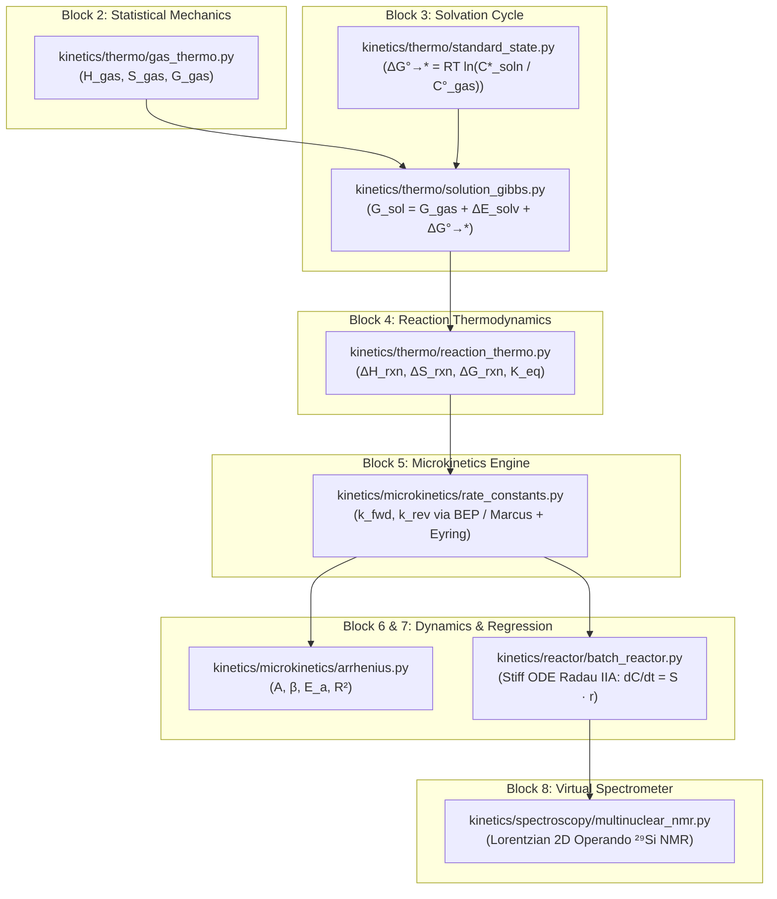

# atom-to-reactor: Functional Specification & Architecture Reference

> **Project:** BatteryAsTank — Master's Thesis (TFM)  
> **Repository:** `atom-to-reactor`  
> **Author:** Yeray Alcaraz Galván  
> **Affiliation:** Department of Chemistry – Ångström Laboratory, Uppsala University  
> **Supervisor:** Prof. Peter Broqvist  

This document provides the complete schematic architecture and technical reference for every Python simulation program (`.py`) in this repository. In accordance with project standards, this repository hosts exclusively production simulation scripts required to solve the multiscale chemical kinetics problem.

---

## 1. Schematic Overview

```text
========================================================================================
1. Block 1: Active Species Database
     - (Configured within 'notebooks/01_multiscale_microkinetics_theory.ipynb')
----------------------------------------------------------------------------------------
2. Block 2: Statistical Mechanics Engine & Quasi-RRHO Thermochemistry
     - kinetics/thermo/gas_thermo.py
----------------------------------------------------------------------------------------
3. Block 3: Solvation Free Energy & Standard-State Shift
     - kinetics/thermo/standard_state.py (Block 3A: Gas-to-Solution Compression Correction)
     - kinetics/thermo/solution_gibbs.py       (Block 3B: Condensed-Phase Solution Free Energy)
----------------------------------------------------------------------------------------
4. Block 4: Reaction Network Thermodynamics & Equilibrium
     - kinetics/thermo/reaction_thermo.py
----------------------------------------------------------------------------------------
5. Block 5: Microkinetic Rate Constants Engine & Detailed Balance
     - kinetics/microkinetics/rate_constants.py
----------------------------------------------------------------------------------------
6. Block 6: Temperature-Dependent Kinetics & Arrhenius Regression
     - kinetics/microkinetics/arrhenius.py
----------------------------------------------------------------------------------------
7. Block 7: Homogeneous Batch Reactor Dynamics
     - kinetics/reactor/batch_reactor.py
----------------------------------------------------------------------------------------
8. Block 8: Virtual Operando Spectrometer (²⁹Si NMR)
     - kinetics/spectroscopy/multinuclear_nmr.py
----------------------------------------------------------------------------------------
> Blocks 1–8 power VÍA 1: 'notebooks/01_multiscale_microkinetics_theory.ipynb'
========================================================================================
10. Block 10: Multi-Stage Temperature-Programmed Protocol Reactor
     - kinetics/reactor/protocol_reactor.py
----------------------------------------------------------------------------------------
11. Block 11: Molecular Symmetry & Chemical Equivalence Partitioning
     - kinetics/spectroscopy/molecular_symmetry.py
----------------------------------------------------------------------------------------
12. Block 12: Multi-nuclear Operando NMR & Dynamic OH Exchange
     - kinetics/spectroscopy/multinuclear_nmr.py
----------------------------------------------------------------------------------------
13. Block 13: Chemometric Reaction Fingerprints & Extent Inversion
     - kinetics/spectroscopy/reaction_fingerprints.py
----------------------------------------------------------------------------------------
> Blocks 10–13 power VÍA 2: 'notebooks/02_operando_experimental_protocol.ipynb'
========================================================================================
```

### Data Flow Across Modules



---

## 2. Block 2: Statistical Mechanics Engine & Quasi-RRHO Thermochemistry

### `kinetics/thermo/gas_thermo.py`

#### Purpose
Computes the standard gas-phase enthalpy $H^\circ_{\text{gas}}(T)$, entropy $S^\circ_{\text{gas}}(T)$, and Gibbs free energy $G^\circ_{\text{gas}}(T)$ in $\text{kJ/mol}$ (and $\text{eV}$) as a continuous function of temperature $T$. It bridges $0\text{ K}$ DFT electronic energies with finite-temperature thermodynamic functions using canonical statistical mechanics and Stefan Grimme's Quasi-Rigid Rotor Harmonic Oscillator (quasi-RRHO, 2012) low-frequency damping.

#### Fundamental Physical Equations
1. **Translational Partition Function (3D Particle in a Box):**
   $$\Lambda_{\text{th}} = \sqrt{\frac{h^2}{2 \pi m k_B T}}, \quad V_{\text{ideal}} = \frac{k_B T}{P^\circ}, \quad q_{\text{trans}} = \frac{V_{\text{ideal}}}{\Lambda_{\text{th}}^3}$$
   $$H_{\text{trans}} = \frac{5}{2} R T, \quad S_{\text{trans}} = R \left( \ln q_{\text{trans}} + \frac{5}{2} \right)$$

2. **Rotational Partition Function (Rigid Rotor):**
   - **Linear molecule:**
     $$q_{\text{rot}} = \frac{8 \pi^2 I_{\text{max}} k_B T}{\sigma_{\text{rot}} h^2}, \quad H_{\text{rot}} = R T, \quad S_{\text{rot}} = R \left( \ln q_{\text{rot}} + 1 \right)$$
   - **Non-linear polyatomic molecule:**
     $$q_{\text{rot}} = \frac{\sqrt{\pi}}{\sigma_{\text{rot}}} \left( \frac{8 \pi^2 k_B T}{h^2} \right)^{3/2} \sqrt{I_A I_B I_C}$$
     $$H_{\text{rot}} = \frac{3}{2} R T, \quad S_{\text{rot}} = R \left( \ln q_{\text{rot}} + \frac{3}{2} \right)$$

3. **Vibrational Partition Function & Quasi-RRHO Damping:**
   - Harmonic zero-point energy: $\text{ZPE} = \sum_i \frac{1}{2} h c \nu_i N_A$
   - Thermal vibrational enthalpy: $U_{\text{vib}} = R \sum_i \frac{\theta_{v,i}}{e^{\theta_{v,i}/T} - 1}$, with $\theta_{v,i} = \frac{h c \nu_i}{k_B}$
   - Free rotor entropy: $S_{\text{free rot}, i} = R \left( \frac{1}{2} + \ln \sqrt{\frac{8 \pi^3 I_{\text{eff}, i} k_B T}{h^2}} \right)$, where $I_{\text{eff}, i} = \frac{\hbar}{4 \pi c \nu_i}$
   - Head-Gordon / Grimme interpolation weight ($\nu_0 = 100\text{ cm}^{-1}$):
     $$w(\nu_i) = \frac{1}{1 + (\nu_0 / \nu_i)^4}$$
     $$S_{\text{vib, qRRHO}} = \sum_i \left[ w(\nu_i) S_{\text{vib, HO}}(\nu_i) + (1 - w(\nu_i)) S_{\text{free rot}}(\nu_i) \right]$$

4. **Total Standard Properties:**
   $$H^\circ_{\text{tot}}(T) = E_{0\text{K}} + H_{\text{trans}} + H_{\text{rot}} + \text{ZPE} + U_{\text{vib}}$$
   $$S^\circ_{\text{tot}}(T) = S_{\text{trans}} + S_{\text{rot}} + S_{\text{vib, qRRHO}}$$
   $$G^\circ_{\text{tot}}(T) = H^\circ_{\text{tot}}(T) - T \cdot S^\circ_{\text{tot}}(T)$$

#### Functions in `kinetics/thermo/gas_thermo.py`

##### 1. `calculate_gas_thermo(species_name, T_K, nu_0=100.0, species_db=None, mode='qRRHO', **kwargs) -> dict`
* **Arguments:**
  * `species_name` (`str`): Target chemical species identifier (e.g. `'TMSPA'`, `'H2O'`, `'TMSOH'`).
  * `T_K` (`float`): Absolute temperature in Kelvin (e.g. `298.15`).
  * `nu_0` (`float`, optional): Frequency damping cutoff threshold in $\text{cm}^{-1}$ (default: `100.0`).
  * `species_db` (`dict`, optional): Molecular properties database. If omitted, inspected dynamically from calling environment.
  * `mode` (`str`, optional): `'wb97mv'` to directly load precomputed ωB97M-V/def2-TZVPD free energies (with legacy alias `'b3lyp_benchmark'`), or `'qRRHO'` for canonical statistical mechanics with Grimme damping.
* **Returns:** `dict`
  * `'H_gas_kJ_mol'` (`float`): Standard gas-phase enthalpy in $\text{kJ/mol}$.
  * `'S_gas_J_mol_K'` (`float`): Standard gas-phase entropy in $\text{J/(mol}\cdot\text{K)}$.
  * `'G_gas_kJ_mol'` (`float`): Standard gas-phase Gibbs free energy in $\text{kJ/mol}$.
  * `'G_gas_eV'` (`float`): Standard gas-phase Gibbs free energy in $\text{eV}$.

##### 2. `_get_species_database(species_db=None) -> dict`
* **Arguments:** `species_db` (`dict`, optional).
* **Behavior:** Internal stack-frame inspection utility that retrieves the active `species_database` from local arguments, global namespace, or outer caller frames (enables zero-boilerplate notebook invocation).

---

## 3. Block 3: Solvation Free Energy & Standard-State Shift

### `kinetics/thermo/standard_state.py` (Block 3A)

#### Purpose
Computes the free energy change corresponding to transferring one mole of ideal gas from the gas-phase standard state ($P^\circ = 1\text{ bar} = 10^5\text{ Pa}$) to the standard solution concentration state ($C^* = 1.0\text{ M} = 1000\text{ mol/m}^3$).

#### Fundamental Physical Equations
$$\Delta G^{\circ \to *}(T) = R T \ln\left( \frac{C^*_{\text{soln}}}{C^\circ_{\text{gas}}(T)} \right) = R T \ln\left( \frac{1000 \cdot R T}{P^\circ} \right)$$
At $T = 298.15\text{ K}$:
$$\Delta G^{\circ \to *} = 8.31446 \times 298.15 \times \ln(24.7895) \approx +7.926\text{ kJ/mol} \ (+1.894\text{ kcal/mol})$$

#### Functions in `kinetics/thermo/standard_state.py`

##### 1. `calculate_standard_state_shift(T_K, P_ref_Pa=1.0e5, **kwargs) -> float`
* **Arguments:**
  * `T_K` (`float`): Temperature in Kelvin.
  * `P_ref_Pa` (`float`, optional): Gas standard pressure in Pascals (default: $1.0 \times 10^5\text{ Pa} = 1\text{ bar}$).
* **Returns:**
  * `float`: Standard-state free energy compression shift $\Delta G^{\circ \to *}$ in $\text{kJ/mol}$.

---

### `kinetics/thermo/solution_gibbs.py` (Block 3B)

#### Purpose
Integrates the complete thermodynamic cycle combining gas-phase Quasi-RRHO free energy, continuum SMD / MACE solvation free energy offsets ($\Delta E_{\text{solv}}$), and standard-state concentration shift ($\Delta G^{\circ \to *}$) to yield the condensed-phase chemical potential $G^*_{\text{sol}, i}(T)$.

#### Fundamental Physical Equations
$$G^*_{\text{sol}, i}(T) = G^\circ_{\text{gas}, i}(T) + \Delta E_{\text{solv}, i} + \Delta G^{\circ \to *}(T)$$
$$H_{\text{sol}, i}(T) = H^\circ_{\text{gas}, i}(T) + \Delta E_{\text{solv}, i}$$
$$S^*_{\text{sol}, i}(T) = S^\circ_{\text{gas}, i}(T) - \frac{\Delta G^{\circ \to *}(T)}{T}$$

#### Functions in `kinetics/thermo/solution_gibbs.py`

##### 1. `calculate_solution_gibbs(species_name, T_K, species_db=None, mode='qRRHO', **kwargs) -> dict`
* **Arguments:**
  * `species_name` (`str`): Target chemical species.
  * `T_K` (`float`): Temperature in Kelvin.
  * `species_db` (`dict`, optional): Species database.
  * `mode` (`str`, optional): `'qRRHO'` (applies full thermodynamic cycle with $\Delta G^{\circ \to *}$) or `'wb97mv'` (omits shift for direct benchmark comparison; legacy alias: `'b3lyp_benchmark'`).
* **Returns:** `dict`
  * `'G_sol_kJ_mol'` (`float`): Liquid-phase Gibbs free energy in $\text{kJ/mol}$.
  * `'G_sol_eV'` (`float`): Liquid-phase Gibbs free energy in $\text{eV}$.
  * `'H_sol_kJ_mol'` (`float`): Liquid-phase enthalpy in $\text{kJ/mol}$.
  * `'S_sol_J_mol_K'` (`float`): Liquid-phase entropy in $\text{J/(mol}\cdot\text{K)}$.

---

## 4. Block 4: Reaction Network Thermodynamics & Equilibrium

### `kinetics/thermo/reaction_thermo.py`

#### Purpose
Computes the net reaction enthalpy $\Delta H_{\text{rxn}}$, entropy $\Delta S_{\text{rxn}}$, Gibbs free energy $\Delta G_{\text{rxn}}$, and thermodynamic equilibrium constant $K_{\text{eq}}$ for any elementary reaction in the reaction network at a given temperature.

#### Fundamental Physical Equations
$$\Delta G_{\text{rxn}}(T) = \sum_{p \in \text{products}} \nu_p G^*_{\text{sol}, p}(T) - \sum_{r \in \text{reactants}} \nu_r G^*_{\text{sol}, r}(T)$$
$$\Delta H_{\text{rxn}}(T) = \sum_{p} \nu_p H_{\text{sol}, p}(T) - \sum_{r} \nu_r H_{\text{sol}, r}(T)$$
$$\Delta S_{\text{rxn}}(T) = \sum_{p} \nu_p S^*_{\text{sol}, p}(T) - \sum_{r} \nu_r S^*_{\text{sol}, r}(T)$$
$$K_{\text{eq}}(T) = \exp\left( -\frac{\Delta G_{\text{rxn}}(T)}{R T} \right)$$

#### Functions in `kinetics/thermo/reaction_thermo.py`

##### 1. `calculate_reaction_thermo(rxn_id, T_K, reactions_net=None, species_db=None, mode='qRRHO', **kwargs) -> dict`
* **Arguments:**
  * `rxn_id` (`str`): Identifier of the reaction (e.g. `'R1_hydrolysis_1'`, `'R4_condensation_TMSOH'`).
  * `T_K` (`float`): Temperature in Kelvin.
  * `reactions_net` (`dict`, optional): Reaction network dictionary defining reactants, products, and stoichiometry.
  * `species_db` (`dict`, optional): Species thermodynamic database.
  * `mode` (`str`, optional): `'wb97mv'` (direct DFT snapshot) or `'qRRHO'` (legacy alias: `'b3lyp_benchmark'`).
* **Returns:** `dict`
  * `'rxn_id'` (`str`): Reaction identifier.
  * `'class'` (`str`): Reaction family classification (e.g. `'hydrolysis'`, `'condensation'`, `'transesterification'`).
  * `'dH_rxn_kJ_mol'` (`float`): Enthalpy of reaction in $\text{kJ/mol}$.
  * `'dS_rxn_J_mol_K'` (`float`): Entropy of reaction in $\text{J/(mol}\cdot\text{K)}$.
  * `'dG_rxn_kJ_mol'` (`float`): Gibbs free energy of reaction in $\text{kJ/mol}$.
  * `'dG_rxn_eV'` (`float`): Gibbs free energy of reaction in $\text{eV}$.
  * `'K_eq'` (`float`): Dimensionless equilibrium constant.

##### 2. `_get_reactions_network(reactions_net=None) -> dict`
* **Arguments:** `reactions_net` (`dict`, optional).
* **Behavior:** Resolves reaction network from arguments, globals, or caller stack frame.

---

## 5. Block 5: Microkinetic Rate Constants Engine & Detailed Balance

### `kinetics/microkinetics/rate_constants.py`

#### Purpose
Computes forward ($k_f$) and reverse ($k_r$) microkinetic rate constants via Transition State Theory (TST) with thermodynamic consistency. It guarantees strict microscopic reversibility and detailed balance ($k_f / k_r = K_{\text{eq}}$) across all reaction pathways. Supports pluggable kinetic models: Bell-Evans-Polanyi (BEP) linear barrier scaling and Marcus theory quadratic activation.

#### Fundamental Physical Equations
1. **Model 1: Bell-Evans-Polanyi (BEP) + Eyring TST:**
   $$\Delta G^\ddagger_f = \max(E_0, E_0 + \alpha \, \Delta G_{\text{rxn}})$$
   $$k_f = \kappa \frac{k_B T}{h} \exp\left( -\frac{\Delta G^\ddagger_f}{R T} \right)$$
   $$k_r = \frac{k_f}{K_{\text{eq}}}, \quad \Delta G^\ddagger_r = \Delta G^\ddagger_f - \Delta G_{\text{rxn}}$$

2. **Model 2: Marcus Theory Quadratic Activation + Eyring TST:**
   $$\Delta G^\ddagger_f = \frac{\lambda}{4} \left( 1 + \frac{\Delta G_{\text{rxn}}}{\lambda} \right)^2$$
   $$k_f = \kappa \frac{k_B T}{h} \exp\left( -\frac{\Delta G^\ddagger_f}{R T} \right), \quad k_r = \frac{k_f}{K_{\text{eq}}}$$
   *Consistency Condition:* When reorganization energy $\lambda$ is unassigned, it defaults to $\lambda = 4 E_0$ (e.g. $3.20\text{ eV}$ for $E_0 = 0.80\text{ eV}$), ensuring identical barrier ($E_0$) and slope ($\alpha = 0.50$) between Marcus and BEP at thermoneutrality ($\Delta G_{\text{rxn}} = 0$).

#### Functions in `kinetics/microkinetics/rate_constants.py`

##### 1. `calculate_rate_constants(rxn_id, T_K, model=None, kinetic_model='bep_eyring', bep_params=None, reactions_net=None, species_db=None, mode='qRRHO', thermo_mode=None, **kwargs) -> dict`
* **Arguments:**
  * `rxn_id` (`str`): Reaction identifier.
  * `T_K` (`float`): Temperature in Kelvin.
  * `model` / `kinetic_model` (`str`, optional): `'bep_eyring'` (or `'bep'`) vs `'marcus_eyring'` (or `'marcus'`).
  * `bep_params` (`dict`, optional): Family-specific $E_0$ and $\alpha$ dictionary.
  * `reactions_net` (`dict`, optional): Reaction network dictionary.
  * `species_db` (`dict`, optional): Species database.
  * `mode` / `thermo_mode` (`str`, optional): Thermodynamic calculation mode (`'wb97mv'` or `'qRRHO'`; legacy alias: `'b3lyp_benchmark'`).
* **Returns:** `dict` (Unified dictionary containing rate constants, barriers, reaction free energy, and equilibrium constant).

##### 2. `bep_eyring(rxn_id, T_K, bep_params=None, reactions_net=None, species_db=None, mode='qRRHO', **kwargs) -> dict`
* Evaluates linear BEP scaling + Eyring TST. Returns explicit barriers $\Delta G^\ddagger_f$, $\Delta G^\ddagger_r$, $k_f$, $k_r$, and $K_{\text{eq}}$.

##### 3. `marcus_eyring(rxn_id, T_K, lambda_eV=None, bep_params=None, reactions_net=None, species_db=None, mode='qRRHO', **kwargs) -> dict`
* Evaluates Marcus quadratic barrier relation + Eyring TST. Returns $\lambda$, $\Delta G^\ddagger_f$, $\Delta G^\ddagger_r$, $k_f$, $k_r$, and $K_{\text{eq}}$.

##### 4. `_get_bep_parameters(bep_params=None) -> dict`
* Resolves `family_bep_parameters` across runtime namespaces.

---

## 6. Block 6: Temperature-Dependent Kinetics & Arrhenius Regression

### `kinetics/microkinetics/arrhenius.py`

#### Purpose
Extracts macroscopic engineering kinetic parameters across temperature sweeps ($0^\circ\text{C}$ to $100^\circ\text{C}$) by fitting microkinetic rate constants to the 3-parameter Modified Arrhenius equation:
$$k(T) = A \left( \frac{T}{T_0} \right)^\beta \exp\left( -\frac{E_a}{R T} \right)$$
where $T_0 = 298.15\text{ K}$.

#### Fundamental Physical Equations
Linearized Ordinary Least Squares (OLS) regression in logarithmic parameter space:
$$\ln k(T) = \ln A + \beta \ln\left( \frac{T}{T_0} \right) - \frac{E_a}{R} \left( \frac{1}{T} \right)$$
Expressed as the matrix system $\mathbf{Y} = \mathbf{X} \boldsymbol{\theta}$:
$$\begin{bmatrix} \ln k(T_1) \\ \vdots \\ \ln k(T_m) \end{bmatrix} = \begin{bmatrix} 1 & \ln(T_1/T_0) & -1/(R T_1) \\ \vdots & \vdots & \vdots \\ 1 & \ln(T_m/T_0) & -1/(R T_m) \end{bmatrix} \begin{bmatrix} \ln A \\ \beta \\ E_a \end{bmatrix}$$
Solved via singular value decomposition (`np.linalg.lstsq`), outputting the determination coefficient $R^2$.

#### Functions in `kinetics/microkinetics/arrhenius.py`

##### 1. `fit_modified_arrhenius(rxn_id, T_grid, direction='f', bep_params=None, reactions_net=None, species_db=None, mode='qRRHO', **kwargs) -> dict`
* **Arguments:**
  * `rxn_id` (`str`): Target reaction.
  * `T_grid` (`np.ndarray`): 1D array of temperatures in Kelvin (e.g. `np.linspace(273.15, 373.15, 20)`).
  * `direction` (`str`, optional): `'f'` for forward rate, `'r'` for reverse rate.
  * `bep_params`, `reactions_net`, `species_db`, `mode`: Microkinetic options.
* **Returns:** `dict`
  * `'rxn_id'` (`str`): Reaction identifier.
  * `'direction'` (`str`): `'f'` or `'r'`.
  * `'A'` (`float`): Pre-exponential factor ($\text{s}^{-1}$ for unimolecular, $\text{M}^{-1}\text{s}^{-1}$ for bimolecular).
  * `'beta'` (`float`): Temperature exponent (dimensionless).
  * `'Ea_kJ_mol'` (`float`): Apparent activation energy in $\text{kJ/mol}$.
  * `'Ea_eV'` (`float`): Apparent activation energy in $\text{eV}$.
  * `'R2'` (`float`): Regression coefficient of determination.

##### 2. `generate_arrhenius_summary(T_grid, reactions_net=None, bep_params=None, species_db=None, mode='qRRHO', **kwargs) -> list`
* **Arguments:** Temperature array and model options.
* **Returns:** `list[dict]` containing forward and reverse parameters ($A_f, \beta_f, E_{a,f}, A_r, \beta_r, E_{a,r}, R^2$) for every reaction in the network, structured for direct conversion into pandas DataFrames or documentation tables.

---

## 7. Block 7: Homogeneous Batch Reactor Dynamics

### `kinetics/reactor/batch_reactor.py`

#### Purpose
Simulates dynamic species concentration profiles $C_i(t)$ inside an isothermal, homogeneous batch reactor ("Tank") over macroscopic timescales (seconds to weeks). Because electrolyte degradation involves rapid proton transfers coupled to slow siloxane condensations, reaction timescales span over 10 orders of magnitude; the module utilizes implicit high-order **Radau IIA** Runge-Kutta numerical integration.

#### Fundamental Physical Equations
1. **Batch Reactor Mass Action Kinetics:**
   $$\frac{d C_i}{d t} = \sum_{j=1}^{N_{\text{rxn}}} S_{ij} r_j(\mathbf{C}, T)$$
   $$r_j(\mathbf{C}, T) = k_{j,f}(T) \prod_{r} C_r^{\nu_{rj}} - k_{j,r}(T) \prod_{p} C_p^{\nu_{pj}}$$
   where $\mathbf{S}$ is the stoichiometric matrix ($S_{ij} = \nu_{ij,\text{prod}} - \nu_{ij,\text{react}}$).

2. **Solvent Reservoir Buffering:**
   For bulk electrolyte solvent (e.g. Ethylene Carbonate, $\text{EC} \approx 4.5\text{ M}$), concentration is optionally buffered ($d C_{\text{EC}} / dt = 0$).

3. **Conservation Invariants:**
   Silicon and phosphorus element conservation are tracked across all time steps to verify integration fidelity:
   $$\sum_{k} n_{\text{Si}, k} C_k(t) = \text{constant}, \quad \sum_{k} n_{\text{P}, k} C_k(t) = \text{constant}$$

#### Functions in `kinetics/reactor/batch_reactor.py`

##### 1. `simulate_tank_reactor(C0_dict, t_end_s=1e6, T_K=298.15, reactions_net=None, bep_params=None, species_db=None, ec_buffered=True, method='Radau', rtol=1e-8, atol=1e-12, n_points=500, mode='wb97mv', **kwargs) -> dict`
* **Arguments:**
  * `C0_dict` (`dict[str, float]`): Initial concentrations in $\text{mol/L}$ ($\text{M}$) (e.g. `{'TMSPA': 0.05, 'H2O': 0.005, 'EC': 4.5, ...}`).
  * `t_end_s` (`float`, optional): Total simulation horizon in seconds (default: $10^6\text{ s} \approx 11.5\text{ days}$).
  * `T_K` (`float`, optional): Operating temperature in Kelvin (default: $298.15\text{ K}$).
  * `reactions_net` (`dict`, optional): Reaction network definition.
  * `bep_params`, `species_db`: Kinetic parameters.
  * `ec_buffered` (`bool`, optional): If `True`, keeps bulk solvent $[EC]$ constant as a reservoir (default: `True`).
  * `method` (`str`, optional): Stiff ODE solver algorithm (default: `'Radau'`).
  * `rtol`, `atol` (`float`, optional): Relative and absolute solver tolerances (default: $10^{-8}$ and $10^{-12}$).
  * `n_points` (`int`, optional): Number of log-spaced temporal evaluation points (default: `500`).
  * `mode` (`str`, optional): Thermodynamic data mode.
* **Returns:** `dict`
  * `'t_s'` (`np.ndarray`): Time vector in seconds.
  * `'t_h'` (`np.ndarray`): Time vector in hours.
  * `'t_d'` (`np.ndarray`): Time vector in days.
  * `'C_M'` (`np.ndarray`): 2D array of concentrations ($N_{\text{species}} \times N_{\text{time}}$) in $\text{M}$.
  * `'C_mM'` (`np.ndarray`): 2D array of concentrations in $\text{mM}$.
  * `'species'` (`list[str]`): List of tracked species names.
  * `'idx'` (`dict[str, int]`): Species name to row index lookup map.
  * `'si_total_M'` (`np.ndarray`): Total silicon concentration vs time.
  * `'p_total_M'` (`np.ndarray`): Total phosphorus concentration vs time.
  * `'si_conserved'` (`bool`): True if $\Delta [\text{Si}]_{\text{max}} < 10^{-6}\text{ M}$.
  * `'p_conserved'` (`bool`): True if $\Delta [\text{P}]_{\text{max}} < 10^{-6}\text{ M}$.
  * `'success'` (`bool`): Solver convergence status.
  * `'message'` (`str`): Integration outcome description.

##### 2. `build_stoichiometric_matrix(reactions_net, tracked_species) -> np.ndarray`
* **Arguments:** `reactions_net` (`dict`), `tracked_species` (`list[str]`).
* **Returns:** 2D numpy array $\mathbf{S}$ of shape $(N_{\text{species}}, N_{\text{rxn}})$.

---

## 8. Block 8: Virtual Operando Spectrometer (²⁹Si NMR)

### `kinetics/spectroscopy/multinuclear_nmr.py`

#### Purpose
Converts dynamic, time-resolved species concentrations $C_k(t)$ into realistic synthetic $^{29}\text{Si}$ NMR spectra, enabling direct 1-to-1 comparison between ODE batch reactor simulations and experimental operando NMR measurements.

#### Fundamental Physical Equations
1. **Normalized Lorentzian Resonance Lineshape:**
   $$L(\delta; \delta_0, \gamma) = \frac{\gamma^2}{(\delta - \delta_0)^2 + \gamma^2}, \quad \gamma = \frac{\text{FWHM}}{2}$$

2. **Spectrometer Signal Convolution:**
   $$I(\delta, t) = \sum_{k \in \text{Si species}} [C_k(t) \cdot 1000] \cdot n_{\text{Si}, k} \cdot L(\delta; \delta_k, \gamma)$$
   where:
   * $C_k(t) \cdot 1000$ is the molar concentration in $\text{mM}$.
   * $n_{\text{Si}, k}$ is the number of chemically equivalent silicon nuclei per molecule (multiplicity).
   * $\delta_k$ is the DFT GIAO chemical shift relative to Tetramethylsilane (TMS, $\delta = 0\text{ ppm}$).

#### Standard DFT Reference Shifts (`DEFAULT_NMR_29SI`)
| Species | Chemical Shift $\delta$ (ppm) | Silicon Multiplicity $n_{\text{Si}}$ | Assignment |
|---|---|---|---|
| `TMSPA` | $-19.86$ | 3 | Tris(trimethylsilyl) phosphate |
| `BMSPA` | $-18.01$ | 2 | Bis(trimethylsilyl) phosphate |
| `MMSPA` | $-17.58$ | 1 | Mono(trimethylsilyl) phosphate |
| `TMSOH` | $-15.57$ | 1 | Trimethylsilanol |
| `siloxyl` (HMDSO) | $-6.92$ | 2 | Hexamethyldisiloxane dimer |
| `TMSOEG` | $-18.01$ | 1 | Silylated ethylene glycol mono-adduct |
| `TMSOdiEG` | $-19.11$ | 1 | Silylated diethylene glycol ether |
| `TMSOCH3` | $-17.58$ | 1 | Silylated methanol |

#### Functions in `kinetics/spectroscopy/multinuclear_nmr.py`

##### 1. `simulate_virtual_nmr(t_s, C_M, species_list, nmr_data=None, delta_range=(-35.0, 5.0), n_delta=2000, lw=0.8, n_snapshots=50, **kwargs) -> dict`
* **Arguments:**
  * `t_s` (`np.ndarray`): Time vector from ODE integration in seconds.
  * `C_M` (`np.ndarray`): Concentration matrix ($N_{\text{species}} \times N_{\text{time}}$) in $\text{M}$.
  * `species_list` (`list[str]`): List of species corresponding to rows of `C_M`.
  * `nmr_data` (`dict`, optional): Mapping `species: (shift_ppm, multiplicity)` (default: `DEFAULT_NMR_29SI`).
  * `delta_range` (`tuple[float, float]`, optional): Chemical shift window in ppm (default: `(-35.0, 5.0)`).
  * `n_delta` (`int`, optional): Number of spectral frequency points (default: `2000`).
  * `lw` (`float`, optional): Full Width at Half Maximum (FWHM) in ppm (default: `0.8`).
  * `n_snapshots` (`int`, optional): Number of log-spaced time slices extracted for 2D map (default: `50`).
* **Returns:** `dict`
  * `'delta_ppm'` (`np.ndarray`): Chemical shift axis in ppm.
  * `'snap_idx'` (`np.ndarray`): Indices of the selected time snapshots.
  * `'t_snap_h'` (`np.ndarray`): Time snapshot coordinates in hours.
  * `'spectra_2d'` (`np.ndarray`): 2D intensity array of shape $(N_{\text{snapshots}}, N_{\delta})$ in $\text{mM}\cdot\text{Si}$.
  * `'nmr_data'` (`dict`): Active NMR parameters.
  * `'lw'` (`float`): Active peak width.

##### 2. `lorentzian(x, x0, fwhm=0.8) -> np.ndarray`
* **Arguments:** Spectral axis `x`, peak center `x0`, width `fwhm`.
* **Returns:** 1D array of normalized Lorentzian intensity.

---

## 9. Integration Example: End-to-End Execution

The following minimal script demonstrates how all modular scripts chain together seamlessly:

```python
import numpy as np
from calculate_gas_thermo import calculate_gas_thermo
from calculate_standard_state_shift import calculate_standard_state_shift
from calculate_solution_gibbs import calculate_solution_gibbs
from calculate_reaction_thermo import calculate_reaction_thermo
from calculate_rate_constants import calculate_rate_constants
from fit_modified_arrhenius import fit_modified_arrhenius
from simulate_tank_reactor import simulate_tank_reactor
from simulate_virtual_nmr import simulate_virtual_nmr

# 1. Evaluate Gas-Phase & Solution Thermodynamics
T = 298.15  # Kelvin
gas_tmspa = calculate_gas_thermo('TMSPA', T_K=T, mode='qRRHO')
sol_tmspa = calculate_solution_gibbs('TMSPA', T_K=T, mode='qRRHO')

# 2. Compute Elementary Reaction Thermodynamics & Equilibrium
rxn_info = calculate_reaction_thermo('R1_hydrolysis_1', T_K=T, mode='qRRHO')

# 3. Derive Microkinetic Rate Constants (BEP + Eyring)
rates = calculate_rate_constants('R1_hydrolysis_1', T_K=T, kinetic_model='bep_eyring')
print(f"k_fwd: {rates['k_f']:.3e} s^-1, k_rev: {rates['k_r']:.3e} s^-1, K_eq: {rates['K_eq']:.3e}")

# 4. Fit Arrhenius Parameters
T_grid = np.linspace(273.15, 373.15, 20)
arrh = fit_modified_arrhenius('R1_hydrolysis_1', T_grid=T_grid, direction='f')
print(f"E_a = {arrh['Ea_kJ_mol']:.2f} kJ/mol, R^2 = {arrh['R2']:.4f}")

# 5. Integrate Batch Reactor Dynamics
C0 = {'TMSPA': 0.05, 'H2O': 0.005, 'BMSPA': 0.0, 'TMSOH': 0.0, 'siloxyl': 0.0, 'EC': 4.5}
sim = simulate_tank_reactor(C0_dict=C0, t_end_s=1e6, T_K=T)

# 6. Generate Synthetic Operando 29Si NMR Spectra
nmr = simulate_virtual_nmr(t_s=sim['t_s'], C_M=sim['C_M'], species_list=sim['species'])
print(f"Synthetic NMR map generated: {nmr['spectra_2d'].shape} points across {nmr['t_snap_h'][-1]:.1f} hours.")
```


---

## 10. Block 10: Multi-Stage Temperature-Programmed Protocol Reactor

### `kinetics/reactor/protocol_reactor.py`

#### Purpose
Simulates non-isothermal bench-scale experimental protocols consisting of discrete multi-stage temperature schedules (e.g. pre-equilibration, discrete reagent injection with physical dilution, temperature steps from 20 °C to 80 °C, and chilled operando NMR acquisition periods). It recalculates finite-temperature rate constants $k_f(T)$ and $k_r(T)$ at every stage setpoint using the canonical Quasi-RRHO thermochemistry engine.

#### Fundamental Physical Equations
1. **Volumetric Recipe to Molarity Conversion:**
   $$C_i = \phi_i \cdot \frac{1000 \cdot \rho_i}{MW_i}$$
   Dilution upon injection of TMSPA:
   $$C_i(t_{\text{inj}}^+) = C_i(t_{\text{inj}}^-) \cdot (1 - \phi_{\text{TMSPA}})$$

2. **Stage-by-Stage Stiff ODE Integration:**
   $$\frac{d C_i}{dt} = \sum_{j=1}^{N_{\text{rxn}}} S_{ij} \left( k_{j,f}(T_m) \prod_r C_r^{\nu_{rj}} - k_{j,r}(T_m) \prod_p C_p^{\nu_{pj}} \right)$$
   Integrated with 5th-order Radau IIA Runge-Kutta across each stage $[t_{m-1}, t_m]$, chaining terminal concentrations $\mathbf{C}(t_m^-)$ as initial states for stage $m+1$.

3. **Element Conservation Invariants (Post-Injection):**
   $$\sum_k n_{\text{Si}, k} C_k(t) = \text{constant}, \quad \sum_k n_{\text{P}, k} C_k(t) = \text{constant}$$

---

## 11. Block 11: Molecular Symmetry & Chemical Equivalence Partitioning

### `kinetics/spectroscopy/molecular_symmetry.py`

#### Purpose
Automatically groups atomic magnetic shieldings from 3D DFT coordinates into topological equivalence classes using covalent adjacency graphs and Weisfeiler-Lehman multiset refinement, eliminating manual peak assignment and identifying labile exchangeable protons (-OH, -NH).

#### Fundamental Physical Equations
1. **Covalent Bond Adjacency Matrix:**
   $$A_{ab} = \mathbb{I}\left( \|\mathbf{x}_a - \mathbf{x}_b\|_2 < 1.2 \cdot (r_{\text{cov}, a} + r_{\text{cov}, b}) \right) \cdot (1 - \delta_{ab})$$

2. **Weisfeiler-Lehman Neighborhood Multiset Refinement:**
   $$\ell^{(t+1)}_a = \text{hash}\left( \ell^{(t)}_a, \, \text{sort}\left(\{\ell^{(t)}_b : b \in \mathcal{N}(a)\}\right) \right)$$
   Converges to topological equivalence classes $\mathcal{C}_k$.

3. **Symmetry-Averaged Chemical Shift Referencing:**
   $$\bar{\sigma}_k = \frac{1}{|\mathcal{C}_k|} \sum_{a \in \mathcal{C}_k} \sigma_a, \quad \delta_k = \sigma_{\text{ref}} - \bar{\sigma}_k$$

---

## 12. Block 12: Multi-nuclear Operando NMR & Dynamic OH Exchange

### `kinetics/spectroscopy/multinuclear_nmr.py`

#### Purpose
Generates synthetic operando NMR spectra for $^{29}\text{Si}$, $^{31}\text{P}$, $^{13}\text{C}$, and $^{1}\text{H}$. Incorporates fast-exchange chemical kinetics for labile hydroxyl protons, automatic chemical shift window clustering (`auto_regions`), and exact water determination by mass balance.

#### Fundamental Physical Equations
1. **Fast-Exchange Labile Proton Dynamic Coalescence:**
   All exchangeable OH protons coalesce into a single population-weighted resonance:
   $$\delta_{\text{OH, exch}}(t) = \frac{\sum_i C_i(t) \cdot n_{i, \text{OH}} \cdot \delta_{i, \text{OH}}}{\sum_i C_i(t) \cdot n_{i, \text{OH}}}$$

2. **Total Hydroxyl Invariance & Water Mass Balance:**
   Because no reaction creates or destroys OH protons ($\sum_i n_{i, \text{OH}} C_i(t) = 2 [\text{H}_2\text{O}]_0$):
   $$[\text{H}_2\text{O}](t) = [\text{H}_2\text{O}]_0 - \frac{1}{2} \sum_{i \ne \text{H}_2\text{O}} n_{i, \text{OH}} \, C_i(t)$$

---

## 13. Block 13: Chemometric Reaction Fingerprints & Extent Inversion

### `kinetics/spectroscopy/reaction_fingerprints.py`

#### Purpose
Constructs multi-nuclear stoichiometric reaction fingerprints $\mathbf{F} = \mathbf{S} \cdot \mathbf{P}_{\text{pure}}$, determines mathematical identifiability via Singular Value Decomposition (SVD), calculates the Net Analyte Signal (NAS) nuclear selectivity matrix, and reconstructs reaction extents $\Delta \boldsymbol{\xi}$ from measured difference spectra via pseudoinverse deconvolution.

#### Fundamental Physical Equations
1. **Stoichiometric Fingerprints & Block Variance Scaling:**
   $$\mathbf{F}_{\text{raw}} = \mathbf{S}_{\text{vis}} \cdot \mathbf{P}_{\text{pure}}, \quad W_{\text{block}(X)} = \frac{1}{\|\mathbf{F}_{\text{raw}, \text{block}(X)}\|_F}, \quad \mathbf{F} = \mathbf{F}_{\text{raw}} \mathbf{W}$$

2. **SVD Identifiability & Basis Projection:**
   $$\operatorname{rank}(\mathbf{F}) = 6 < 9 \implies \text{Silanolysis is indistinguishable from hydrolysis + condensation: } R_5 = R_1 + R_4$$
   Yields the 6-reaction lumped basis $\mathbf{F}_{\mathcal{B}}$: $\{R_1 \oplus R_5, R_2 \oplus R_6, R_3 \oplus R_7, R_4 \oplus R_{5-7}, R_8, R_9\}$.

3. **Net Analyte Signal (NAS) & Selectivity:**
   $$\mathbf{NAS}_j = \left( \mathbf{I} - \mathbf{F}_{-j}^\top \left( \mathbf{F}_{-j} \mathbf{F}_{-j}^\top \right)^{-1} \mathbf{F}_{-j} \right) \mathbf{f}_j, \quad \text{sel}_{j, X} = \frac{\|\mathbf{NAS}_{j, X}\|_2}{\|\mathbf{f}_{j, X}\|_2}$$

4. **Pseudoinverse Extent Inversion:**
   $$\widehat{\Delta \boldsymbol{\Xi}} = (\Delta \mathbf{D} \mathbf{W}) \cdot \mathbf{F}_{\mathcal{B}}^\dagger = (\Delta \mathbf{D} \mathbf{W}) \cdot \mathbf{F}_{\mathcal{B}}^\top \left( \mathbf{F}_{\mathcal{B}} \mathbf{F}_{\mathcal{B}}^\top \right)^{-1}$$
