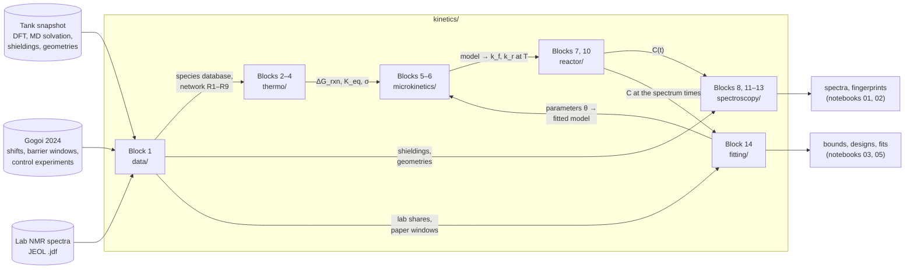
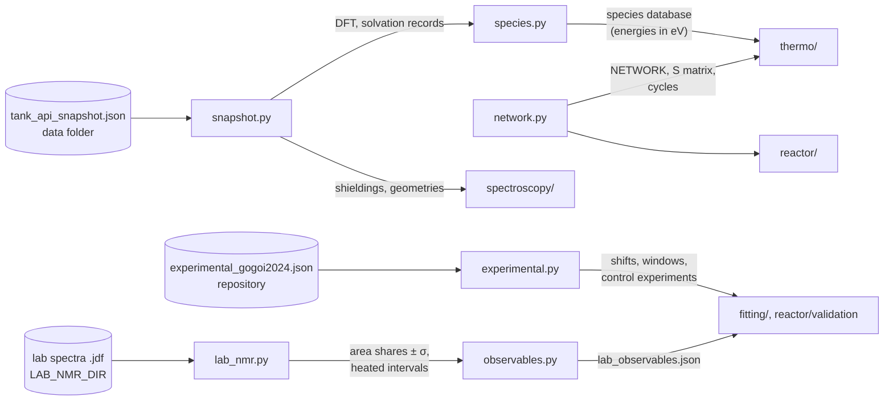
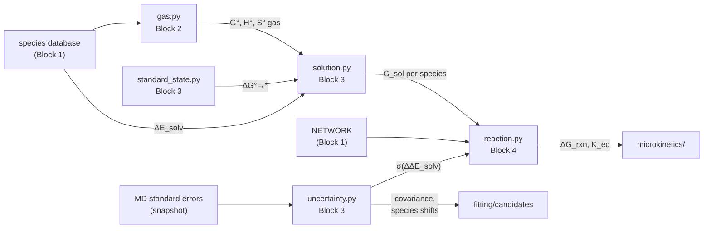
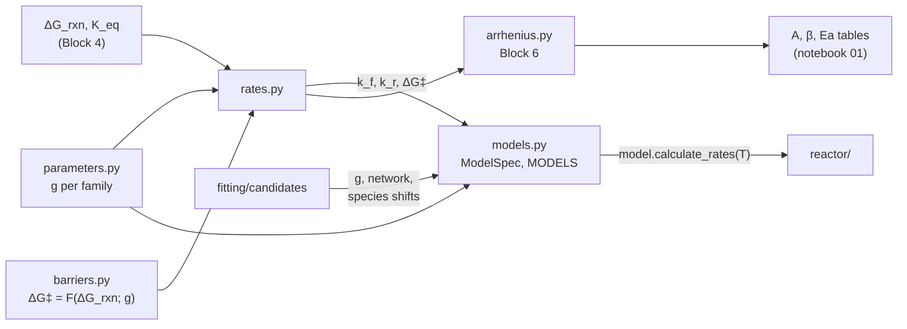
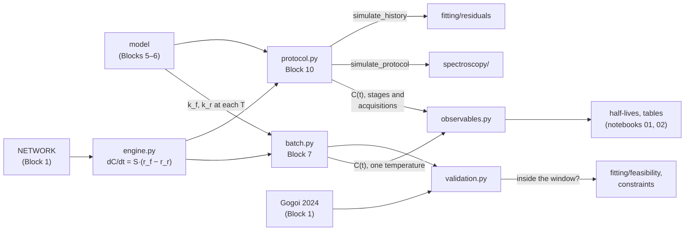
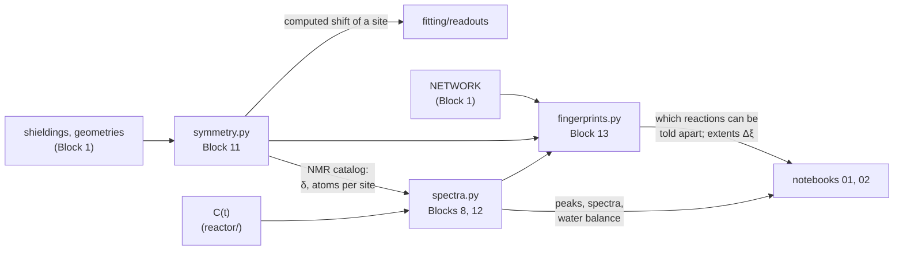
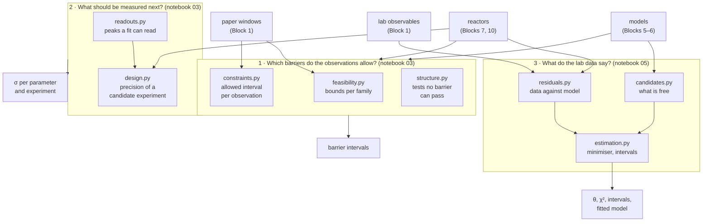
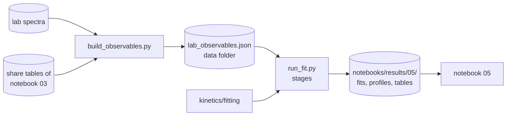

# atom-to-reactor: module reference

| | |
|---|---|
| **Status** | Current |
| **Source** | Y. Alcaraz Galván |
| **Scope** | Every module of the engine (`kinetics/`), the two runner scripts and the display layer: what each takes, what it returns and how the pieces connect. Written from the code. |
| **Applies to** | Branch `fit/first-fit`, 2026-10-07 |

**How to read it.** The document goes from the whole to the part, always in the same order:

1. One diagram of the whole project: the blocks and what passes between them.
2. One section per block, opening with a diagram of that block alone: its files and what passes between them.
3. One subsection per file, with its route and its public functions: input → output.

**Conventions.**

- A **block** is a stage of the engine. Block numbers belong to the engine and to the [theory document](docs/theory-multiscale_microkinetics.md); notebooks use their own section numbers.
- Functions whose name starts with `_` are internal and are not listed.
- Units are part of the names (`T_K`, `t_end_s`, `g_eV`, `C_M`). Verbs are fixed: `load_` reads a file, `build_` assembles a structure, `calculate_` evaluates a quantity, `simulate_` integrates in time, `find_` searches, `tabulate_`/`describe_` return a table.
- "Options" in an input column means keyword arguments with defaults; only the ones that change the result are named.
- The equations behind each block are in the [theory document](docs/theory-multiscale_microkinetics.md); the models the fit compares are in [reference-fit_models.md](docs/reference-fit_models.md); how a fit runs from start to end is in [reference-fitting_system.md](docs/reference-fitting_system.md).

---

## 0. The whole project

| Block | Folder | Takes | Gives | Shown in |
|---|---|---|---|---|
| 1 | [kinetics/data/](kinetics/data/) | The three data sources (snapshot, paper, lab spectra) | Species database, the network R1–R9, measured windows and shifts, lab observables | notebooks 01, 04 |
| 2–4 | [kinetics/thermo/](kinetics/thermo/) | Species database, network | G of each species in EC; ΔG_rxn, K_eq and their uncertainty per reaction | notebook 01 |
| 5–6 | [kinetics/microkinetics/](kinetics/microkinetics/) | ΔG_rxn, an intrinsic barrier `g` per reaction family | A named model (`ModelSpec`) that returns k_f and k_r at any temperature | notebook 01 |
| 7, 10 | [kinetics/reactor/](kinetics/reactor/) | A model, a composition, a temperature history | Concentrations over time; checks against the paper | notebooks 01, 02 |
| 8, 11–13 | [kinetics/spectroscopy/](kinetics/spectroscopy/) | Concentrations, computed shieldings | Synthetic NMR spectra; which reactions the spectra can tell apart | notebooks 01, 02 |
| 14 | [kinetics/fitting/](kinetics/fitting/) | Models, reactors, measured data | Barrier bounds, experiment designs, fitted parameters with intervals | notebooks 03, 05 |
| — | [scripts/](scripts/) | The engine | `lab_observables.json`; the fit result files | notebook 05 |
| — | [demo/](demo/) | Results of the engine | Figures and display tables (no science) | every notebook |

Block 9 (sensitivity of the time scale to the barrier) has no module of its own: it is the batch reactor of Block 7 run over a range of barriers, in notebook 01.

Two shared files sit beside the blocks: [kinetics/constants.py](kinetics/constants.py) and [kinetics/paths.py](kinetics/paths.py) (section 1).

---

## 1. Shared: constants and paths

### 1.1 constants.py · physical constants and unit conversions

**Route:** [kinetics/constants.py](kinetics/constants.py) · **Input:** none · **Output:** constants, imported by every block.

| Group | Names |
|---|---|
| Fundamental | `R_SI`, `KB_SI`, `KB_EV`, `H_SI`, `HBAR_SI`, `C_CM_S`, `NA` |
| Standard states | `T_STD_K` (298.15 K), `P_STD_PA` (1 bar), `C_STD_MOL_M3` (1 M), `ZERO_CELSIUS_K` |
| Conversions | `EV_TO_J`, `EV_TO_KJ_MOL`, `KJ_MOL_TO_EV`, `EV_TO_KCAL_MOL`, `HARTREE_TO_EV`, `AMU_TO_KG`, `ANGSTROM_TO_M` |

### 1.2 paths.py · where the data files are

**Route:** [kinetics/paths.py](kinetics/paths.py) · **Input:** the environment variables `ATOM_DATA_DIR` and `LAB_NMR_DIR` (shell or `.env`) · **Output:** paths, used by the loaders of Block 1.

| Function | Input | Output |
|---|---|---|
| `data_dir` | — | The data folder, or `None` when `ATOM_DATA_DIR` is not set |
| `data_path` | Path parts inside the data folder | The full path (a placeholder path when the variable is not set, so the loader's error says what to set) |
| `require_data_dir` | — | The data folder; raises when it is not set |
| `lab_nmr_dir` | — | The NMR spectra folder, or `None` |
| `require_lab_nmr_dir` | — | The NMR spectra folder; raises when not set or missing |

---

## 2. Block 1 · data: the inputs

### 2.1 snapshot.py · read-only access to the Tank snapshot

**Route:** [kinetics/data/snapshot.py](kinetics/data/snapshot.py) · **Input:** `tank_api_snapshot.json` (data folder) · **Output:** records per species. The snapshot is parsed once and shared: do not modify what these functions return.

| Function | Input | Output |
|---|---|---|
| `load_snapshot` | Optional path | The parsed JSON |
| `get_dataset_records` | Optional path | {species: gas-phase DFT record} |
| `get_solvation_records` | Optional path | {species: MD solvation record} |
| `get_structure` | Species | (elements, coordinates in Å) |
| `get_nmr_shieldings` | Species | Per-atom shielding records, or `[]` |
| `count_elements` | Species | Atom count per element |
| `calculate_molar_mass` | Species | Molar mass in g/mol |

### 2.2 species.py · species database

**Route:** [kinetics/data/species.py](kinetics/data/species.py) · **Input:** the snapshot · **Output:** one record per species with `mass_g_mol`, `G_gas_eV`, `H_gas_eV`, `E_scf_eV`, `dE_solv_eV`, `dE_solv_sigma_eV`.

| Function | Input | Output |
|---|---|---|
| `load_species_database` | Optional snapshot path | The database as an independent copy (safe to modify) |
| `resolve_species_database` | A database or `None` | The given database, else the shared read-only default |

### 2.3 network.py · the reaction network

**Route:** [kinetics/data/network.py](kinetics/data/network.py) · **Input:** none (declared in the file) · **Output:** `NETWORK` ({reaction: reactants, products, family}) and `NETWORK_SPECIES` (the 11 species).

| Function | Input | Output |
|---|---|---|
| `list_species` | A network | Its species, in order of first appearance |
| `build_stoichiometric_matrix` | Network, species list | S (species × reactions), products positive |
| `build_order_matrices` | Network, species list | Mass-action orders of the forward and reverse rates |
| `find_reaction_cycles` | Network | Reaction combinations with zero net change (the Wegscheider cycles) |
| `expand_stoichiometry` | {species: coefficient} | Species list with repeats |
| `format_equation` | One reaction | Text, e.g. `2 TMSOH ⇌ HMDSO + H2O` |

### 2.4 experimental.py · data from Gogoi et al. 2024

**Route:** [kinetics/data/experimental.py](kinetics/data/experimental.py) · **Input:** [data/experimental_gogoi2024.json](data/experimental_gogoi2024.json) · **Output:** measured shifts, barrier windows, control experiments, water series.

| Function | Input | Output |
|---|---|---|
| `load_experimental_data` | Optional path | The parsed file |
| `get_measured_shifts` | Optional nucleus | Table of measured shifts in ppm |
| `get_barrier_windows` | — | Table of ΔG‡ windows per reaction in eV |
| `get_water_series` | — | The water series: medium, samples, heating |

### 2.5 lab_nmr.py · the measured lab spectra

**Route:** [kinetics/data/lab_nmr.py](kinetics/data/lab_nmr.py) · **Input:** JEOL `.jdf` files (`LAB_NMR_DIR`) · **Output:** an inventory of the files, processed spectra, area shares with uncertainties.

| Function | Input | Output |
|---|---|---|
| `read_jdf` | Path of one `.jdf` | Title, nucleus, axis, data and acquisition parameters |
| `build_lab_nmr_inventory` | Root folder | One row per file with its acquisition settings |
| `calculate_spectrum` | An FID and its sweep, frequency and offset | Unphased complex spectrum and its ppm axis |
| `phase_spectrum` | Complex spectrum | Real spectrum after automatic phasing, and the two phases |
| `refine_window_phase` | ppm axis, spectrum, one window | Spectrum rotated to the best zero-order phase for that window |
| `load_spectrum` | Path. Options: `window_ppm` | ppm axis and real spectrum (FIDs are transformed and phased) |
| `load_text_spectrum` | Path of a Delta text export | ppm axis and intensity |
| `estimate_noise` | Intensity | Standard deviation of the signal-free edge |
| `calculate_window_integrals` | ppm, intensity, {window: (lo, hi)} | Area, height and position of the signal in each window |
| `calculate_area_shares` | ppm, intensity, windows, region | Share of the total area per window with `sigma_noise` and `sigma_baseline` |
| `tabulate_area_shares` | Inventory rows, windows, region | The shares of several spectra, one row per (spectrum, window) |
| `find_heated_windows` | Inventory rows of one sample | Clock intervals recorded above room temperature |

### 2.6 observables.py · the lab observables a fit reads

**Route:** [kinetics/data/observables.py](kinetics/data/observables.py) · **Input:** two share tables (³¹P, ¹³C), from the raw spectra or from the CSVs of notebook 03; the recipes and recorded histories declared in the file · **Output:** `lab_observables.json` (data folder): per sample its recipe, temperature history and shares.

| Function | Input | Output |
|---|---|---|
| `load_share_tables` | Optional folder | (³¹P table, ¹³C table) exported by notebook 03 |
| `load_lab_sample_folders` | Optional path | Which raw folders hold each sample |
| `build_lab_inventory_for_observables` | Root of the raw spectra | (³¹P table, ¹³C table, {sample: heated intervals}) |
| `build_lab_observables` | The two tables, `built_from`. Options: `heated_windows`, `strict` | The observables dict |
| `write_lab_observables` | Observables dict, optional path | The JSON file |
| `load_lab_observables` | Optional path | The observables dict (a fresh copy) |
| `list_spectrum_sets` | One sample record | [(nucleus, role, spectra)] |
| `tabulate_observable_shares` | Observables dict | One row per (sample, nucleus, spectrum, window) |
| `describe_lab_observables` | Observables dict | One row per sample: role, spectra, temperatures, times |
| `calculate_replicate_scatter` | Observables dict, sample | Scatter of repeated spectra against their noise (Birge ratio) |

---

## 3. Blocks 2–4 · thermo: free energies and reaction thermodynamics

Every function takes `thermo_mode`: `'wb97mv'` (stored ωB97M-V Gibbs energy at 298.15 K, the default) or `'qRRHO'` (statistical mechanics from frequencies; the snapshot has none, so it falls back to the stored value with a warning).

### 3.1 gas.py · gas-phase thermochemistry (Block 2)

**Route:** [kinetics/thermo/gas.py](kinetics/thermo/gas.py)

| Function | Input | Output |
|---|---|---|
| `check_thermo_mode` | A mode name | Raises if it is not a known mode |
| `calculate_gas_thermo` | Species, `T_K`. Options: `thermo_mode`, `nu0_cm1` | H°, S° and G° of the gas-phase species (kJ/mol, J/(mol·K), eV) |

### 3.2 standard_state.py · from 1 bar gas to 1 M solution (Block 3)

**Route:** [kinetics/thermo/standard_state.py](kinetics/thermo/standard_state.py)

| Function | Input | Output |
|---|---|---|
| `calculate_standard_state_shift` | `T_K` | ΔG°→* = RT ln(c\*/c°_gas) in kJ/mol (+7.96 at 298.15 K) |

### 3.3 solution.py · free energy in EC (Block 3)

**Route:** [kinetics/thermo/solution.py](kinetics/thermo/solution.py)

| Function | Input | Output |
|---|---|---|
| `calculate_solution_gibbs` | Species, `T_K`. Options: `thermo_mode` | G, H and S of the solvated species: G_sol = G°_gas + ΔE_solv (+ ΔG°→* in `'qRRHO'` mode) |

### 3.4 uncertainty.py · solvation uncertainty and energy corrections (Block 3)

**Route:** [kinetics/thermo/uncertainty.py](kinetics/thermo/uncertainty.py) · The pure-EC reference run is shared by every species, so its error cancels in the 2 → 2 reactions. Corrections are applied per species, never per reaction, so the Wegscheider cycles stay closed.

| Function | Input | Output |
|---|---|---|
| `calculate_solvation_sigma_components` | Optional solvation records | {species: (σ of the solute, σ of the shared solvent term)} |
| `calculate_solvation_sigma` | Reactants, products | Standard error of ΔΔE_solv of one reaction, in eV |
| `calculate_solvation_covariance` | Reaction ids | Covariance of ΔΔE_solv between reactions, in eV² |
| `calculate_solvation_sigma_naive` | Reactants, products | σ from adding the species totals in quadrature (an overestimate, for comparison) |
| `calculate_species_shifts` | {reaction: ΔG shift in eV}. Options: `species_sigma_eV`, `keep_others` | {species: shift in eV}, the smallest set that moves those reactions |
| `build_shifted_species_database` | {species: shift in eV} | A species database with those solvation energies moved |

### 3.5 reaction.py · reaction thermodynamics (Block 4)

**Route:** [kinetics/thermo/reaction.py](kinetics/thermo/reaction.py)

| Function | Input | Output |
|---|---|---|
| `calculate_reaction_thermo` | Reaction id, `T_K` | ΔH, ΔS, ΔG and K_eq of one reaction in EC |
| `calculate_network_thermo` | `T_K` (default 298.15 K) | One row per reaction: gas-phase ΔG, ΔΔE_solv ± σ, ΔG_rxn, K_eq |
| `calculate_cycle_residuals` | {reaction: ΔG_rxn} | [(cycle, Σ ΔG around it)]; zero when the energies are consistent |

---

## 4. Blocks 5–6 · microkinetics: rate constants and named models

The chain for one reaction at temperature T: the family gives the intrinsic barrier `g`; the barrier shape turns `g` and ΔG_rxn into ΔG‡; Eyring gives k_f; detailed balance gives k_r = k_f / K_eq.

### 4.1 barriers.py · barrier shapes (Block 5)

**Route:** [kinetics/microkinetics/barriers.py](kinetics/microkinetics/barriers.py) · Pure functions: `x` is ΔG_rxn in eV, `g` the intrinsic barrier in eV. Each returns (ΔG‡ forward in eV, effective slope α).

| Function | Input | Output |
|---|---|---|
| `bep_cap` | `x`, `g`, `alpha` | max(g, g + α·x). The legacy form; depends on the direction a reaction is written |
| `marcus` | `x`, `g` | g + x/2 + x²/(16g) |
| `agmon_levine` | `x`, `g` | x + (g/ln 2)·ln[1 + exp(−x·ln 2/g)] |
| `blowers_masel` | `x`, `g`, `w` | Blowers–Masel barrier; tends to Marcus for large `w` |
| `two_parabola` | `x`, `g`, `alpha0` | Crossing of two parabolas of unequal curvature; α(0) = `alpha0` |
| `reversed_params` | A family parameter dict | The parameters of the reversed reaction |
| `calculate_barrier` | `x`, shape name, `g`. Options: work terms `wR_eV`, `wP_eV` | (ΔG‡ forward, α) for any shape. This is what rates.py calls |
| `invert_marcus_barrier` | An observed ΔG‡ and `x` | The `g` that reproduces it under Marcus |

### 4.2 parameters.py · parameter sets per reaction family (Block 5)

**Route:** [kinetics/microkinetics/parameters.py](kinetics/microkinetics/parameters.py) · **Output:** the declared sets `REFERENCE_BEP_PARAMETERS`, `FAMILY_BEP_PARAMETERS`, `LEVEL1_PARAMETERS`. Keys per family: `g_eV`, `alpha`, `shape`, `T_ref_K`, `dS_act_J_mol_K`, `alpha0`, `w_eV`, `wR_eV`, `wP_eV`.

| Function | Input | Output |
|---|---|---|
| `normalize_family_params` | One family entry | The entry with defaults filled in; unknown keys raise |
| `resolve_family_params` | Reaction family, a parameter set, a fallback set | The normalised entry that applies to that family |

### 4.3 rates.py · rate constants (Block 5)

**Route:** [kinetics/microkinetics/rates.py](kinetics/microkinetics/rates.py) · `kinetic_model` is one of `'bep_eyring'`, `'marcus_eyring'`, `'agmon_levine'`, `'blowers_masel'`, `'two_parabola'`, `'level1'`.

| Function | Input | Output |
|---|---|---|
| `calculate_rate_constants` | Reaction id, `T_K`. Options: `kinetic_model`, `family_params`, `network`, `species_db`, `viscosity_Pa_s` | k_f, k_r, K_eq, ΔG_rxn and both barriers of one reaction |
| `calculate_eyring_rate` | ΔG‡ in eV, `T_K` | k = (k_B·T/h)·exp(−ΔG‡/k_B·T) |
| `calculate_network_rates` | `T_K`, the same options | The same for every reaction, one row each |

### 4.4 models.py · the model registry (Block 5)

**Route:** [kinetics/microkinetics/models.py](kinetics/microkinetics/models.py) · **Output:** `MODELS`, the four registered models: `reference_bep`, `family_bep`, `family_marcus`, `level1`.

| Name | Input | Output |
|---|---|---|
| `ModelSpec` | `name`, `label`, `kinetic_model`, `family_params`. Optional: `thermo_mode`, `status`, `assumptions`, `network`, `species_shifts_eV` | One model: everything a reactor needs to get rate constants |
| `ModelSpec.calculate_rates` | `T_K` | Rate table of every reaction at that temperature |
| `ModelSpec.with_barrier` | `g_eV`, optional families | A copy with that intrinsic barrier |
| `ModelSpec.with_family_params` | A family and the keys to change | A copy with those parameters changed |
| `get_model` | A registry name or a `ModelSpec` | The `ModelSpec` |
| `describe_models` | Optional list of models | Overview table: kinetics, barriers, status, assumptions |
| `tabulate_family_barriers` | Optional list of models | The intrinsic barrier each model gives each family |

### 4.5 arrhenius.py · k(T) in modified-Arrhenius form (Block 6)

**Route:** [kinetics/microkinetics/arrhenius.py](kinetics/microkinetics/arrhenius.py) · With a temperature-independent barrier the fit returns its own inputs (β = 1, Ea = ΔG‡): it is a consistency check, not a validation.

| Function | Input | Output |
|---|---|---|
| `fit_modified_arrhenius` | Reaction id, temperature grid. Options: `direction`, rate options | A, β, Ea and R² of k_f or k_r |
| `build_arrhenius_table` | Temperature grid, rate options | Forward and reverse parameters of every reaction |

---

## 5. Blocks 7 and 10 · reactor: concentrations over time

Three reactors share one engine. They differ only in the temperature history:

| Reactor | History | Called by |
|---|---|---|
| `simulate_batch_reactor` | One temperature | Notebook 01, the control experiments, experiment design |
| `simulate_protocol` | The bench recipe and its heating steps | Notebook 02 |
| `simulate_history` | Any sequence of isothermal segments, state returned at chosen times | The fit |

### 5.1 engine.py · the mass-action ODE system

**Route:** [kinetics/reactor/engine.py](kinetics/reactor/engine.py)

| Name | Input | Output |
|---|---|---|
| `MassActionSystem` | Network, species list, optional buffered concentrations | The ODE system of that network |
| `MassActionSystem.calculate_net_rates` | C, k_f, k_r | Net rate of every reaction in M/s |
| `MassActionSystem.rhs`, `.jacobian` | t, C, k_f, k_r | dC/dt and its analytic Jacobian |
| `MassActionSystem.integrate` | c0, k_f, k_r, output times. Options: `method`, `rtol`, `atol`, `max_rhs_calls` | The `solve_ivp` solution; raises `IntegrationBudgetExceeded` beyond the call budget |
| `calculate_element_totals` | C over time, species | {element: total concentration over time} (Si and P balances) |

### 5.2 batch.py · isothermal batch reactor (Block 7)

**Route:** [kinetics/reactor/batch.py](kinetics/reactor/batch.py)

| Function | Input | Output |
|---|---|---|
| `simulate_batch_reactor` | `c0_M` ({species: M}). Options: `T_K`, `t_end_s`, `model`, `buffered_species` | Time grids, `C_M` (species × times), `species`, `idx`, element balances, `success` |

### 5.3 protocol.py · protocol reactor and sample histories (Block 10)

**Route:** [kinetics/reactor/protocol.py](kinetics/reactor/protocol.py)

| Function | Input | Output |
|---|---|---|
| `calculate_recipe_molarities` | Water and TMSPA volume fractions | Molarities of the stock and after adding TMSPA, the dilution factor, a summary table |
| `build_protocol_schedule` | Hold temperatures and durations | The list of `Stage`s and their timetable (t = 0 at TMSPA addition) |
| `simulate_protocol` | Stages, recipe. Options: `model` | Time grids, concentrations, the temperature program and the state at each NMR acquisition |
| `simulate_history` | `c0_M`, segments ((T_K, duration_s), ...), sample times, `model`. Options: solver settings, `max_rhs_calls` | `C_M` at the sample times, `species`, `idx`, `success`, `message`. Never raises: a failed run returns `success = False` |

### 5.4 observables.py · numbers read off a run

**Route:** [kinetics/reactor/observables.py](kinetics/reactor/observables.py)

| Function | Input | Output |
|---|---|---|
| `find_crossing_time` | t, y, a level | First time y falls to that level |
| `calculate_worst_case_pressure_bar` | Dissolved gas concentration, liquid and gas volumes, `T_K` | Headspace pressure if all the gas left the liquid (an upper bound) |
| `summarize_batch_runs` | {name: batch result} | Per run: TMSPA half-life, water consumption, peak TMSOH, final CO2 and HMDSO |
| `tabulate_acquisitions` | A protocol result | Composition in mM at each NMR acquisition |
| `calculate_remaining_fraction` | A protocol result, a species | Fraction of that species left at each acquisition |
| `tabulate_trajectory` | Any reactor result | Concentrations of every species over time, for export |

### 5.5 validation.py · the models against the paper

**Route:** [kinetics/reactor/validation.py](kinetics/reactor/validation.py) · **Input:** the control experiments and the water series of Gogoi 2024 · **Output:** predicted observable against observed window.

| Function | Input | Output |
|---|---|---|
| `simulate_control_experiment` | One control experiment, a model | The value of its observable at the end |
| `is_within_window` | A value, low, high | True if inside (an open side is `None`) |
| `evaluate_control_experiments` | A list of models. Options: `experiments` | One row per (experiment, model): predicted value, window, verdict |
| `calculate_water_series_c0` | Water vol% | Initial concentrations of that water-series sample |
| `calculate_phosphate_fractions` | `C_M`, `idx` | Fraction of all P in each phosphate |
| `simulate_phosphate_path` | `c0_M`, a model | The phosphate fractions along an isothermal run |
| `evaluate_water_series` | A list of models | Per (model, time): fractions per sample and which windows hold |
| `evaluate_heating_observation` | A list of models | The 2 vol% sample at room temperature and after heating, against its windows |

---

## 6. Blocks 8, 11–13 · spectroscopy: from concentrations to spectra

All shifts here are computed, not measured: they place peaks but carry no kinetic information.

### 6.1 symmetry.py · chemical shifts from shieldings (Block 11)

**Route:** [kinetics/spectroscopy/symmetry.py](kinetics/spectroscopy/symmetry.py)

| Function | Input | Output |
|---|---|---|
| `build_bond_graph` | Elements, coordinates | Bond adjacency matrix |
| `find_equivalence_classes` | Elements, adjacency matrix | A class label per atom (equivalent atoms share one) |
| `extract_shielding_sites` | Species, element | [(mean shielding, atoms, labile)] per class |
| `build_nmr_catalog` | Optional species and nuclei. Options: `labile_shift_ppm` | {element: {species: [(δ in ppm, atoms, labile)]}}, referenced to TMS or H₃PO₄ |

### 6.2 spectra.py · synthetic spectra and the water balance (Blocks 8, 12)

**Route:** [kinetics/spectroscopy/spectra.py](kinetics/spectroscopy/spectra.py)

| Function | Input | Output |
|---|---|---|
| `lorentzian` | Axis, centre, width | A Lorentzian of unit height |
| `calculate_nmr_peaks` | Element, `C_M`, species index | [(label, shift over time, intensity over time)], with the OH protons merged into one exchange peak |
| `simulate_nmr_spectra` | Element, `C_M`, species index, ppm axis. Options: `fwhm_ppm` | Spectra (times × ppm) |
| `find_shift_windows` | A list of shifts | Display windows that group them |
| `calculate_water_mass_balance` | `C_M`, species index, initial water | Water from the OH balance, direct water, the OH carriers |

### 6.3 fingerprints.py · which reactions the spectra can tell apart (Block 13)

**Route:** [kinetics/spectroscopy/fingerprints.py](kinetics/spectroscopy/fingerprints.py)

| Function | Input | Output |
|---|---|---|
| `find_visible_species` | Optional species and catalog | Species with at least one non-labile site |
| `build_feature_space` | Visible species. Options: `nuclei` | `FeatureSpace`: the joined ppm axis of all nuclei |
| `build_pure_spectra` | Visible species, feature space | The spectrum of each pure species per mM |
| `build_reaction_fingerprints` | Network, visible species, pure spectra, feature space | The spectral change of each reaction, raw and normalised |
| `analyze_reaction_identifiability` | Fingerprints, reaction labels, feature space | The independent reactions, the lumped ones (e.g. `R1 ⊕ R5`), selectivity per nucleus |
| `recover_reaction_extents` | Spectral differences, the basis, weights | Extents Δξ in mM of the basis reactions |
| `run_fingerprint_analysis` | Optional network, species, catalog | All of the above in one call |
| `simulate_acquisition_spectra` | A protocol result, an analysis. Options: `noise_rel` | The joined spectra at injection and at every acquisition |

---

## 7. Block 14 · fitting: bounds, experiment design and the fit

The block answers three questions in order, and each has its own files:

How a fit runs from the first stage to the last, the scenarios, the fit rule and the result files are described in [reference-fitting_system.md](docs/reference-fitting_system.md). This section lists the functions.

### 7.1 feasibility.py · bounds on the family barriers

**Route:** [kinetics/fitting/feasibility.py](kinetics/fitting/feasibility.py) · **Input:** a model and the control experiments of Gogoi 2024 · **Output:** the interval of `g` each family may take. Used by notebook `03_experiment_plan`.

| Function | Input | Output |
|---|---|---|
| `get_family_parameter` | Model, family, key | The value of that parameter in the model |
| `scan_family_barriers` | Model. Options: grid of `g`, families, experiments | One row per (family, g, experiment) with `consistent` |
| `find_barrier_bounds` | Model. Options: a scan, tolerance | One row per bound (`g ≥` or `g ≤`), refined by bisection |
| `summarize_feasible_intervals` | Bounds, scan | Per family: the feasible interval and the experiments that set its ends |
| `project_bounds_to_entropy` | Bounds, family, a grid of ΔS‡ | The bounds as lines in the (ΔS‡, g) plane |

### 7.2 constraints.py · what each observation allows

**Route:** [kinetics/fitting/constraints.py](kinetics/fitting/constraints.py) · **Input:** observations (a mixture, a temperature, a time interval, windows on observables) and a model · **Output:** the barrier interval each observation allows, and what is left when all must hold. Used by notebook `03_feasible_region`.

| Function | Input | Output |
|---|---|---|
| `build_share_window` | A share, its σ, a side | (low, high) window, k standard errors wide |
| `build_observation` | Id, label, `c0_M`, `T_K`, time interval, windows, provenance | One observation in the common format |
| `observations_from_controls` | Optional experiments | The control experiments as observations |
| `select_observations` | Observations, a family | Those that probe that family |
| `describe_observations` | Observations | Display table |
| `replace_observation` | An observation and the fields to change | A changed copy |
| `evaluate_observation` | An observation, a model | `consistent`, `violation`, the best time and the values there |
| `scan_barrier` | Model, one barrier, observations. Options: grid | One row per (g, observation) with `consistent` |
| `find_allowed_intervals` | Model, one barrier, observations | Per observation, the interval it allows, edges refined |
| `intersect_intervals` | The intervals table | The interval left when every observation must hold |
| `summarize_region` | The intervals table | One line: the interval left, or which observations exclude each other |
| `trace_boundaries` | Model, two barriers with their grids, observations | The edge of each observation's region in the plane of the two barriers |

### 7.3 structure.py · tests of the model structure

**Route:** [kinetics/fitting/structure.py](kinetics/fitting/structure.py) · **Input:** measured shares, recipes, heating histories · **Output:** statements that hold whatever the barriers are (stoichiometry and thermodynamics only). Used by notebook `03_feasible_region`.

| Function | Input | Output |
|---|---|---|
| `calculate_released_silyl_M` | Phosphate shares, initial TMSPA | Concentration of TMS groups released |
| `calculate_path_distance` | A simulated composition path, measured shares and σ | Closest approach of the path to the measurement |
| `calculate_equilibrium_locus` | Phosphate shares, initial TMSPA and water, `T_K` | The ΔG_rxn of R2, R3 and R4 for which that composition is an equilibrium |
| `find_closest_on_locus` | The locus, computed ΔG_rxn and their covariance | The point of the locus closest to the computed values, in standard errors |
| `calculate_rt_equivalent_hours` | A heating table, barriers, `T_ref_K` | Hours at room temperature worth the same progress |
| `calculate_required_water_M` | Converted TMSPA, liquid density | The water needed, in M and in ppm |

### 7.4 readouts.py · the NMR peaks a fit can read

**Route:** [kinetics/fitting/readouts.py](kinetics/fitting/readouts.py) · **Input:** the measured shifts of Gogoi 2024 and the stored geometries · **Output:** which species contribute to each measured peak, and with how many nuclei.

| Function | Input | Output |
|---|---|---|
| `find_site_atoms` | Species, nucleus, site | Indices of the atoms at that site |
| `calculate_site_dft_shift` | Species, nucleus, site | Its computed shift in ppm (for comparison only) |
| `build_nmr_readouts` | Optional nuclei | {nucleus: {peak: {species: nuclei per molecule}}} |
| `find_unread_species` | Nucleus | Species that carry the nucleus but have no measured shift |
| `find_reachable_species` | `c0_M` | Species that can be present from that starting mixture |
| `tabulate_readout_evidence` | Optional nuclei | One row per measured shift: its peak, nuclei, computed shift |

### 7.5 design.py · what a candidate experiment would determine

**Route:** [kinetics/fitting/design.py](kinetics/fitting/design.py) · **Input:** a composition, a temperature program, acquisition times; a model; the parameters to determine · **Output:** the smallest standard error a fit of that experiment could reach (Fisher information). Used by notebook `03_experiment_plan`.

| Name | Input | Output |
|---|---|---|
| `ExperimentDesign` | `name`, `label`, `c0_M`, `segments`, `sampling_h`, `purpose` | One candidate experiment |
| `build_composition` | EC and solute concentrations | {species: M} for every network species |
| `build_in_situ_design` | Name, `c0_M`, segments. Options: nuclei, dead time | A design recorded in the magnet at the reaction temperature |
| `build_isothermal_design` | Name, `c0_M`, `T_C`, duration | The same at one temperature |
| `build_step_design` | Name, `c0_M`, hold temperatures | Holds at rising temperature, each followed by one acquisition |
| `calculate_readouts` | `C_M`, `idx`, nucleus | {peak: concentration of the nucleus in it} |
| `simulate_design` | A design, a model | The trajectory and the readouts at every acquisition |
| `split_family_by_reaction` | A model, a family | (model, network, new families) with one class per reaction |
| `add_readout_noise` | A simulated design | The readouts plus Gaussian noise (a synthetic measurement) |
| `describe_designs` | Designs | One row per design: purpose, composition, program, spectra |
| `calculate_design_information` | A design, a model, parameters | Sensitivities of the readouts and the Fisher information |
| `calculate_parameter_precision` | Information, parameters. Options: `prior_sigma` | (σ per parameter, correlation matrix) |
| `compare_designs` | Designs, a model, parameters. Options: `combinations` | σ of every parameter per design and per combination |
| `scan_design_precision` | Designs, a model, parameters, the true values to assume | σ per (design, assumed truth, parameter) |
| `calculate_half_life_map` | A model, `c0_M`, a family, grids of `g` and T | Half-life in hours per (g, T) |
| `calculate_eyring_precision` | Sets of temperatures, σ of a barrier | Precision of ΔH‡ and ΔS‡ |
| `calculate_barrier_error_budget` | A barrier, `T_C`. Options: temperature and concentration errors | Systematic errors on that barrier |

### 7.6 residuals.py · the lab data against a model

**Route:** [kinetics/fitting/residuals.py](kinetics/fitting/residuals.py) · **Input:** the lab observables, a scenario of the unknown sample ages, a model · **Output:** the residual vector r, with χ² = Σr². Constants: `SCENARIOS` (`short`, `middle`, `long`, `free`), `SCENARIO_AGES_H`, `SEARCH_SOLVER`, `REPORT_SOLVER`.

| Function | Input | Output |
|---|---|---|
| `build_sample_set` | Observables, scenario. Options: `roles`, `exclude`, `paper`, `floor_scale`, `overrides` | The list of samples a model is compared with |
| `build_sample_history` | One sample, optional age | (temperature segments from mixing, spectrum times since mixing) |
| `calculate_predicted_shares` | One sample, a model. Options: `age_h`, `water_fraction`, `solver` | The predicted shares per block, or `None` if the simulation fails |
| `calculate_residuals` | A model, samples. Options: `ages`, `water_fraction`, `return_details` | The whitened residual vector |
| `find_free_age` | A model, samples | {sample: the age that model prefers} (free scenario) |
| `tabulate_residuals` | A model, samples | One row per measured quantity with z = (predicted − measured)/σ |
| `summarize_residuals` | Residual vector, optional table | χ², number of residuals, the largest \|z\| and where |
| `copy_sample_set` | Samples | An independent copy |

### 7.7 candidates.py · what is free in each model

**Route:** [kinetics/fitting/candidates.py](kinetics/fitting/candidates.py) · **Input:** a structure name and a parameter set θ · **Output:** a self-contained model. `FIT_STRUCTURES` holds `M0-BEP`, `M0-Marcus`, `M1`, `M1-split`, `M3`, `M3-split`; adding `+W` to a name frees the water fraction. The models are defined in [reference-fit_models.md](docs/reference-fit_models.md).

| Name | Input | Output |
|---|---|---|
| `FitParameter` | `name`, `kind`, `target`, `lower`, `upper`, `unit` | One free parameter and its search box |
| `FitStructure` | `name`, `base_model`, `shared_barrier`, `split`, `freed`, `water` | One candidate structure |
| `FitStructure.parameters` | The sample set | The free parameters, in the order of the parameter vector |
| `FitStructure.build` | θ as {name: value} | `model` (a `ModelSpec`), `ages`, `water_fraction`, `prior` (residuals of the freed energies) |
| `FitStructure.with_water`, `.with_shape` | —, a shape name | The same structure with free water, or with another barrier shape |
| `get_structure` | A name, `NAME+W`, or a structure | The `FitStructure` |
| `embed_parent_theta` | A structure and the θ of the structure it extends | A θ of the larger structure that reproduces the smaller fit (a starting point) |
| `scale_energy_prior` | Structure, built dict, θ, a scale | The built dict with the energy constraint rescaled |
| `tabulate_reaction_barriers` | Structure, θ | Per reaction: ΔG‡, ΔG_rxn and k_f at the temperature where it is observed |
| `build_fitted_model` | A fit result | A `ModelSpec` with status `fitted`, usable by any reactor |

### 7.8 estimation.py · the minimiser and what it can and cannot determine

**Route:** [kinetics/fitting/estimation.py](kinetics/fitting/estimation.py) · **Input:** a structure and a sample set · **Output:** best fit, profile intervals, leave-one-out, parameter combinations. Fit rule: a structure fits a scenario if no \|z\| exceeds 3.

| Name | Input | Output |
|---|---|---|
| `FitProblem` | Structure, samples. Options: `solver`, `fixed`, `prior_scale` | The problem: parameter names, box, and `residuals(x)`, `chi2(x)`, `table(x)`, `build(x)` |
| `fit_structure` | A problem. Options: `n_screen`, `n_starts`, `start_points`, `seed_values`, `workers` | The fit: `theta`, `chi2`, `max_abs_z`, `fits`, `table`, `ages`, `local_optima`, `at_bounds` |
| `build_profile_grid` | Problem, θ, a parameter | The grid of that parameter around its best value |
| `calculate_profile` | Problem, fit, parameters. Options: `grids` | One row per (parameter, value): χ² re-minimised over the others |
| `get_profile_theta` | One profile row | The parameter set stored in it |
| `extend_profile` | Problem, profile, other starting sets | The profile with the lower χ² kept at each point (several basins) |
| `add_profile_points` | Profile, local optima | The profile with the accepted optima added |
| `refine_profile_edges` | Problem, profile | The profile with extra points where an interval ends |
| `find_confidence_interval` | Profile, a parameter. Options: `delta` (3.84) | `best`, `low`, `high`, `status` (an open side stays open) |
| `calculate_parameter_directions` | Problem, θ | The parameter combinations the data determine, and those they do not |
| `fit_leave_one_out` | Structure, {sample: sample set without it}, the full fit | {left-out sample: fit} |
| `compare_structures` | {label: fit} | One row per fit: χ², largest \|z\|, the fit rule, AICc |
| `simulate_synthetic_shares` | Structure, θ, samples. Options: `seed` | A sample set whose shares are the model's prediction plus noise |
| `calculate_prediction_band` | A function of θ, a list of θ | The range of that prediction over the parameter sets |
| `write_fit_result`, `load_fit_result` | A result dict and a path; a path | The JSON file; the result with its tables restored |

---

## 8. Runners

### 8.1 build_observables.py · write the lab observables file

**Route:** [scripts/build_observables.py](scripts/build_observables.py)

| Command | Input | Output |
|---|---|---|
| `python scripts/build_observables.py` | The two share tables exported by notebook 03 | `lab_observables.json` in the data folder |
| `... --from-raw` | The raw spectra (`LAB_NMR_DIR`) | The same file, with shares and heating episodes recomputed and the ¹³C spectra of the phosphate tubes included |
| `... --out PATH` | — | Writes to another path |

### 8.2 run_fit.py · the staged fit

**Route:** [scripts/run_fit.py](scripts/run_fit.py) · `python scripts/run_fit.py STAGE [--workers N] [--results DIR] [--quick]`. Every job writes one file and is skipped when that file exists, so a stage can be stopped and started again. The stages, their inputs and their files are in [reference-fitting_system.md](docs/reference-fitting_system.md), section 4.

| Stage | Does |
|---|---|
| `registered` | Evaluates the four registered models as they are |
| `throughput` | Measures evaluations per second on this machine |
| `recovery` | Refits synthetic data with a known answer (the check of the pipeline) |
| `baselines` | Fits M0-BEP, M0-Marcus and M1 |
| `extended` | Fits M1-split, M3 and M3-split |
| `refit` | Re-checks M3 and M3-split at a tighter tolerance |
| `night` | Profiles, leave-one-out, indistinguishability, sensitivities |
| `traces` | Tests a trace of TMSOH at mixing |
| `predictions` | Hold-out samples, checks, storage at 25 °C, the bench protocol |

---

## 9. Display layer

**Route:** [demo/](demo/) · **Input:** results of the engine · **Output:** figures and formatted tables. Nothing here computes science.

| File | Draws | For |
|---|---|---|
| [style.py](demo/style.py) | Shared colours, line styles and axis helpers | every figure |
| [tables.py](demo/tables.py) | Display tables (`format_*`) | every notebook |
| [thermo_plots.py](demo/thermo_plots.py) | Species free energies, driving forces, Wegscheider cycles, f(T) | Blocks 2–4, notebook 01 |
| [rate_plots.py](demo/rate_plots.py) | Barrier models compared, k(T), Arrhenius | Blocks 5–6, notebook 01 |
| [reactor_plots.py](demo/reactor_plots.py) | Concentration panels, model overlays, control experiments, barrier sensitivity | Blocks 7, 10, notebooks 01, 02 |
| [nmr_plots.py](demo/nmr_plots.py) | Stacked spectra, peak tracking, water balance, shift parity | Blocks 8, 11–12, notebooks 01, 02 |
| [fingerprint_plots.py](demo/fingerprint_plots.py) | Nucleus selectivity, recovery of reaction extents | Block 13, notebook 02 |
| [lab_nmr_plots.py](demo/lab_nmr_plots.py) | Acquisition timeline, measured spectra, processing check | Block 1, notebook 04 |
| [design_plots.py](demo/design_plots.py) | Feasibility scan, entropy constraints, half-life maps, design precision | Block 14, notebook `03_experiment_plan` |
| [fitting_plots.py](demo/fitting_plots.py) | Allowed intervals, boundary maps, time scenarios, structure tests | Block 14, notebook `03_feasible_region` |
| [fit_plots.py](demo/fit_plots.py) | Residual maps, parameters across scenarios, profiles, recovery, predictions | Block 14, notebook 05 |
