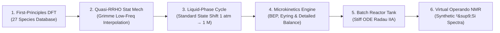

# atom-to-reactor: Multiscale Microkinetics, Operando Spectroscopy & Reactor Dynamics

> [!CAUTION]
> **PROJECT STATUS: EARLY EXPERIMENTAL STAGE**  
> This repository is in an early stage of development. The codebase **contains known errors, unverified logic, and has not undergone deep rigorous validation**.  
>  
> * **DO NOT use in production** or rely on it for critical workflows/decision-making.  
> * Results, APIs, and implementations are subject to breaking changes and major corrections without notice.  

[](https://www.python.org/)
[]()
[]()

A multiscale chemical engineering simulation platform linking **first-principles quantum chemistry (DFT)** to **macroscopic batch reactor kinetics** and **operando $^{29}\text{Si}$ NMR spectroscopy**. Developed as part of the **BatteryAsTank** master's thesis project at Uppsala University.

---

## Multiscale Architecture



---

## Chemical System: TMSPA Scavenging Mechanism

In lithium-ion batteries using $\text{LiPF}_6$ in alkyl carbonate solvents, trace water contamination ($10\text{--}50\text{ ppm}$) triggers autocatalytic hydrolysis:

$$\text{LiPF}_6 \rightleftharpoons \text{LiF} + \text{PF}_5$$
$$\text{PF}_5 + \text{H}_2\text{O} \longrightarrow \text{POF}_3 + 2\,\text{HF}$$

The generated hydrofluoric acid ($\text{HF}$) dissolves the solid electrolyte interphase (SEI) and corrodes cathode active materials.

**Tris(trimethylsilyl) phosphite / phosphate (TMSPA)** acts as an electrochemically active sacrificial scavenger. Through oxophilic nucleophilic substitution at the silicon centers, TMSPA consumes moisture and acidic fluoride species:

$$\text{P-O-SiMe}_3 + \text{H}_2\text{O} \longrightarrow \text{P-O-H} + \text{Me}_3\text{Si-OH (TMSOH)}$$
$$2\,\text{Me}_3\text{Si-OH} \rightleftharpoons \text{Me}_3\text{Si-O-SiMe}_3 \text{ (HMDSO)} + \text{H}_2\text{O}$$
$$\text{Me}_3\text{Si-OH} + \text{HF} \longrightarrow \text{Me}_3\text{Si-F (TMSF)} + \text{H}_2\text{O}$$

This platform models the non-linear coupling, reaction rates, and species evolution across variable operating temperatures.

---

## Theoretical Framework & Key Equations

### 1. Quasi-Harmonic Statistical Mechanics (Quasi-RRHO)
To avoid the divergence of vibrational entropy for low-frequency torsional modes ($\omega \to 0$), vibrational entropy is evaluated using Stefan Grimme's interpolation (2012) between a harmonic oscillator and a free rotor:

$$S_{\text{qRRHO}} = \sum_i \left[ w(\omega_i) S_{\text{vib}}(\omega_i) + (1 - w(\omega_i)) S_{\text{rotor}}(\omega_i) \right]$$

$$w(\omega) = \frac{1}{1 + \left(\omega_0 / \omega\right)^4}, \quad \omega_0 = 100\text{ cm}^{-1}$$

### 2. Standard-State Shift & Solvation Cycle
Conversion from ideal gas standard state ($P^\circ = 1\text{ bar}$) to standard solution concentration ($C^* = 1.0\text{ M}$):

$$\Delta G^*_{\text{shift}} = R T \ln\left(\frac{R T C^*}{P^\circ}\right) = R T \ln(24.7895) \approx +1.89\text{ kcal/mol at } 298.15\text{ K}$$

$$\Delta G^*_{\text{solv, net}} = \Delta G^\circ_{\text{gas}}(T) + \Delta \Delta G_{\text{solv}} + \Delta n \cdot \Delta G^*_{\text{shift}}$$

### 3. Transition State Theory & Microscopic Reversibility
Forward and backward rate constants satisfy the Eyring rate equation and strict detailed balance:

$$k_{\text{fwd}}(T) = \kappa \frac{k_B T}{h} \exp\left(-\frac{\Delta G^\ddagger(T)}{R T}\right), \quad \frac{k_{\text{fwd}}(T)}{k_{\text{rev}}(T)} = K_{\text{eq}}(T) = \exp\left(-\frac{\Delta G^\circ_{\text{rxn}}(T)}{R T}\right)$$

Activation free energies are coupled to reaction thermodynamics via the Bell-Evans-Polanyi (BEP) principle:

$$\Delta G^\ddagger = E_0 + \alpha \, \Delta G^\circ_{\text{rxn}}$$

An opt-in **Level 1 engine** (`kinetic_model='level1'`) replaces the capped BEP with smooth, reversal-invariant barrier relations (Marcus by default; Agmon–Levine, Blowers–Masel and two-parabola available), temperature-dependent intrinsic barriers and recalibrated family parameters (see `MODULES.md` §5).

### 4. Stiff Tank Reactor Dynamics
The batch reactor ODE system tracks 27 interacting chemical species:

$$\frac{d C_i}{d t} = \sum_{j} \nu_{ij} r_j, \quad r_j = k_{j,\text{fwd}} \prod_{\text{reactants}} C_k - k_{j,\text{rev}} \prod_{\text{products}} C_l$$

Because reaction timescales span over 10 orders of magnitude (from picosecond proton transfer to day-long siloxane condensation), integration is performed using the implicit **Radau IIA** algorithm (order 5).

### 5. Virtual Operando $^{29}\text{Si}$ NMR Spectrometer
Concentrations of silicon-bearing species ($C_k(t)$) are mapped to observable NMR chemical shifts ($\delta_k$ in ppm) using a Lorentzian line-broadening convolution:

$$I(\delta, t) = \sum_{k \in \text{Si species}} C_k(t) \cdot n_{\text{Si}, k} \cdot \frac{\gamma / \pi}{(\delta - \delta_k)^2 + \gamma^2}$$

---

## Directory Structure & Modules

> [!TIP]
> For the complete schematic architecture, mathematical derivations, parameter types, and return dictionaries of every simulation program, consult **[MODULES.md](MODULES.md)**.
> For the in-depth theoretical derivations and statistical mechanics background, see **[docs/theory-multiscale_microkinetics.md](docs/theory-multiscale_microkinetics.md)**.
> For the block-by-block audit and scientific findings, see **[docs/improvement_plan.md](docs/improvement_plan.md)**.

| Directory / File | Responsibility | Key Interfaces / Contents |
|---|---|---|
| `docs/theory-multiscale_microkinetics.md` | Complete theoretical background document | Derivations, stat mech, solvation cycles, BEP/Marcus kinetics, ODEs |
| `docs/guide-operando_experimental_protocol.md` | Guide to Notebook 02 (Operando Protocol) | Protocol design, barrier calibration, multinuclear NMR, reaction identifiability |
| `docs/guide-experiment_plan.md` | Guide to Notebook 03 (Experiment Plan) | Literature controls, water series anomaly, Fisher precision, actionable NMR plan |
| `docs/improvement_plan.md` | Block-by-block scientific audit | 14 findings, severity analysis, Gogoi 2024 barrier calibration |
| `MODULES.md` | Production module specifications (Blocks 1–13) | Complete architecture reference, APIs, equations, and I/O contracts |
| `kinetics/thermo/` | Statistical mechanics & solvation | Gas thermo, standard state shifts, solution Gibbs, reaction thermo |
| `kinetics/microkinetics/` | Transition state rate derivation & Arrhenius | BEP/Marcus rate constants, detailed balance, modified Arrhenius regression |
| `kinetics/reactor/` | Homogeneous & protocol reactor engines | Stiff ODE solver (Radau IIA), multi-stage bench protocol simulation |
| `kinetics/spectroscopy/` | Operando multi-nuclear spectroscopy | Symmetry classification, multinuclear NMR ($^{29}\text{Si}, ^{31}\text{P}, ^{13}\text{C}, ^{1}\text{H}$), reaction fingerprints |
| `notebooks/` | Interactive Jupyter simulation suite | `01_multiscale_microkinetics_theory` (theory pipeline), `02_operando_experimental_protocol` (bench protocol, multinuclear NMR, fingerprints) |
| `scripts/sync_linear.py` | Linear issue tracking & roadmap sync | GraphQL synchronization of TFM audit findings and milestones |
| `tests/` | Automated test suite | End-to-end integration and mathematical verification tests |
| `requirements.txt` | Python package dependency specification | Core numerical and scientific libraries |

---

## Quick Start

### 1. Prerequisites
- Python 3.10, 3.11, or 3.12
- Conda / Mamba or standard Python virtual environment

### 2. Installation
```bash
git clone https://github.com/yralcaraz/atom-to-reactor.git
cd atom-to-reactor

python3 -m venv .venv
source .venv/bin/activate
pip install -r requirements.txt
```

### 3. Running the Pipeline
Launch the master interactive notebooks:
```bash
jupyter lab notebooks/01_multiscale_microkinetics_theory.ipynb
```
Or execute simulation modules directly in Python:
```python
from kinetics.reactor import simulate_tank_reactor
from kinetics.spectroscopy import simulate_virtual_nmr
# Run dynamic integration with defined initial concentrations and kinetic constants
```

---

## Project Context & Academic Attribution

- **Project:** BatteryAsTank — Master's Thesis
- **Author:** Yeray Alcaraz Galván
- **Supervision:** Prof. Peter Broqvist
- **Affiliation:** Department of Chemistry – Ångström Laboratory, Uppsala University, Sweden

---

## Repository Tree Structure

```text
atom-to-reactor/
├── .gitignore
├── MODULES.md
├── README.md
├── requirements.txt
├── data/
│   └── tank_api_snapshot.json
├── docs/
│   ├── improvement_plan.md
│   └── theory-multiscale_microkinetics.md
├── kinetics/
│   ├── __init__.py
│   ├── microkinetics/
│   │   ├── __init__.py
│   │   ├── arrhenius.py
│   │   ├── barrier_models.py
│   │   ├── kinetic_parameters.py
│   │   └── rate_constants.py
│   ├── reactor/
│   │   ├── __init__.py
│   │   ├── batch_reactor.py
│   │   └── protocol_reactor.py
│   ├── spectroscopy/
│   │   ├── __init__.py
│   │   ├── molecular_symmetry.py
│   │   ├── multinuclear_nmr.py
│   │   └── reaction_fingerprints.py
│   └── thermo/
│       ├── __init__.py
│       ├── gas_thermo.py
│       ├── reaction_thermo.py
│       ├── solution_gibbs.py
│       ├── species_data.py
│       └── standard_state.py
├── notebooks/
│   ├── 01_multiscale_microkinetics_theory.ipynb
│   └── 02_operando_experimental_protocol.ipynb
├── scripts/
│   └── sync_linear.py
└── tests/
    ├── data/
    │   └── block5_legacy_baseline.json
    ├── test_barrier_models.py
    └── test_pipeline_integration.py
```


