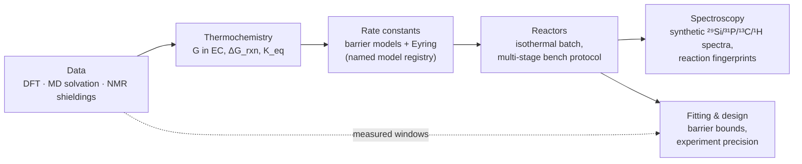

# atom-to-reactor

Multiscale kinetics of the TMSPA water scavenger in ethylene carbonate: from DFT energies to reactor concentrations, operando NMR spectra and the experiments needed to fit them.

Multiscale Modelling of EMC Transesterification as a Degradation Pathway in Li-ion
Battery Electrolytes, Master's thesis project, Department of Chemistry – Ångström Laboratory, Uppsala University.

> [!WARNING]
> **Research code, under active development.** The pipeline runs end to end and is covered by tests. A first, diagnostic fit against lab NMR snapshots exists (notebook 05), but there are no time-resolved data and no model is calibrated: `level1` is partly derived from published observations and several of its barriers are still placeholders (see [Status and limitations](#status-and-limitations)). APIs may change without notice.

---

## What it does

TMSPA (tris(trimethylsilyl) phosphate) reacts with water and with the EC solvent through a cascade of silyl transfers. The repository models that cascade as a 9-reaction network and follows it through six stages:



| ID | Reaction | Family |
|---|---|---|
| R1–R3 | TMSPA → BMSPA → MMSPA → H₃PO₄, each step + H₂O → + TMSOH | hydrolysis |
| R4 | 2 TMSOH → HMDSO + H₂O | condensation |
| R5–R7 | the same phosphate ladder, each step + TMSOH → + HMDSO | transfer |
| R8 | EC + TMSOH → TMSOEG + CO₂ | solvent attack |
| R9 | EC + TMSOEG → TMSOdiEG + CO₂ | solvent attack |

Every reaction is reversible. Reverse rates follow from detailed balance, and the reactor integrates the mass-action ODEs with an implicit (Radau) solver.

## Models

Rate constants come from a named model, so that different barrier assumptions can be run side by side and compared against the same data (`kinetics.describe_models()` prints this table with the full assumptions).

| Name | Barrier relation | Status | Basis |
|---|---|---|---|
| `peter_reference` | capped BEP, E₀ = 1.15 eV for all reactions | reference | Reproduces a reference protocol model; a design choice, not a fit |
| `family_bep` | capped BEP per family | sensitivity | Solvent attack from Gogoi 2024; other families 0.80 eV placeholders |
| `family_marcus` | Marcus, same intrinsic barriers | sensitivity | As `family_bep` |
| `level1` | Marcus, recalibrated per family | provisional | Condensation and solvent attack derived from Gogoi 2024; hydrolysis and transfer still placeholders |

## Quick start

Requires Python 3.10+ (developed on 3.11).

```bash
git clone https://github.com/yralcaraz/atom-to-reactor.git
cd atom-to-reactor
python -m venv .venv && source .venv/bin/activate
pip install -r requirements.txt
```

**Tests.** Each test file runs as a script. The files also follow pytest naming.

```bash
for f in tests/test_*.py; do python "$f"; done
```

**Notebooks.**

```bash
jupyter lab notebooks/
```

**From Python.**

```python
from kinetics import (NETWORK_SPECIES, calculate_recipe_molarities, describe_models,
                      simulate_batch_reactor, simulate_protocol, summarize_batch_runs)

describe_models()                                   # registry: barriers, status, assumptions

# Bench recipe: 2 vol% water in EC, then 5 vol% TMSPA
c0 = {sp: 0.0 for sp in NETWORK_SPECIES} | calculate_recipe_molarities()['after']

# Isothermal batch run at 40 °C for one week, two models side by side
runs = {name: simulate_batch_reactor(c0, T_K=313.15, t_end_s=7 * 86400, model=name)
        for name in ('family_bep', 'level1')}
summarize_batch_runs(runs)                          # half-life, water use, final CO2 and HMDSO

sim = simulate_protocol(model='level1')             # full multi-stage temperature protocol
```

## Notebooks

The notebooks are demonstrations. The science lives in `kinetics/`, and the figures and display tables in `demo/`.

| Notebook | Content | Guide |
|---|---|---|
| [01_multiscale_microkinetics_theory](notebooks/01_multiscale_microkinetics_theory.ipynb) | Blocks 1–11: input data, free energies in EC, reaction thermodynamics and Wegscheider cycles, barrier models, model selection against experiment, k(T), batch reactor, sensitivity, virtual ²⁹Si NMR | [theory](docs/theory-multiscale_microkinetics.md) |
| [02_operando_experimental_protocol](notebooks/02_operando_experimental_protocol.ipynb) | Bench protocol simulation, model comparison, predicted multinuclear NMR, water from ¹H, which reactions the spectra can tell apart | [guide](docs/guide-operando_experimental_protocol.md) |
| [03_experiment_plan](notebooks/03_experiment_plan.ipynb) | What the data constrain today (barrier bounds), where the model fails (water series), NMR readouts and timing, which experiment determines which parameter, tentative plan. Written before the lab spectra existed | [guide](docs/guide-experiment_plan.md) |
| [03_feasible_region](notebooks/03_feasible_region.ipynb) | Every observation (lab spectra and Gogoi 2024) as a constraint: barrier intervals for a ladder of model structures, tests no barrier can pass. Stored without outputs | [method](docs/methodology-feasible_region.md) |
| [04_lab_nmr_data_overview](notebooks/04_lab_nmr_data_overview.ipynb) | The raw lab NMR spectra: samples, acquisition settings, what changes in time, what is unclear in the files | — |
| [05_first_fit](notebooks/05_first_fit.ipynb) | First fit of the candidate structures to the lab observables under four scenarios of the unknown mixing times: misfit per observation, profile intervals, what the data cannot determine. Shows results computed by `scripts/run_fit.py`; stored without outputs | [plan](docs/plan-first_fit.md) |

## Repository layout

```text
atom-to-reactor/
├── kinetics/                 the package, one folder per pipeline stage
│   ├── constants.py          physical constants and unit conversions
│   ├── data/                 Block 1      snapshot, species database, network, experimental data
│   ├── thermo/               Blocks 2–4   G in solution, standard-state shift, solvation σ, ΔG_rxn
│   ├── microkinetics/        Blocks 5–6   barrier models, family parameters, rates, model registry, Arrhenius
│   ├── reactor/              Blocks 7,10  mass-action engine, batch and protocol reactors, validation
│   ├── spectroscopy/         Blocks 8,11–13  shifts from shieldings, spectra, fingerprints
│   └── fitting/              Block 14     barrier bounds, NMR readouts, experiment design, residuals, fits and profiles
├── demo/                     figures and display tables for the notebooks (no science)
├── notebooks/                01 theory · 02 operando protocol · 03 experiment plan, feasible region · 04 lab data · 05 first fit
├── data/                     computed snapshot and measured reference data (see data/README.md)
├── docs/                     theory, methodology, notebook guides, references
├── tests/                    test scripts; Block 5 legacy baseline for regression
├── scripts/                  build_observables.py (lab observables file) · run_fit.py (staged first fit) · sync_linear.py
├── MODULES.md                functional specification of the modules
└── requirements.txt
```

The most used functions are re-exported from `kinetics` (see [kinetics/\_\_init\_\_.py](kinetics/__init__.py)). Function names follow fixed verbs: `load_` reads from disk, `build_` assembles a structure, `calculate_` evaluates a physical quantity, `simulate_` integrates in time, and `find_` searches. Units are part of argument names (`T_K`, `t_end_s`, `C_mM`). The full conventions are in [reference-api_migration.md](docs/reference-api_migration.md).

## Data

| File | Content | Origin |
|---|---|---|
| `data/tank_api_snapshot.json` | Gas-phase DFT (ωB97M-V/def2-TZVPD) for 24 species, MACE-OMol MD solvation energies in EC for 12, computed NMR shieldings and geometries | Computed; offline snapshot of Peter Broqvist's Tank dataset API (2026-09-24) |
| `data/experimental_gogoi2024.json` | Measured ³¹P/²⁹Si/¹³C/¹H shifts, barrier windows, control experiments, water series | Measured; Gogoi et al., *J. Phys. Chem. C* 2024, 128, 1654 |
| `data/lab_observables.json` | Area shares, uncertainties and sample histories of the lab NMR spectra (N. Gogoi, 2022–2023) | Measured, unpublished; kept in the repository only while it stays private; built by `scripts/build_observables.py` |

[data/README.md](data/README.md) documents every field and its limitations.

## Documentation

| Document | Type | Status |
|---|---|---|
| [MODULES.md](MODULES.md) | Functional specification of every module | Function names predate the 2026-09-29 layout ¹ |
| [theory-multiscale_microkinetics](docs/theory-multiscale_microkinetics.md) | Theory: statistical mechanics, solvation cycle, barrier models, reactor equations | Rev 1; names predate the 2026-09-29 layout ¹ |
| [methodology-feasible_region](docs/methodology-feasible_region.md) | Method: modelling and fitting with incomplete data | Draft for review |
| [guide-operando_experimental_protocol](docs/guide-operando_experimental_protocol.md) | Guide to notebook 02 | Stable |
| [guide-experiment_plan](docs/guide-experiment_plan.md) | Guide to notebook 03 and the experiment plan | Draft for review |
| [reference-api_migration](docs/reference-api_migration.md) | Old → current function and module names | Stable |
| [improvement_plan](docs/improvement_plan.md) | Block-by-block audit of the first notebook (Findings 1–19) | Historical |
| [plan-first_fit](docs/plan-first_fit.md) | Plan of the first fit: data, candidate structures, methods, cost and phases | Executed (notebook 05) |

¹ [reference-api_migration.md](docs/reference-api_migration.md) maps the old names to the current code.

## Status and limitations

**In place**
- Full pipeline from snapshot data to reactor trajectories, synthetic spectra and experiment design, covered by the test scripts in `tests/`.
- A named-model registry, so that every result states which barrier assumptions produced it.
- Re-simulation of the Gogoi 2024 control experiments and water series for any model.
- A first, diagnostic fit of six candidate structures to the lab NMR observables (notebook 05, `scripts/run_fit.py`): best fit and misfit per observation under four scenarios of the unknown mixing times, profile intervals, leave-one-sample-out, sensitivity to the declared errors and times, checks against samples the fit did not use.

**Open**
- **No kinetic time series.** The lab spectra are snapshots at unknown times after mixing; no sample was followed while it reacted. Rates are therefore tied to assumed ages, and every barrier of hydrolysis and transfer is seen at room temperature only.
- **No fitted model is registered.** The four registered models are unchanged and none describes the lab data. The first fit finds parameter sets consistent with the data, but which one depends on the assumed ages and on what the samples held at mixing (notebook 05). A fitted set can be built from a result file with `kinetics.fitting.build_fitted_model`; it is not written into the registry.
- **Hydrolysis and transfer barriers are placeholders** in every registered model. With them, `level1` consumes TMSPA within the first 20 °C hold.
- **The lab observables were built from exported share tables**, not from the raw spectra; the audit that needs the raw spectra is listed in the file.
- **No vibrational frequencies** in the snapshot. Free energies use the stored DFT values, and the quasi-RRHO mode cannot yet run on real data.
- **Solvation is an energy, not a free energy** (MD ΔE_solv, no solvation entropy).
- **No fluorine chemistry.** LiPF₆, HF and TMSF are outside the network and the snapshot.
- **Computed ²⁹Si shifts** are systematically 3–6 ppm above the measured ones and are used for comparison only.

## Context

- **Project:** Multiscale Modelling of EMC Transesterification as a Degradation Pathway in Li-ion
Battery Electrolytes, Master's thesis
- **Author:** Yeray Alcaraz Galván
- **Supervision:** Prof. Peter Broqvist
- **Affiliation:** Department of Chemistry – Ångström Laboratory, Uppsala University, Sweden

No licence file is included yet.
