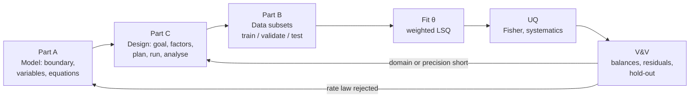
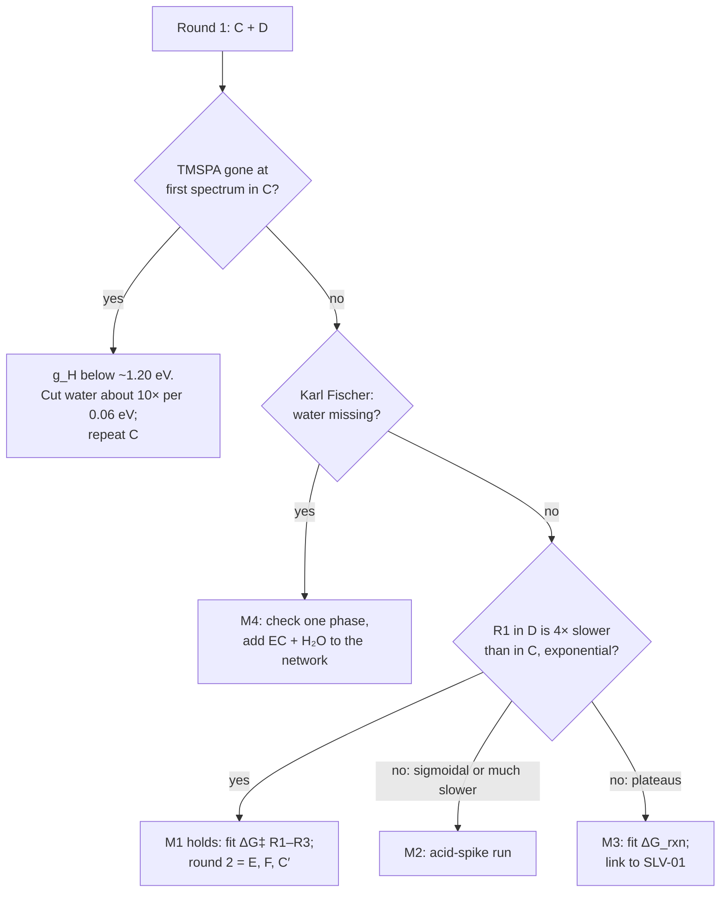

# Experiment plan for TMSPA kinetics

| | |
|---|---|
| **Status** | Draft for review |
| **Classification** | CONFIDENTIAL (see CLASSIFICATION.md) |
| **Source** | Y. Alcaraz Galván; numbers computed from P. Broqvist, Tank dataset snapshot (unpublished) |
| **Scope** | Plan for Notebook 03 (`notebooks/03_experiment_plan.ipynb`) and the programming step that follows. |
| **Numbers** | Every number tagged **[NB03 §n]** is an output of section n of Notebook 03 (`notebooks/03_experiment_plan.ipynb`, commit `ef9c683`, model `level1`). |
| **Frameworks** | Model anatomy and lifecycle (Parts A–B). Leardi, *Experimental design in chemistry: A tutorial*, Anal. Chim. Acta 652 (2009) 161–172 (Part C). |

**Tags.** **[NB03 §n]** computed in section n of Notebook 03; this document's own sections are A1–D, so § always points to the notebook (or to Leardi). **[ASSUMED]** an input still to be confirmed (NMR facility, lab, literature). **[PROPOSED]** new in this revision; not computed or programmed yet, so it must be checked before it is coded.

**Experiment names** (the notebook's design names; details in C3). **A** Peter's step protocol (reference) · **B** TMSPA + 2 vol% H₂O, 40 °C · **C** same, ramp 40→60→80 °C · **D** 0.5 vol% H₂O, 40 °C · **E** TMSPA + TMSOH, dry, 40 °C · **F** TMSOH, dry, 80 °C · **C′** C at a second starting T · **D′**, **H** proposed additions. Not to be confused with **E1–E4**, Gogoi's published control experiments.

---

## 0. Summary

**Goal.** Specify the barrier parameter E₀ (g in `level1`) of each TMSPA hydrolysis step (R1–R3) by fitting time-resolved NMR data, after testing that hydrolysis is first order in water. Report the fitted ΔG‡(T) per step alongside E₀: ΔG‡ is what the data fix directly, while E₀ also inherits the error of the computed ΔG_rxn (SLV-01, see A4). Transfer, condensation and solvent attack come second, ΔS‡ last.
  

| # | Statement | Evidence |
|---|---|---|
| 1 | Existing data bound three families and leave hydrolysis free: solvent attack g = 1.27–1.39 eV, condensation g ≥ 1.24 eV, transfer g ≤ 1.13 eV. | [NB03 §3] |
| 2 | A single global barrier is excluded. `peter_reference` (1.15 eV for every family) fails E1, E2 and E4. | [NB03 §2] |
| 3 | Under our reading of Gogoi's water series, and assuming the samples were measured at a common time, no barrier values reproduce it (0 of 21 sets). This points to the rate law, not the barriers; the unstated sampling times are the main loophole. | [NB03 §4] |
| 4 | The first experiment must therefore **test the rate law**, not only fit a barrier. | follows from 3 |
| 5 | Round 1 = **C** (2 vol% H₂O, in situ 40→60→80 °C) + **D** (0.5 vol% H₂O, 40 °C). That is 2 of 5 runs, 40 % of the budget, which matches Leardi's rule for a first round. | [NB03 §7, §9]; Leardi §4 |
| 6 | If the rate law survives round 1, the plan C+D+E+F determines every parameter except transfer, at or below the ~2 meV systematic floor. | [NB03 §7.2–7.3] |

---

## Part A — The model: what it is made of

### A1. System boundary and assumptions

| Item | Choice in `level1` | Breaks when |
|---|---|---|
| Domain | 0D batch (NMR tube), one homogeneous liquid phase | water separates as a phase (EC/DEC), or gradients remain after mixing |
| Time regime | Dynamic. T(t) is piecewise constant (isothermal segments). | T lags after a step (probe equilibration) |
| Solvent | EC at constant concentration: 7.1 M for EC/DEC (Gogoi), ≈ **15.0 M for pure EC first** | EC is consumed noticeably (EC + H₂O ≥ 40 °C is **not in the network**) |
| Chemistry | 9 elementary reversible reactions in 4 families. No LiPF₆, no HF. | real electrolyte (this is the OOD case, B1) |
| Thermodynamics | ΔG_rxn from ωB97M-V (298 K) + MACE ΔE_solv in EC. Ideal dilute (activity = concentration). | σ(ΔG_rxn) is large: standard errors of 0.23–0.44 eV (SLV-01); concentrated or ionic media |
| Kinetics | Marcus barrier with one intrinsic g per family, ΔS‡ = 0 | acid catalysis, water clustering, a mechanism change with T |
| Gas | CO₂ stays in solution | sealed tube with headspace: CO₂ partitions out; F can reach up to 15 bar (upper bound) and ¹³C sees only dissolved CO₂ [NB03 §8.1] |

### A2. Variables and parameters

| Class | Symbol | Content |
|---|---|---|
| Independent | t | time; 0D, so there is no spatial coordinate |
| States (10 + solvent) | C_i(t) | TMSPA, BMSPA, MMSPA, H₃PO₄, H₂O, TMSOH, HMDSO, TMSOEG, TMSOdiEG, CO₂; EC held constant |
| Specs / inputs u | T(t), C_i(0), t_end, sampling times | fixed by the experiment design (Part C) |
| Fixed constants | k_B, h, R | universal |
| Computed parameters | ΔG_rxn,j (9), σ_solv,j | from the snapshot; **not fitted** |
| Fitted parameters θ | g_R1, g_R2, g_R3, g_transfer, g_condensation, g_solvent (6) | hydrolysis is split per step so a step counts as determined only if the data see it happen [NB03 §7]. Transfer (R5–R7) and solvent attack (R8–R9) are still one g each, so a run that sees only R5 is credited with R6–R7 too; splitting them is open [PROPOSED] |
| Later parameters | ΔS‡ per step or family | only from a step observed at ≥ 2 temperatures (A4); fitted globally with g over all T segments (B2) |
| Not identifiable | Brønsted α within a family | the ΔG_rxn values inside a family are too close together [NB03 §1] |

Current `level1` values [NB03 §1]: hydrolysis 0.80 and transfer 0.80 eV are **placeholders**. Condensation 1.30 and solvent attack 1.32 eV were derived from the Gogoi controls.

### A3. Relations

| Type | Equation |
|---|---|
| Mass balance (batch) | dC/dt = Nᵀ · r(C, T; θ), where N is the 9 × 11 stoichiometric matrix |
| Rate law (mass action) | r_j = k_f,j ∏_reactants C − k_b,j ∏_products C |
| Eyring | k = (k_B T / h) · exp(−ΔG‡ / k_B T) |
| Marcus | ΔG‡_f = g · (1 + ΔG_rxn / 4g)²  ;  ΔG‡_b = ΔG‡_f − ΔG_rxn |
| Temperature | g(T) = g(25 °C) − (T − 298.15 K) · ΔS‡ |
| Constraints | C_i ≥ 0; the P and Si element totals are constant |
| Initial conditions | C_i(0) from the recipe; the t = 0 spectrum checks them |
| **Observation model** | y_n,p(t_k) = Σ_i ν_n,p,i · C_i(t_k) + ε, with ε ~ N(0, σ_n²) (ν = nuclei of type n per molecule in peak p) |

Check (R1): g = 0.80, ΔG_rxn = −0.474 → ΔG‡ = 0.80 · (1 − 0.474/3.2)² = **0.580 eV** [NB03 §1 table ✓].

Assumed readouts [ASSUMED, to confirm with the NMR facility]:

| Nucleus | Peaks | One spectrum every | σ per integral |
|---|---|---|---|
| ³¹P | TMSPA, BMSPA, MMSPA, H₃PO₄ (1 P each) | 5 min | 1 mM |
| ²⁹Si | xMSPA band, TMSOH + TMS-glycols, HMDSO | 30 min | 5 mM |
| ¹³C | CO₂, TMSOEG, TMSOdiEG | 60 min | 5 mM |

### A4. Degrees of freedom and identifiability

- **DoF.** 11 states with 11 ODEs; EC's equation is trivial because EC is held constant. Once u is fixed the system is closed. The only free quantities are θ.
- **Structural identifiability**, i.e. what the equations allow in principle:

| Quantity | Identifiable? | Why |
|---|---|---|
| ΔG‡ of a step at temperature T | yes, if the step proceeds inside the observation window | it sets the time scale directly |
| g of a family | only through ΔG_rxn | it inherits σ(ΔG_rxn): 125 meV (σ = MD standard errors) [NB03 §7.3] |
| g and ΔS‡ from one temperature | no, they are confounded | one T fixes a single combination g − (T − 298)ΔS‡ [NB03 §3.2] |
| α | no | see A2 |

- **Practical identifiability**, i.e. whether the data are informative enough, is the Fisher analysis in Part B3.

---

## Part B — Lifecycle: fit, uncertainty, verification and validation

### B1. Data and subsets

| Dataset | Status | Subset role | Note |
|---|---|---|---|
| Snapshot (DFT + MD) | computed | fixed input | gives ΔG_rxn and σ; not kinetic |
| Gogoi 2024, shifts | measured | peak assignment | not kinetic |
| Gogoi controls E1–E4 | measured, qualitative | **training** (feasibility) | already used to set `level1` condensation and solvent attack, so they **cannot serve as a test** |
| Gogoi water series + heating | measured, qualitative | **falsification test** | not used in any fit; the model fails it [NB03 §4] |
| C, D, E, F, C′ (planned) | pending | **training** | time-resolved; the fit itself |
| C vs D | pending | **validation** (choose the rate law) | selects between the M1–M4 candidates (C3) |
| Hold-out run H | [PROPOSED] | **test** | predicted *before* it is measured, and evaluated once (C3) |
| Real electrolyte (1 M LiPF₆ in EC/EMC, HF) | future | **OOD** | outside the declared domain: the network has no salt or HF chemistry |

### B2. Calibration

- **Objective.** Weighted least squares χ²(θ) = Σ_k ((y_k − ŷ_k(θ)) / σ_k)². Under the Gaussian observation model of A3 this is maximum likelihood.
- **Parameters** are fitted in eV (g) and J/mol/K (ΔS‡). A prior of 300 meV is used only to regularise the Fisher inversion.
- **Solver** [PROPOSED]: `scipy.optimize.least_squares` (trust-region) on BDF-integrated ODEs. Use BDF, not LSODA, which stalls at g_H = 0.80 eV with 2 vol% H₂O.
- **Global (g, ΔS‡) fit**: fit g and ΔS‡ of each step together over all temperature segments of a run, with g referenced at 60 °C (mid-ramp). Fisher result [NB03 §7.5]: C alone gives ΔS‡ of R2 and R3 (σ 3–10 J/mol/K for g ≤ 1.25 eV) but not of R1 (σ 40–75), which C + C′ brings to ≤ 15 J/mol/K. With ΔS‡ free, σ(g of R1 at 60 °C) is 8–16 meV for C alone, so the sub-meV R1 values of §7.1 hold only if ΔS‡ is known. Fitting code: [PROPOSED].
- **Model selection** [PROPOSED]: compare the rate laws M1–M4 on C + D by AIC or BIC, penalising extra parameters.

### B3. Uncertainty quantification

| Layer | Method | Result |
|---|---|---|
| Noise (local) | Fisher F = Σ JᵀJ/σ² + diag(1/σ_prior²); σ_θ = √diag(F⁻¹) (Cramér-Rao) | holds only at the assumed true θ, so NB03 scans over plausible truths [NB03 §7.1] |
| Systematics | ±0.5 K in T → 1.68 meV; ±5 % in [H₂O]₀ → 1.32 meV | floor = √(1.68² + 1.32²) = **2.14 meV** [NB03 §7.3] |
| ΔG‡ → g | Marcus inversion with σ(ΔG_rxn) | +125 meV (SLV-01) [NB03 §7.3] |
| ΔH‡, ΔS‡ | Eyring regression, σ(ΔG‡) = 3 meV | span 40 K, 3 temperatures: σΔS‡ ≈ 10 J/mol/K, σΔH‡ ≈ 3.4 kJ/mol [NB03 §7.4] |
| Correlations | covariance matrix from F⁻¹ | [PROPOSED]: report it; not shown in NB03 yet |

**Reading rule.** A Fisher σ below 2 meV means the result is limited by systematics, not that it is better. The primary result is **ΔG‡ per step**. g derived from it carries the +125 meV of σ(ΔG_rxn) (SLV-01: the MD σ are standard errors).

### B4. Verification and validation

| Check | Kind | Criterion [PROPOSED] |
|---|---|---|
| P and Si element balance along each simulation | verification | relative drift < 10⁻⁶ |
| ODE tolerance, BDF vs Radau spot check | verification | observables agree within 0.1 σ_n |
| P balance in the data (sum of the 4 ³¹P integrals) | data verification | constant within noise; a drop means precipitation or an unseen species |
| Residuals: mean, autocorrelation (runs test) | diagnostics | runs of same-sign residuals point to a wrong rate law (e.g. an induction period) |
| Karl Fischer before and after the run | validation of an input | water missing beyond stoichiometry points to M4 |
| Hold-out run H, predicted in advance | validation | prediction inside its 95 % band |
| Domain of applicability | declaration | 40–80 °C, 0.5–2 vol% H₂O, pure EC, no salt |

---

## Part C — Experimental design (Leardi's five steps)

### C0. Why a designed plan rather than one variable at a time

1. **Interactions.** Changing one variable at a time misses effects that depend on the level of another variable.
2. **Global rather than local knowledge.** A design plus a model predicts the response anywhere in the domain; single runs only tell you about the points you ran.
3. **Plan the information before running.** The information a design gives can be computed before any experiment (the leverage).

Two translations to our model:

- **Leverage ↔ Fisher σ.** For Leardi's linear polynomials the leverage depends only on the design. Our model is nonlinear in θ, so its information also depends on the unknown truth. That is why NB03 plots σ against the true g (§7.1) rather than giving one number.
- **Interaction as a test of the rate law** [PROPOSED]. Under M1 the initial rate is r₀ = k(T)·[H₂O]·[TMSPA]. So ln r₀ = ln k(T) + ln[H₂O] + const, which is **additive**: the order in water is 1 and the water × T interaction is 0. A 2² factorial on (ln[H₂O], T) gives both numbers with no kinetic fit. An order ≠ 1 or an interaction ≠ 0 rejects M1 whatever the barrier.

### C1. Step 1 — Goal

| Priority | Target | Success criterion |
|---|---|---|
| 1 | Rate law of hydrolysis: M1 against M2–M4 | one candidate is preferred by AIC/BIC and its residuals are white |
| 2 | ΔG‡(T) of R1, R2, R3 | σ ≤ 10 meV each, i.e. rate constant known to a factor 1.5 at 25 °C [PROPOSED threshold] |
| 3 | ΔG‡ of transfer, condensation, solvent attack | same threshold, or a tighter bound where it cannot be met |
| 4 | ΔH‡ and ΔS‡ per hydrolysis step | σΔS‡ ≤ 10 J/mol/K |

### C2. Step 2 — Every factor that *can* have an effect

Leardi's warning is against "sentimental screening", i.e. dropping a factor because we *think* it doesn't matter. Every factor below gets an explicit role.

| Factor | Range / levels | Role | Why it can matter |
|---|---|---|---|
| Temperature T | 40, 60, 80 °C | **varied** (in-run ramp) | Eyring; floor at 40 °C because pure EC melts at 36.4 °C |
| [H₂O]₀ | 0.5, 2 vol% (263, 1052 mM) | **varied** | order in water; the Gogoi threshold |
| [TMSPA]₀ | 5 vol% (149 mM) | fixed | rate ∝ [TMSPA] under M1 |
| [TMSOH]₀ | 0 / 30 mM (E) / 0.45 M (F) | varied between experiments | isolates transfer, condensation, solvent attack |
| Acid (P–OH) | product; spike with H₃PO₄ at t = 0 | **measured**; spike [PROPOSED] | autocatalysis (M2) |
| Solvent | pure EC [ASSUMED] (Gogoi: EC/DEC 1:1) | fixed | water miscibility (M4) |
| LiPF₆ / HF | 0 | fixed (excluded) | real-electrolyte chemistry; OOD |
| TMSPA purity (BMSPA) | batch-dependent | **measured** (t = 0 ³¹P) | shifts the initial condition |
| Dead time, mixing → first spectrum | ≤ 10 min [ASSUMED] | controlled | loses early R1 if the reaction is fast |
| Probe temperature accuracy | ±0.5 K [ASSUMED] | calibrated | 1.68 meV systematic |
| Tube and headspace | sealed; 0.6 mL liquid / 1–2 mL gas [ASSUMED] (Gogoi: 150 µL sample, PTFE stoppers) | controlled | CO₂ pressure (up to 15 bar in F) and CO₂ loss from the ¹³C readout [NB03 §8.1] |
| Relaxation agent (Cr(acac)₃) | 0 or small | ask the facility | may catalyse |
| Batch or day of preparation | — | blocked (same batches for C and D) | hidden drift |

### C3. Step 3 — Plan: domain, postulated models, experiments

**Domain.** A run is informative only if the half-life lies between the first spectrum (10 min) and the end of the run (12 h) [NB03 §6.2]:

| Case | Measurable window of g |
|---|---|
| Hydrolysis, 2 vol% H₂O | 1.25–1.30 eV at 40 °C; up to 1.45 eV at 80 °C |
| Hydrolysis, 0.5 vol% H₂O | about 0.04 eV lower (1.20–1.30 eV at 40 °C) |
| Transfer, dry, 30 mM | g ≥ 1.10 eV at 40 °C. At 0.80 eV, t½ ≪ 1 s. |

**Postulated models** (M2–M4 [PROPOSED], not in the code):

| ID | Rate law for hydrolysis | Signature in C and D |
|---|---|---|
| M1 | first order in H₂O (current) | exponential decay; R1 in D exactly 4× slower than in C |
| M2 | acid-catalysed: k·[H₂O]·(1 + K_a·[P–OH]) | sigmoidal decay in C; D much more than 4× slower |
| M3 | equilibrium-limited (ΔG_rxn off, SLV-01) | plateaus that shift with the water content |
| M4 | water unavailable (phase separation, or EC + H₂O above 40 °C) | Karl Fischer and the ¹H balance show water missing |

**Experiments** (σ at the reference truth: every hydrolysis step at g = 1.25 eV, other families at `level1` values) [NB03 §7.2, §9]:

| Run | Specs (u) | Readouts | Determines | σ at reference truth (meV) |
|---|---|---|---|---|
| **C** | TMSPA 149 mM + H₂O 1052 mM; 40→60→80 °C, 8 h each | ³¹P / 5 min (287 spectra), ²⁹Si / 30 min (48) | R1, R2, R3; transfer if g_T ≥ 0.9 eV | R1 0.1, R2 0.1, R3 0.7, cond 2.3 |
| **D** | H₂O 263 mM, 40 °C, 8 h | as C | order in water (vs C) | R1 0.1, R2 14.8, R3 300 (not seen) |
| **E** | TMSPA + TMSOH, 30 mM each, dry EC, 40 °C, 8 h | ³¹P, ²⁹Si | transfer, or a tighter upper bound | 271 at g_T = 0.80 eV; 3.4 at 1.0 eV |
| **F** | TMSOH 0.45 M, dry EC, 80 °C, 24 h | ²⁹Si / 30 min, ¹³C / 1 h | condensation, solvent attack | 6.2, 0.1 |
| **C′** | C started at 50 °C: 50 → 70 → 80 °C, 8 h each | as C | ΔH‡, ΔS‡ of R1 | C + C′: σΔS‡(R1) ≤ 15 J/mol/K [NB03 §7.5] |
| **Plan C+D+E+F** | | | everything except transfer | R1 0.0, R2 0.1, R3 0.7, transfer 166, cond 2.0, solv 0.1 |
| Plan with B (isothermal 40 °C) replacing C | | | loses R3 | R3 182 |

**Range of validity of C** [NB03 §7.1]:

| Quantity | Range where C determines it |
|---|---|
| R1 | σ ≤ 0.3 meV for g ≥ 1.20 eV; 15 meV at 1.10 eV; undetermined at 1.00 eV |
| R2, R3 | σ ≤ 3.3 meV for g = 1.10–1.30 eV; 14 and 39 meV at 1.35 eV; > 100 meV at 1.40 eV |

**Additions for review** [PROPOSED]:

- **D′** = D at 50 °C. It also gives ΔS‡ of R1 but not R3 at g = 1.30 eV, so C′ is the better second-temperature run [NB03 §7.5]. {C, D, C′, D′} forms the 2² factorial on (water, T) from C0, which estimates the order in water and the water × T interaction directly.
- **Replicate of C**, if the budget allows. It measures run-to-run variance, which the Fisher σ ignores (Leardi's replicated centre point).
- **Hold-out H**: 1 vol% H₂O at 40 °C. It uses the water level of Gogoi's surviving sample, followed over time, and its prediction must be written down before the run.
- **Acid spike**: C with H₃PO₄ at t = 0. This is the direct test of M2; run it only if round 1 points to M2.

**Budget and rounds.** Leardi advises spending ≤ 40 % of the budget in the first round, because the problem is usually reformulated after it.

| Round | Runs | Share of the 5-run plan |
|---|---|---|
| 1 | C, D | 40 % |
| 2 | E, F, C′ (+ D′, H) | the rest, chosen by the decision gate below |

### C4. Step 4 — Perform

- Karl Fischer on the stock before adding TMSPA, and on the sample after the run.
- First ³¹P spectrum ≤ 10 min after mixing; record the exact mixing time.
- Probe temperature calibrated (±0.5 K); log T(t) through each step.
- Interleave ³¹P and ²⁹Si in one run. Sealed tube with known headspace volume.
- Use the same TMSPA and EC batches for C and D (blocking).
- Deliverable: integrals per peak per time **with their uncertainties**, as pseudo-2D arrays.

### C5. Step 5 — Analyse and decide

---

## Part D — Questions for the lab

**Jan Felix (NMR)**

1. Can spectra be recorded in the magnet at 40–80 °C? How soon after mixing can the first start? How accurate is the sample temperature?
2. ³¹P: what are the T₁ values of the silyl phosphates in EC? Is 5 min per spectrum with ~1 mM error per integral realistic?
3. ²⁹Si: how long does an inverse-gated spectrum take? Is Cr(acac)₃ acceptable? Can TMSOH (≈ 15 ppm) and the TMS-glycols (≈ 19 ppm) be resolved?
4. ¹H: are the TMS methyls of TMSPA, BMSPA, TMSOH and HMDSO resolved? That would allow mM concentrations for transfer.
5. Can ³¹P and ²⁹Si be interleaved? What lock and reference (Gogoi used a DMSO-d₆ insert)? Is the tube sealed, and how large is the headspace?
6. What is the data format? Pseudo-2D, with integrals and uncertainties?

**Erik (samples)**

1. Karl Fischer water before TMSPA addition and after the run.
2. Purity of the TMSPA batch (Gogoi found BMSPA in "pure" TMSPA).
3. Pure EC or EC/DEC? Is the sample one phase?
4. The exact reaction time of control E4.

---

## Appendix — Corrections to 0929-1

| # | 0929-1 said | NB03 shows |
|---|---|---|
| 1 | Peter's reference fails E1, E3, E4 | fails **E1, E2, E4**; it passes E3 |
| 2 | E1 window "assumed"; E2 10–90 %; E4 ≥ 90 % | E1 ≤ 2 %; E2 **5–90 %**; E4 **≥ 95 %**; E3 ≤ 5 %. The file labels E1, E2 *derived* and E3, E4 *assumed*, but in all four the numeric limit is our interpretation of a qualitative statement [NB03 §2, §3.1] |
| 3 | B, C, D give σ(R1) < 0.5 meV for all g ≥ 1.10 eV | only for g ≥ 1.20 eV; **13–16 meV at 1.10 eV** |
| 4 | Ramp C gives σ ≤ 0.7 meV "across the entire ladder" | only at the reference truth (1.25 eV); 39 meV (R3) at 1.35 eV; > 100 meV at 1.40 eV |
| 5 | Design E runs 4 h | **8 h** |
| 6 | Design F: TMSOH 100 mM, 8 h | **0.45 M, 24 h**, read by ²⁹Si + ¹³C |
| 7 | Priority 5 = a 50→70 °C ramp "across a 40 K span" | repeat C at a second T chosen for t½ = 30 min–5 h (and 50→70 °C spans only 20 K) |
| 8 | "> 800 mM CO₂, 3–5 bar" in the tube | now simulated: F ends with 851 mM CO₂; worst case 15 bar (0.6 mL liquid / 1 mL gas), 3.7 bar with 0.15 mL liquid [NB03 §8.1] |
| 9 | "Commercial TMSPA contains 5–10 % BMSPA" (Gogoi) | no figure in our data; only that BMSPA was found |
| 10 | The ΔG‡ → g error was not quantified | +125 meV (SLV-01: MD σ are standard errors) |
| 11 | Hydrolysis and transfer `level1` values not stated | both 0.80 eV **placeholders** |
| 12 | E1–E4 treated as independent evidence | they are **training data** for `level1`; only the water series is untouched |
