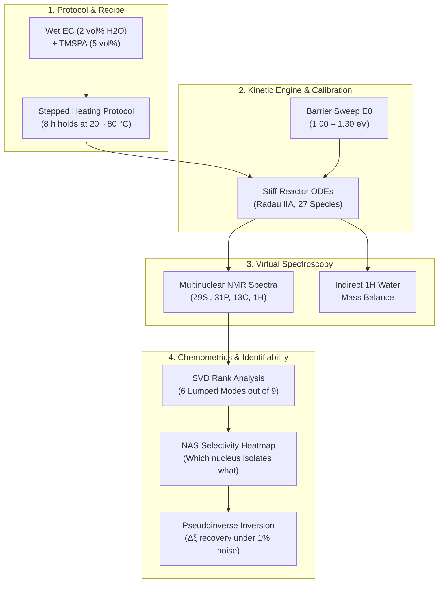

# Operando protocol: simulation, NMR and reaction identifiability

| | |
|---|---|
| **Status** | Stable |
| **Scope** | Guide to Notebook 02 (`notebooks/02_operando_experimental_protocol.ipynb`): how to read each figure of the protocol simulation. |
| **Builds on** | NB01 `01_multiscale_microkinetics_theory.ipynb`, [theory-multiscale_microkinetics.md](theory-multiscale_microkinetics.md), [MODULES.md](../MODULES.md) |

---

## Executive Summary

Notebook `02_operando_experimental_protocol.ipynb` bridges quantum chemical microkinetics with real laboratory operando spectroscopy. It simulates the benchtop protocol developed by Peter Broqvist (`tmspa_hydrolysis_protocol.ipynb`) for scavenging water in wet ethylene carbonate ($\text{EC}$) using tris(trimethylsilyl) phosphite/phosphate ($\text{TMSPA}$).

The notebook addresses four central experimental and chemometric challenges:
1. **Protocol Design & Thermal Calibration:** How the stepped temperature program ($20\text{--}80^\circ\text{C}$) samples the kinetic landscape and how the effective activation barrier $E_0$ controls reactant depletion.
2. **Species Concentration Evolution:** Tracking the sequential phosphate hydrolysis ladder, silanol condensation, and competing solvent ring-opening reactions.
3. **Virtual Multinuclear NMR Spectroscopy:** Simulating observable spectra for four distinct nuclei ($^{29}\text{Si}$, $^{31}\text{P}$, $^{13}\text{C}$, $^{1}\text{H}$) using DFT-computed chemical shifts and line-broadening models.
4. **Spectroscopic Identifiability & Extent Inversion:** Determining mathematically which reaction pathways can be uniquely distinguished by NMR spectroscopy through Net Analyte Signal (NAS) analysis and assessing reaction extent ($\Delta \xi$) recovery under experimental noise.



---

## 1. Recipe, Protocol Schedule & Thermal Design

### 1.1 Chemical Recipe & Stoichiometric Excess
The experimental procedure starts from a stock solution of ethylene carbonate containing $2\text{ vol}\%$ water, stirred for 24 h and equilibrated for 12 h. At $t = 0$, $5\text{ vol}\%$ of $\text{TMSPA}$ scavenger is injected.

```text
Stock Solution:               After TMSPA Injection (t = 0):
  - EC:    93.1 vol% (14.70 M)  →  13.97 M
  - H2O:    1.9 vol% ( 1.11 M)  →   1.05 M
  - TMSPA:  5.0 vol% ( 0.00 M)  →   0.15 M  (149.4 mM)
```

$$\text{Molar Ratio: } \frac{[\text{H}_2\text{O}]_0}{[\text{TMSPA}]_0} = \frac{1.0515\text{ M}}{0.1494\text{ M}} \approx 7.04 : 1$$

> [!NOTE]
> **Stoichiometric Implication:** Water is present in a **7-fold molar excess** over TMSPA. Therefore, water is not the limiting reagent. TMSPA limits the extent of the phosphate hydrolysis cascade: complete conversion of TMSPA can at most consume $3 \times 0.15\text{ M} = 0.45\text{ M}$ of water, leaving over $0.60\text{ M}$ of unreacted water in the system.

### 1.2 Thermal Schedule & Operando Acquisitions
The temperature protocol consists of seven consecutive 8-hour isothermal holds at $T \in \{20, 30, 40, 50, 60, 70, 80\}^\circ\text{C}$. Between holds, the reactor is rapidly cooled back to $20^\circ\text{C}$ for a 1-hour operando acquisition window. This ensures all NMR spectra are acquired at a standardized temperature ($20^\circ\text{C}$), eliminating temperature-dependent chemical shift drifts and spectral line broadening during measurement.

---

## 2. Barrier Models Comparison & Calibration (`plot_protocol_calibration`)

### 2.1 The Scientific Question
*How sensitive is the bench experiment to the underlying reaction barrier? Which intrinsic barrier $E_0$ ensures that chemical conversion is distributed informatively across the 20–80 °C temperature window rather than exhausting all reactants prematurely?*

```text
Figure Layout:
┌──────────────────────────────────────────────┬──────────────────────────────────────────────┐
│  Panel A: Barrier Sweep (E0 = 1.00 – 1.30 eV)│  Panel B: Registered Models Comparison       │
│                                              │                                              │
│  1.0 ──┐                                     │  1.0 ──┐ (peter_reference: gradual decay)    │
│  0.8   │ E0 = 1.30 eV (almost no reaction)   │  0.8   │                                     │
│  0.6   │                                     │  0.6   │                                     │
│  0.4   │ E0 = 1.15 eV (reference, sigmoidal) │  0.4   │                                     │
│  0.2   │                                     │  0.2   │ (family_bep, marcus, level1:        │
│  0.0 ──┴─── E0 = 1.00 eV (depleted at 30 °C) │  0.0 ──┴─── completely depleted at 20 °C)   │
│      20  30  40  50  60  70  80 °C           │      20  30  40  50  60  70  80 °C           │
└──────────────────────────────────────────────┴──────────────────────────────────────────────┘
```

### 2.2 Visual Elements & Graphical Reading
* **E-axis (X):** Hold temperature prior to acquisition ($20\text{--}80^\circ\text{C}$).
* **Y-axis:** Fraction of unreacted $\text{TMSPA}$ remaining at each acquisition ($[\text{TMSPA}] / [\text{TMSPA}]_0$).
* **Panel A (Intrinsic Barrier Sweep):** Evaluates the capped Bell-Evans-Polanyi (BEP) reference model with uniform intrinsic barriers $E_0$ from $1.00\text{ eV}$ to $1.30\text{ eV}$ in steps of $0.05\text{ eV}$.
  - $E_0 = 1.00\text{ eV}$: Reaction is too fast; $\text{TMSPA}$ is $100\%$ consumed before the $30^\circ\text{C}$ hold.
  - $E_0 = 1.30\text{ eV}$: Reaction is too slow; only $8\%$ reacts even after the final $80^\circ\text{C}$ hold.
  - $E_0 = 1.15\text{ eV}$ (highlighted in bold blue): Produces an ideal sigmoidal depletion curve where $\text{TMSPA}$ conversion is nicely distributed across $50^\circ\text{C}$ ($73\%$ left), $60^\circ\text{C}$ ($34\%$ left), and $70^\circ\text{C}$ ($4\%$ left).
* **Panel B (Registered Microkinetic Models):**
  - `peter_reference` ($E_0 = 1.15\text{ eV}$): Exhibits the gradual depletion described above.
  - `family_bep`, `family_marcus`, `level1`: Show **zero remaining TMSPA** at all temperatures ($0.000$ at $20^\circ\text{C}$).

### 2.3 Physical & Chemical Interpretation
1. **The Premature Depletion Paradox:** The uncalibrated quantum chemical models (`family_bep`, `level1`) use raw gas-phase/implicit-SMD DFT barriers for hydrolysis and silanol transfer of approximately $g \approx 0.80\text{ eV}$ ($\sim 18.5\text{ kcal/mol}$). Under the Eyring equation at $20^\circ\text{C}$, a barrier of $0.80\text{ eV}$ corresponds to a half-life of seconds, consuming all $\text{TMSPA}$ before the first acquisition at 8 h.
2. **The Calibration Choice:** Selecting $E_0 = 1.15\text{ eV}$ ($\sim 26.5\text{ kcal/mol}$) is a conscious **experimental design choice** (not an empirical fit to data). It sets a kinetic benchmark that makes the operando protocol sensitive and informative. If experimental spectra demonstrate gradual depletion between $20^\circ\text{C}$ and $80^\circ\text{C}$, the true condensed-phase free energy barrier in wet EC must be in the $1.10\text{--}1.20\text{ eV}$ regime (Finding 18).

---

## 3. Concentration Trajectories Through the Protocol (`plot_concentration_panels`)

### 3.1 The Scientific Question
*How do individual chemical intermediates, solvent decomposition products, and moisture evolve over time as the temperature steps from 20 °C to 80 °C?*

```text
Figure Layout (2 × 2 Panels with Temperature Program Strip on Top):
┌─────────────────────────────────────────────────────────────────────────────────────────────┐
│ [T-Strip] 20°C ── 30°C ── 40°C ── 50°C ── 60°C ── 70°C ── 80°C  (Acquisitions marked by ┆)  │
├──────────────────────────────────────────────┬──────────────────────────────────────────────┤
│ 1. Phosphate Ester Ladder (R1–R3, R5–R7)     │ 2. Silanols & Siloxanes (R4–R7)              │
│    TMSPA → BMSPA → MMSPA → H3PO4             │    TMSOH (transient peak ~11 mM)             │
│    Sequential cascade with thermal kinks     │    HMDSO (< 0.3 mM, condensation uphill)    │
├──────────────────────────────────────────────┼──────────────────────────────────────────────┤
│ 3. Water Depletion (R1–R4)                   │ 4. Solvent Attack Products (R8–R9)           │
│    1051 mM → 605 mM                          │    TMSOEG, TMSOdiEG, and CO2                 │
│    Steepest drops during high-T holds        │    CO2 reaches ~900 mM at 80 °C              │
└──────────────────────────────────────────────┴──────────────────────────────────────────────┘
```

### 3.2 Detailed Panel Analysis

#### Panel 1: Phosphate Ester Ladder ($\text{TMSPA} \to \text{BMSPA} \to \text{MMSPA} \to \text{H}_3\text{PO}_4$)
* Shows classical sequential reaction intermediate kinetics:
  $$\text{TMSPA} \xrightarrow{k_1} \text{BMSPA} \xrightarrow{k_2} \text{MMSPA} \xrightarrow{k_3} \text{H}_3\text{PO}_4$$
* **$\text{TMSPA}$:** Dominates at $20\text{--}40^\circ\text{C}$ ($149\text{ mM} \to 138\text{ mM}$), then plummets at $50\text{--}60^\circ\text{C}$.
* **$\text{BMSPA}$:** Peaks during the $60^\circ\text{C}$ hold at $\approx 55\text{ mM}$.
* **$\text{MMSPA}$:** Peaks slightly later, at $70^\circ\text{C}$ ($\approx 32\text{ mM}$).
* **$\text{H}_3\text{PO}_4$:** Begins accumulating significantly above $60^\circ\text{C}$ ($14\text{ mM}$) and becomes the exclusive terminal phosphate at $80^\circ\text{C}$ ($148\text{ mM}$, recovering all phosphorus).
* **Thermal Kinks:** Every change in hold temperature produces a sharp discontinuity in reaction slope ($dC/dt$), visible as distinctive kinks in the concentration curves.

#### Panel 2: Silanol / Siloxane Chemistry ($\text{TMSOH}$, $\text{HMDSO}$)
* **$\text{TMSOH}$ (Trimethylsilanol):** Generated by hydrolysis ($R_1\text{--}R_3$). It reaches a transient maximum of $\approx 10.7\text{ mM}$ during the $40\text{--}50^\circ\text{C}$ holds. It subsequently drops to $< 0.1\text{ mM}$ at $80^\circ\text{C}$ because it is consumed by nucleophilic attack on the solvent ($R_8, R_9$).
* **$\text{HMDSO}$ (Hexamethyldisiloxane):** Stays remarkably low ($< 0.25\text{ mM}$) across the entire run. This confirms that silanol self-condensation ($2\,\text{TMSOH} \rightleftharpoons \text{HMDSO} + \text{H}_2\text{O}$) is endergonic in liquid EC and outcompeted by solvent ring opening.

#### Panel 3: Solvent Degradation & Gas Evolution ($\text{TMSOEG}$, $\text{TMSOdiEG}$, $\text{CO}_2$)
* Tracks the parasitic consumption of ethylene carbonate by silanol nucleophiles:
  $$\text{EC} + \text{TMSOH} \xrightarrow{R_8} \text{TMSOEG} + \text{CO}_2 \uparrow$$
  $$\text{EC} + \text{TMSOEG} \xrightarrow{R_9} \text{TMSOdiEG} + \text{CO}_2 \uparrow$$
* Above $50^\circ\text{C}$, solvent degradation accelerates drastically. At $80^\circ\text{C}$, $\text{CO}_2$ concentration reaches **$892\text{ mM}$** ($\sim 0.9\text{ M}$), and the second-generation glycol ether $\text{TMSOdiEG}$ reaches **$446\text{ mM}$**, accompanied by residual $\text{TMSOEG}$ ($0.1\text{ mM}$).
* *Physical consequence:* Significant internal pressure buildup occurs from gaseous $\text{CO}_2$ release inside sealed operando NMR tubes.

#### Panel 4: Water Concentration Trajectory
* Water decreases from $1051\text{ mM}$ ($1.05\text{ M}$) down to $605\text{ mM}$ ($0.61\text{ M}$).
* A total of $\approx 446\text{ mM}$ of water is consumed:
  - $3 \times 149\text{ mM} \approx 447\text{ mM}$ is consumed by the full conversion of $\text{TMSPA}$ to $\text{H}_3\text{PO}_4$.
  - Water consumption matches the phosphate ladder stoichiometry; solvent attack does not directly consume water.

---

## 4. Virtual Multinuclear NMR Spectroscopy (`plot_stacked_spectra` & `plot_peak_tracking`)

### 4.1 The Scientific Question
*What do the simulated operando spectra look like across the 7 acquisitions for each active nucleus? Which nucleus provides the clearest analytical window for tracking reaction progress?*

```text
Multinuclear Spectral Overview:
┌───────────────┬─────────────────────────────────────────────────┬────────────────────────────────┐
│ Nucleus       │ Primary Resonances (ppm)                        │ Analytical Value / Limitations │
├───────────────┼─────────────────────────────────────────────────┼────────────────────────────────┤
│ 31P           │ TMSPA (-22.0), BMSPA (-14.3),                   │ CLEANEST READOUT               │
│               │ MMSPA (-7.0), H3PO4 (0.0)                       │ Baseline resolution, 1 P/site  │
├───────────────┼─────────────────────────────────────────────────┼────────────────────────────────┤
│ 29Si          │ xMSPA triplet (27.6–31.0),                      │ SEVERE OVERLAP                 │
│               │ TMSOH / TMSOEG / TMSOdiEG (~21.0)               │ Line-broadened degeneracies    │
├───────────────┼─────────────────────────────────────────────────┼────────────────────────────────┤
│ 13C           │ CO2 (129), Glycol carbons (60–77),              │ COMPLETE SOLVENT TRACKING      │
│               │ TMS methyl carbons (~0)                         │ High selectivity, low S/N      │
├───────────────┼─────────────────────────────────────────────────┼────────────────────────────────┤
│ 1H            │ TMS methyls (~0.1), Glycols (3.5–4.5),          │ FAST PROTON EXCHANGE           │
│               │ Exchange-averaged OH (2.0–3.0)                  │ OH peak area invariant         │
└───────────────┴─────────────────────────────────────────────────┴────────────────────────────────┘
```

### 4.2 Nucleus-by-Nucleus Analysis (`plot_stacked_spectra`)

1. **$^{31}\text{P}$ NMR (The Gold Standard):**
   - The four phosphate species are separated by $\sim 7\text{ ppm}$ increments without spectral overlap:
     $$\text{TMSPA } (-22.0\text{ ppm}) \longrightarrow \text{BMSPA } (-14.3\text{ ppm}) \longrightarrow \text{MMSPA } (-7.0\text{ ppm}) \longrightarrow \text{H}_3\text{PO}_4 \text{ } (0.0\text{ ppm})$$
   - Comparison to Gogoi et al. (2024) experimental reference values (dashed lines: $-24.6$, $-13.9\text{--}-15.2$, $-6.4\text{--}-8.0$, $-0.3\text{ ppm}$) demonstrates exceptional agreement (within $2.6\text{ ppm}$).
   - Because each molecule contains exactly one phosphorus nucleus ($n_{\text{P}} = 1$), the integral of each peak is directly proportional to its absolute molar concentration.

2. **$^{29}\text{Si}$ NMR:**
   - The phosphate silicons ($\text{TMSPA}$, $\text{BMSPA}$, $\text{MMSPA}$) form a tightly clustered triplet at $27.6\text{--}31.0\text{ ppm}$ (experimentally measured as an unresolved single envelope at $\approx 25\text{ ppm}$).
   - The free silanol ($\text{TMSOH}$) and the solvent attack adducts ($\text{TMSOEG}$, $\text{TMSOdiEG}$) overlap heavily around $21\text{ ppm}$.
   - Computed $^{29}\text{Si}$ DFT shifts are systematically shifted $3\text{--}6\text{ ppm}$ downfield relative to solution measurements due to gas-phase dielectric neglect.

3. **$^{13}\text{C}$ NMR:**
   - Dissolved $\text{CO}_2$ exhibits a distinct, isolated sharp resonance at $\approx 129\text{ ppm}$.
   - The ring-opened glycol backbones appear between $60\text{ ppm}$ and $77\text{ ppm}$, clearly differentiating $\text{TMSOEG}$ from $\text{TMSOdiEG}$.
   - All trimethylsilyl methyl carbons ($\text{Si-CH}_3$) cluster near $0\text{ ppm}$.

4. **$^{1}\text{H}$ NMR:**
   - Sharp, intense singlets near $0.1\text{ ppm}$ correspond to the 9 equivalent methyl protons of the $\text{-SiMe}_3$ groups.
   - The glycol $-\text{CH}_2-$ protons appear between $3.5$ and $4.5\text{ ppm}$.
   - All hydroxyl ($\text{OH}$) protons collapse into a single coalesced peak due to fast chemical exchange.

### 4.3 $^{31}\text{P}$ Peak Tracking (`plot_peak_tracking`)
The peak tracking figure presents:
* **Top:** The temperature schedule strip $T(t)$.
* **Middle:** A 2D intensity colormap ($\delta \,^{31}\text{P}$ vs time $t$) showing the intensity migration from $-22\text{ ppm}$ to $0\text{ ppm}$ across successive thermal holds.
* **Bottom:** Time-resolved peak integral trajectories matching the concentration profiles, with discrete circular markers at the 7 acquisition points.

---

## 5. Water Determination from $^1\text{H}$ NMR (`plot_water_balance`)

### 5.1 The Fast Exchange Problem
In solution, hydroxyl protons exchange rapidly between water, silanols, and phosphate acids on the NMR timescale ($k_{\text{ex}} \gg \Delta \omega_{1\text{H}}$):
$$\text{H}_2\text{O}^* + \text{H}_3\text{PO}_4 \rightleftharpoons \text{H}_2\text{O} + \text{H}_2\text{PO}_4\text{H}^*$$

As a result, $^{1}\text{H}$ NMR does **not** show separate peaks for $\text{H}_2\text{O}$, $\text{TMSOH}$, or $\text{H}_3\text{PO}_4$. Instead, all $\text{OH}$ protons coalesce into a single exchange-averaged resonance:
$$\delta_{\text{obs}} = \sum_i f_i \, \delta_i, \quad f_i = \frac{n_{\text{OH}, i} \, C_i}{\sum_j n_{\text{OH}, j} \, C_j}$$

> [!WARNING]
> **Fundamental Conservation Law:** No chemical reaction in the network creates or destroys hydroxyl protons ($\sum \nu_{\text{OH}} = 0$). Therefore, the total integral of the exchange-averaged $\text{OH}$ peak remains strictly constant throughout the entire experiment:
> $$\int I_{\text{OH}}(\delta) \, d\delta = 2 \, [\text{H}_2\text{O}]_0 = \text{constant}$$
> **Conclusion:** The area of the $^{1}\text{H}$ $\text{OH}$ peak **cannot** measure water consumption!

### 5.2 The Indirect Mass Balance Solution
Because water cannot be quantified from its own peak area, its concentration must be determined indirectly by subtracting the protons assigned to resolved reaction products from the known initial water inventory:

$$[\text{H}_2\text{O}](t) = [\text{H}_2\text{O}]_0 - \frac{1}{2} \sum_{i \ne \text{H}_2\text{O}} n_{\text{OH}, i} \, C_i(t)$$

Where $n_{\text{OH}, i}$ is the number of hydroxyl groups on species $i$:
* $\text{H}_3\text{PO}_4$: $n_{\text{OH}} = 3$
* $\text{MMSPA}$: $n_{\text{OH}} = 2$
* $\text{BMSPA}$, $\text{TMSOH}$, $\text{TMSOEG}$, $\text{TMSOdiEG}$: $n_{\text{OH}} = 1$

```text
Figure Layout:
┌──────────────────────────────────────────────┬──────────────────────────────────────────────┐
│  Panel A: OH Proton Carrier Stackplot        │  Panel B: Mass Balance vs Direct Simulation  │
│                                              │                                              │
│  2.0 ──┐                                     │  1050 ──┐ [H2O] from mass balance (line)     │
│  mM    │ TMSOdiEG / TMSOEG                   │   mM    │                                    │
│  OH    │ H3PO4 (3 OH each, expands at high T)│   850   │ ● Acquisitions (exact match)       │
│        │                                     │         │                                    │
│  1.0   │                                     │   650   │                                    │
│        │ H2O (shrinks from 1051 to 605 mM)   │         │                                    │
│  0.0 ──┴──────────────────────────────────── │   450 ──┴────────────────────────────────────│
│        0    10   20   30   40   50   60 h    │         0    10   20   30   40   50   60 h    │
└──────────────────────────────────────────────┴──────────────────────────────────────────────┘
```

### 5.3 Graphical Reading of `plot_water_balance`
* **Panel A (Stackplot of OH Carriers):** Demonstrates that the total OH pool remains flat at $2 \times 1.0515\text{ M} = 2.103\text{ M}$ ($2103\text{ mM}$ of protons). Over time, protons transfer out of water (grey area) into $\text{H}_3\text{PO}_4$ (blue) and $\text{TMSOdiEG}$ (red).
* **Panel B (Reconstructed Water):** The mass balance reconstruction (solid curve) matches the directly simulated water concentration with machine precision:
  $$\max \left| [\text{H}_2\text{O}]_{\text{mass balance}} - [\text{H}_2\text{O}]_{\text{simulated}} \right| = 8.9 \times 10^{-16}\text{ M}$$
* **Practical Laboratory Requirement:** To apply this equation to real laboratory spectra, $[\text{H}_2\text{O}]_0$ must be measured independently prior to $\text{TMSPA}$ addition using a **Karl Fischer titration**.

---

## 6. Spectroscopic Identifiability & Selectivity Heatmap (`plot_selectivity`)

### 6.1 The Mathematical Framework
Each elementary reaction $r$ induces a characteristic spectral change across all four nuclei, defined as its **reaction fingerprint**:
$$\mathbf{F}_r = \sum_i \nu_{ir} \, \mathbf{P}_i$$
where $\nu_{ir}$ is the stoichiometric coefficient of species $i$ in reaction $r$, and $\mathbf{P}_i$ is the pure-component spectrum of species $i$ per $\text{mM}$.

```text
The 9 Elementary Reactions:
  - R1: TMSPA + H2O → BMSPA + TMSOH            (Hydrolysis 1)
  - R2: BMSPA + H2O → MMSPA + TMSOH            (Hydrolysis 2)
  - R3: MMSPA + H2O → H3PO4 + TMSOH            (Hydrolysis 3)
  - R4: 2 TMSOH → HMDSO + H2O                  (Condensation)
  - R5: TMSPA + TMSOH → BMSPA + HMDSO          (Silanolysis 1)
  - R6: BMSPA + TMSOH → MMSPA + HMDSO          (Silanolysis 2)
  - R7: MMSPA + TMSOH → H3PO4 + HMDSO          (Silanolysis 3)
  - R8: EC + TMSOH → TMSOEG + CO2              (Solvent Attack 1)
  - R9: EC + TMSOEG → TMSOdiEG + CO2           (Solvent Attack 2)
```

#### Stoichiometric Linearity & Reaction Lumping ($\oplus$)
Notice that adding hydrolysis and condensation yields silanolysis:
$$R_1 + R_4 = (\text{TMSPA} + \text{H}_2\text{O} \to \text{BMSPA} + \text{TMSOH}) + (2\,\text{TMSOH} \to \text{HMDSO} + \text{H}_2\text{O})$$
$$\text{Sum: } \text{TMSPA} + \text{TMSOH} \longrightarrow \text{BMSPA} + \text{HMDSO} \equiv R_5$$

Similarly:
$$R_2 + R_4 \equiv R_6, \quad R_3 + R_4 \equiv R_7$$

Because $R_5$, $R_6$, and $R_7$ produce concentration changes that are exact linear combinations of $(R_1, R_4)$, $(R_2, R_4)$, and $(R_3, R_4)$, **no static spectroscopic technique can distinguish them**. Singular Value Decomposition (SVD) reveals an effective rank of **6**:
$$\text{Effective Rank} = 6 \quad (\text{out of } 9 \text{ elementary steps})$$

The 6 identifiable lumped reaction modes are designated with the $\oplus$ symbol:
1. $R_1 \oplus R_5$
2. $R_2 \oplus R_6$
3. $R_3 \oplus R_7$
4. $R_4 \oplus R_5, R_6, R_7$
5. $R_8$
6. $R_9$

### 6.2 Net Analyte Signal (NAS) Selectivity Metric
For each reaction mode $j$, the Net Analyte Signal ($\mathbf{NAS}_j$) is the component of its fingerprint $\mathbf{F}_j$ that is completely orthogonal to the subspace spanned by all other reaction fingerprints:
$$\mathbf{NAS}_j = \mathbf{F}_j - \mathbf{F}_{-j} \left( \mathbf{F}_{-j}^T \mathbf{F}_{-j} \right)^{-1} \mathbf{F}_{-j}^T \mathbf{F}_j$$

$$\text{Selectivity}_j = \frac{\|\mathbf{NAS}_j\|}{\|\mathbf{F}_j\|} \in [0, 1]$$

* **Selectivity = 1.0:** Total exclusivity. The reaction produces spectral peaks that no other reaction can mimic.
* **Selectivity = 0.0:** Complete collinearity. The reaction's spectral changes overlap entirely with other pathways.
* **Selectivity = "—":** Complete blindness. The nucleus does not detect any species involved in that reaction.

### 6.3 Reading the Heatmap Matrix

```text
Selectivity Heatmap (0 = shared/confounded, 1 = exclusive/orthogonal):
┌─────────────────────────┬────────┬────────┬────────┬────────┬─────────────┐
│ Identifiable Mode       │  29Si  │  31P   │  13C   │   1H   │ all nuclei  │
├─────────────────────────┼────────┼────────┼────────┼────────┼─────────────┤
│ R1 ⊕ R5                 │  0.92  │  0.82  │  0.97  │  0.85  │    0.98     │
│ R2 ⊕ R6                 │  0.88  │  0.71  │  0.91  │  0.83  │    0.96     │
│ R3 ⊕ R7                 │  0.82  │  0.82  │  0.81  │  0.86  │    0.94     │
│ R4 ⊕ R5,R6,R7           │  0.79  │   —    │  0.89  │  0.92  │    0.94     │
│ R8                      │  0.10  │   —    │  0.84  │  0.65  │    0.77     │
│ R9                      │  0.10  │   —    │  0.98  │  0.68  │    0.82     │
└─────────────────────────┴────────┴────────┴────────┴────────┴─────────────┘
```

1. **$^{31}\text{P}$ Column:** Excellent selectivity for the three phosphate steps ($0.82, 0.71, 0.82$), but completely blind ("—") to silanol condensation ($R_4$) and solvent attack ($R_8, R_9$) because no phosphorus atoms participate in those steps.
2. **$^{29}\text{Si}$ Column:** Isolates phosphate and siloxane reactions well ($0.79\text{--}0.92$), but fails severely on solvent degradation ($R_8, R_9$: selectivity **$0.10$**). This failure occurs because the trimethylsilyl groups on $\text{TMSOEG}$ and $\text{TMSOdiEG}$ have chemical shifts that overlap almost indistinguishably with $\text{TMSOH}$ at $\approx 21\text{ ppm}$.
3. **$^{13}\text{C}$ Column:** **The most balanced nucleus.** Selectivity exceeds $0.81$ across every single lumped reaction, uniquely resolving solvent ring opening via $\text{CO}_2$ ($129\text{ ppm}$) and distinct glycol ether carbons ($60\text{--}77\text{ ppm}$).
4. **`all nuclei` Column:** Concatenating all four spectra achieves the highest overall selectivity ($0.77\text{--}0.98$), demonstrating that **multinuclear operando NMR** is essential to decouple the full reaction network.

---

## 7. Reaction Extent Recovery Under Experimental Noise (`plot_extent_recovery`)

### 7.1 The Scientific Question
*If we record synthetic multinuclear NMR spectra perturbed by 1% realistic experimental Gaussian noise, can we invert the linear system and reliably recover how much each reaction advanced ($\Delta \xi$) during each temperature hold?*

### 7.2 Mathematical Inversion
Spectral differences between consecutive acquisition steps ($\Delta \mathbf{D}$) are related to the reaction extent advances ($\Delta \boldsymbol{\xi}$) by:
$$\Delta \mathbf{D} \cdot \mathbf{W} = \Delta \boldsymbol{\xi} \cdot \mathbf{F}_{\text{basis, norm}}$$

Applying the Moore-Penrose pseudoinverse ($\mathbf{F}^{+}$) yields:
$$\Delta \boldsymbol{\xi}_{\text{recovered}} = (\Delta \mathbf{D} \cdot \mathbf{W}) \, \mathbf{F}_{\text{basis, norm}}^{+}$$

```text
Extent Recovery Grid (Model True [Bars] vs Inverted Noisy Spectra [Dots]):
┌──────────────────────────────┬──────────────────────────────┬──────────────────────────────┐
│ R1 ⊕ R5                      │ R2 ⊕ R6                      │ R3 ⊕ R7                      │
│   60 ──┐                     │   80 ──┐                     │   80 ──┐                     │
│  (mM)  │       ●             │  (mM)  │          ●          │  (mM)  │          ●          │
│   30   │    ●     ●          │   40   │       ●             │   40   │       ●     ●       │
│    0 ──┴───■──■──■──■──■──   │    0 ──┴───■──■──■──■──■──   │    0 ──┴───■──■──■──■──■──   │
│        20 30 40 50 60 70 80  │        20 30 40 50 60 70 80  │        20 30 40 50 60 70 80  │
│        EXCELLENT RECOVERY    │        EXCELLENT RECOVERY    │        EXCELLENT RECOVERY    │
├──────────────────────────────┼──────────────────────────────┼──────────────────────────────┤
│ R4 ⊕ R5,R6,R7                │ R8                           │ R9                           │
│  1.0 ──┐   ●                 │  200 ──┐          ●          │  200 ──┐          ●          │
│  (mM)  │ ●                   │  (mM)  │       ●             │  (mM)  │       ●             │
│  0.0 ──┼───■──■──■──■──■──   │  100   │    ●     ●          │  100   │    ●     ●          │
│ -0.6 ──┘         ●           │    0 ──┴───■──■──■──■──■──   │    0 ──┴───■──■──■──■──■──   │
│        20 30 40 50 60 70 80  │        20 30 40 50 60 70 80  │        20 30 40 50 60 70 80  │
│        NOISE-DOMINATED!      │        EXCELLENT RECOVERY    │        EXCELLENT RECOVERY    │
└──────────────────────────────┴──────────────────────────────┴──────────────────────────────┘
```

### 7.3 Detailed Interpretation & Noise Breakdown

1. **Dominant Modes ($R_1 \oplus R_5$, $R_2 \oplus R_6$, $R_3 \oplus R_7$, $R_8$, $R_9$):**
   - The recovered extents (blue dots) **coincide almost perfectly** with the true model values (grey bars).
   - Reaction extents in these pathways range from $20\text{ mM}$ to $> 200\text{ mM}$. The signal-to-noise ratio is sufficiently high that a $1\%$ spectral noise level introduces negligible error.
   - The sequential activation is clearly visible: $R_1 \oplus R_5$ peaks at $50\text{--}60^\circ\text{C}$, $R_2 \oplus R_6$ peaks at $60\text{--}70^\circ\text{C}$, and $R_3 \oplus R_7$ peaks at $70\text{--}80^\circ\text{C}$.

2. **The Failure Mode: Condensation ($R_4 \oplus R_5, R_6, R_7$):**
   - In the bottom-left panel, the recovered values scatter wildly between $-0.6\text{ mM}$ and $+1.0\text{ mM}$, showing non-physical negative reaction steps, while the true model bar is near zero ($< 0.15\text{ mM}$).
   - **Why this happens:** Silanol condensation is thermodynamically disfavored in this environment; its true physical extent is minute ($< 0.2\text{ mM}$). A $1\%$ noise on the dominant peaks of the spectrum creates noise residuals of several $\text{mM}$. Because the condensation fingerprint is weak, pseudoinverse projection amplifies this noise, completely swamping the true chemical signal (**noise-dominated regime**).

### 7.4 Methodological Assumptions & Caveats
Notebook 02 concludes with two critical warnings regarding experimental interpretation:
1. **Circularity of the Test:** The test is synthetic and circular: the same gas-phase DFT chemical shifts used to construct the feature matrix $\mathbf{F}$ were used to generate the synthetic spectra. In real experiments, minor solvent-induced shift variations or concentration-dependent peak movements will introduce additional systematic errors.
2. **The $t = 0$ Requirement:** The extent inversion relies on computing spectral difference vectors ($\Delta \mathbf{D} = \mathbf{D}_{k} - \mathbf{D}_{k-1}$), which presupposes an accurate initial spectrum at $t = 0$. If reaction begins immediately upon mixing at room temperature before the probe is locked and shimmed, the initial baseline is corrupted.

---

## 8. Summary & Key Takeaways for Experimentalists

| Diagnostic Area | Finding / Conclusion | Actionable Recommendation |
| :--- | :--- | :--- |
| **Limiting Reagent** | Water is in 7-fold stoichiometric excess ($1.05\text{ M}$ vs $0.15\text{ M}$ $\text{TMSPA}$). | Expect residual water ($\sim 0.6\text{ M}$) even after full TMSPA depletion. |
| **Barrier Magnitude** | Capped DFT barriers ($\sim 0.8\text{ eV}$) react completely before the first acquisition. | Real-world barriers in liquid EC must be $\sim 1.15\text{ eV}$ to observe stepped conversion over $20\text{--}80^\circ\text{C}$. |
| **Primary Observable** | $^{31}\text{P}$ has zero overlap, 1 P/molecule, and excellent agreement with experiment ($< 2.6\text{ ppm}$). | Use $^{31}\text{P}$ peak integrals as the primary dataset for kinetic parameter fitting. |
| **Water Quantification** | Fast chemical exchange makes the $^{1}\text{H}$ $\text{OH}$ peak area constant and uninformative. | Measure $[\text{H}_2\text{O}]_0$ via Karl Fischer titration and reconstruct water consumption by mass balance. |
| **Reaction Identifiability** | Stoichiometric cycles collapse 9 elementary steps into 6 identifiable modes. | Do not attempt to fit independent rate constants for silanolysis ($R_5\text{--}R_7$) from static spectra alone. |
| **Detection Limits** | Inversion recovers extents $> 5\text{ mM}$, but secondary modes with $\Delta \xi < 1\text{ mM}$ fail. | Treat recovered silanol condensation extents ($R_4$) as noise artifacts unless S/N is significantly improved. |
