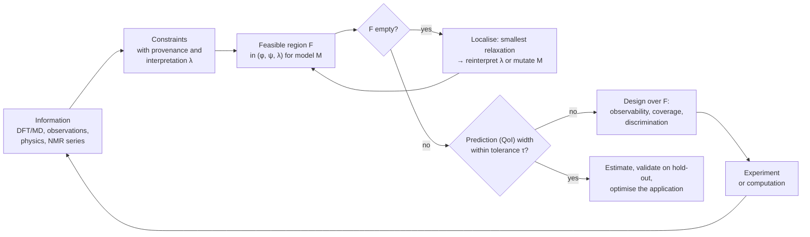

# Feasible-region methodology: from DFT to C(t) with incomplete data

| | |
|---|---|
| **Status** | Draft for review |
| **Scope** | One method for the two open problems of the project: (1) how to model the layer between DFT energies and C(t); (2) how to "fit" the model before kinetic data exist, in order to know which data are needed. It must work now (windows, no time series), later (NMR time series) and for other systems or models. |
| **Builds on** | NB01 `01_multiscale_microkinetics_theory.ipynb`, NB02 `02_operando_experimental_protocol.ipynb`, NB03 `03_experiment_plan.ipynb` (outputs as saved in the working tree on 2026-10-01), and `docs/guide-experiment_plan.md` (the experiment-specific plan, which is one instance of this method). |
| **Tags** | **[NB01 Bn]** block n of NB01; **[NB02 §n]**, **[NB03 §n]** notebook sections; **[App. A]** computed for this document with the current code (script and output in Appendix A); **[PROPOSED]** not coded or not checked yet; **[ASSUMED]** an input still to be confirmed. Section numbers without a tag refer to this document. |

---

## 0. Summary

The two problems are one problem seen from two sides. The layer between DFT and C(t) (barriers, their temperature dependence, the rate law) needs more numbers than DFT provides. Without kinetic data those numbers cannot be fitted, and we want to know which data would fix them. Both questions are about the same object: **the space of every quantity the model needs**.

Every piece of information cuts away part of that space: the DFT and MD energies, Gogoi's observations, physical laws and, later, NMR time series. What survives is the **feasible region F**. It can end in one of three states, and each one says what to do next:

| State of F | Meaning | Next step |
|---|---|---|
| **empty** | the information contradicts the model or our reading of it | find the smallest change that restores feasibility: reinterpret an observation, or change the model (**mutation**, Section 8) |
| **open or wide** along some direction | underdetermined | that direction *is* the data we need: design the experiment that cuts it (Section 6) |
| **small** along every direction that matters for the prediction | determined | estimate, validate on held-out data, optimise the application (Sections 7, 8.5) |

| # | Statement | Evidence |
|---|---|---|
| 1 | The layer DFT → k(T) has about 30 continuous unknowns in three groups: computed thermodynamics φ (6 independent directions, not 9), kinetic parameters ψ (g, ΔS‡) and interpretation parameters λ (window edges, unknown times). On top of these sits a discrete structure M: rate law, network, family partition. | Section 2; [App. A1] |
| 2 | Every bound we report today is a **slice**: one g scanned, everything else held at one point (φ at the DFT mean, ΔS‡ = 0, λ at the file values). A slice is always contained in the **projection**, which is the bound the information actually supports. The current intervals are therefore too narrow. | Section 4.2 |
| 3 | Moving only the ΔG_rxn of the probed reaction by ±1σ (raw-std reading of the MD σ), the transfer bound g ≤ 1.13 eV becomes g ≤ 1.24 eV, and the solvent-attack interval 1.27–1.39 eV slides anywhere within 1.07–1.58 eV. Under a 0.02 eV reading of σ the bounds move by only ±0.01 eV. | Section 4.4; [App. A2] |
| 4 | The solvation axis also decides **which constraints exist**. E4 cannot be met at any g once the BMSPA energy is 0.11 eV less favourable than computed (0.44σ). E3 gives no bound on condensation once ΔG_rxn(R4) ≥ 0.22 eV (0.36σ above the DFT value). So the qualitative observations also bound the DFT dimension. | Section 4.5; [App. A2, A3] |
| 5 | Inconsistency can be measured, not only detected. The water-series contradiction disappears if the 2 vol% spectrum was taken ≥ 2.2× later than the 1 vol% one. The heating observation does not depend on that time, so it is the firmer evidence. It points to equilibrium (M3) or water loss (M4) rather than acid catalysis (M2). | Section 5.3; [App. A5] |
| 6 | A design must be judged over F, not at one assumed truth. NB03 §7 uses a 1-D grid of hydrolysis g with everything else at placeholders. Its verdict "transfer undetermined" holds only for the placeholder g_T = 0.80 eV, while F reaches 1.13–1.24 eV, where experiment E is informative. | Section 6; [NB03 §7.1–7.2] |
| 7 | Resolving SLV-01 (are the MD σ standard deviations or standard errors?) is the cheapest "experiment" available. It changes the projected width of the g intervals about fourfold, and it decides whether M3 is admissible at all. | Sections 4.4, 5.3, 6.6 |



The picture of an n-dimensional space cut by boundaries is, formally, **set-membership (bounded-error) estimation** [4]. In chemical kinetics it was developed as **Bound-to-Bound Data Collaboration** for combustion mechanisms [1–3], where, as here, much of the experimental information consists of bounds rather than curves. The method below adapts that framework to our pipeline and adds the parts our problem needs: computed priors with correlated errors, interpretation parameters, and a discrete model space.

---

## 1. Where NB01–NB03 stand, in the language of the method

| Layer | Notebook | What it provides | Kind of information | State of its boundary |
|---|---|---|---|---|
| L0 species energies G_i | NB01 B1–B2 | ωB97M-V G at 298 K + MACE ΔE_solv in EC, with σ per species | computed | defined, but the width is uncertain by a factor of about 10 (SLV-01) |
| L1 reaction energies ΔG_rxn | NB01 B3–B4 | 9 values; Wegscheider cycles close; the sign of 6 of 9 is unresolved at ±1σ | computed | correlated; only 6 independent directions [App. A1] |
| L2 barriers | NB01 B5; NB03 §1 | Marcus with one g per family, ΔS‡ = 0; α not identifiable | structural hypothesis + placeholders | hydrolysis free, transfer half-bounded, condensation half-bounded, solvent attack bounded [NB03 §3] |
| L3 rate constants | NB01 B5, B7 | Eyring + detailed balance | exact, given L1–L2 | — |
| L4 rate law, network | NB01 B8; NB03 §4 | mass action, 9 reactions, EC buffered | structural hypothesis | contested by the water series and the heating observation [NB03 §4] |
| L5 reactor | NB01 B8; NB02 §1–4 | batch reactor, step protocol, in-situ designs | exact, given the inputs | — |
| L6 observation | NB02 §5–7; NB03 §6 | peaks Gogoi resolved; noise per integral | measured (shifts), assumed (noise) | 6 of 9 reaction extents identifiable [NB02 §7] |

**Reading.** Each row is one step of the pipeline. Only L3 and L5 are exact. Every other layer brings unknowns. Some are computed with an error bar (L0, L1), some are hypotheses (L2, L4), some are placeholders (L2 for hydrolysis, L6 noise).

The notebooks already contain every element of the method, but each element acts alone and at one point of the space:

| Element of the method | Where it is today | What limits it |
|---|---|---|
| Feasibility: windows → bounds | NB03 §3 (`scan_family_barriers`, `find_barrier_bounds`) | one family scanned at a time; φ, ΔS‡ and λ fixed |
| Firmness of a bound | NB03 §3.1: the bounds move 0.03–0.08 eV with the assumptions behind them | one assumption at a time |
| Bounds not aligned with an axis | NB03 §3.2: E1 and E2 as lines in the (ΔS‡, g) plane | only ΔS‡, not ΔG_rxn |
| Consistency test | NB03 §4: 0 of 21 parameter sets pass the 1 and 2 vol% pair | pass/fail only; no measure of how far off, or of which assumption to relax |
| Structural identifiability | NB02 §7: rank 6 of 9 | none; it is the rank of the stoichiometric matrix (Section 2.3) |
| Design | NB03 §6–7: half-life maps, Fisher σ over true values of g_H | truths on a 1-D grid, other coordinates at placeholders |
| Error propagation ΔG‡ → g | NB03 §7.3: +10 or +125 meV | applied after the fit, not inside the region |
| Model selection | NB01 B6, NB03 §2: registry, pass/fail on E1–E4 | the same data set the values and test them (NB03 §2 note) |

---

## 2. The parameter space

### 2.1 The pipeline as one map

With N the 9 × 11 stoichiometric matrix (products positive) and u the experiment design (composition, temperature program, sampling times):

$$
\begin{aligned}
&\text{L0 species} && G_i = \hat G_i + \delta_i, \qquad \operatorname{cov}(\delta) = \Sigma_G = \operatorname{diag}(s_i^2) + s_\text{EC}^2\,\mathbf 1\mathbf 1^\top \\
&\text{L1 reactions} && x = N G, \qquad x_j \equiv \Delta G_{\text{rxn},j} \\
&\text{L2 barriers} && \Delta G^\ddagger_j(T) = F_s\!\big(x_j;\ g_{f(j)} - (T - T_\text{ref})\,\Delta S^\ddagger_{f(j)}\big), \qquad F_\text{Marcus}(x; g) = g\,(1 + x/4g)^2 \\
&\text{L3 rate constants} && k_{f,j} = \tfrac{k_BT}{h}\,e^{-\Delta G^\ddagger_j/k_BT}, \qquad k_{r,j} = k_{f,j}\,e^{x_j/k_BT} \\
&\text{L4 rate law } (M) && r_j = k_{f,j}\textstyle\prod_\text{reactants} C^{\nu} - k_{r,j}\prod_\text{products} C^{\nu} \quad (\text{M1, mass action}) \\
&\text{L5 reactor} && \dot C = N^\top r\big(C, T(t)\big), \qquad C(0) = C_0(u) \\
&\text{L6 observation} && y_{n,p}(t_k) = \textstyle\sum_i \nu_{n,p,i}\,C_i(t_k) + \varepsilon \quad \text{(time series)}, \qquad h_e = \text{functional of } C(t_e) \quad \text{(window)}
\end{aligned}
$$

Here s_i is the solute part of the MD σ of species i (gas and solution boxes), and s_EC is the pure-EC box shared by every species (`kinetics/thermo/uncertainty.py`). Altogether the model is a map θ ↦ y = S_M(θ; u).

### 2.2 The coordinates

| Group | Symbol | Content | Dimension | How NB03 treats it |
|---|---|---|---|---|
| Computed thermodynamics | φ: x = x̂ + Nδ | corrections to the species free energies in EC | **6** (rank of N) | fixed at the DFT mean |
| Kinetics | ψ = (g_f, ΔS‡_f) | intrinsic barrier and activation entropy per family (or per step) | 8 (12 with hydrolysis split per step) | g scanned one family at a time; ΔS‡ = 0 except §3.2 and §7.5 |
| Interpretation | λ | window edges of E1–E4 (5 numbers) and the E4 time; water-series windows (7), sampling time(s), heating window | about 16 | file values; varied one at a time in §3.1 |
| Experimental nuisance (future data) | λ_exp | sample-temperature offset, [H₂O]₀, dead time, noise per nucleus | about 6 | error budget in §7.3 |
| Structure | M | rate law (M1–M4), network (e.g. EC + H₂O), family partition, barrier shape | discrete | M1, 9 reactions, 4 families, Marcus |

**Reading.** Each row is one kind of unknown. The last column is the point: every boundary reported today was found by moving one coordinate while all the others stayed at a single point.

### 2.3 The thermodynamic coordinates are six correlated directions

Because every ΔG_rxn is built from species energies, x = NG, its covariance is

$$\Sigma_x = N\,\Sigma_G\,N^\top = N\,\operatorname{diag}(s_i^2)\,N^\top,$$

since N𝟏 = 0 for these 2 → 2 steps and the shared EC term cancels. N has rank 6 [App. A1], so Σ_x has three zero eigenvalues. They are the three Wegscheider cycles (R5 = R1 + R4, and so on): there is no uncertainty along them. The six non-zero directions have σ = 0.59, 0.50, 0.31, 0.25, 0.19 and 0.18 eV [App. A1]. Selected correlations:

| Pair | Correlation | Why |
|---|---|---|
| R4 with R1, R2, R3 | −0.68, −0.72, −0.73 | TMSOH and H₂O sit on opposite sides in R4 and in hydrolysis |
| R4 with R5, R6, R7 | +0.64, +0.68, +0.70 | R5–R7 = R1–R3 + R4 |
| R8 with R9 | +0.71 | EC and CO₂ (σ = 0.30 eV) are on the same side in both |
| R9 with R1–R7 | 0.00 | no shared species |

**Reading.** The solvation "dimension" is not nine independent error bars. Learning one ΔG_rxn better also tells us about the others. A joint 95 % region in six dimensions extends to 3.55σ along each axis (√χ²₆,₀.₉₅), not to 1.96σ. The ±1σ moves used in Section 4 are therefore illustrations, not the full region. The width of the whole region is itself uncertain by an order of magnitude (SLV-01).

The same rank appears in NB02 §7. Spectra identify only 6 of the 9 reaction extents (R1 ⊕ R5, R2 ⊕ R6, R3 ⊕ R7, …), because composition can only fix the net extent along the six independent directions of N. Transfer (R5) and hydrolysis plus condensation (R1 + R4) lead to the same composition. They can be separated only through their rate laws, by changing the concentration of a species that enters one route and not the other. Water is that species, which is why the dry experiment E isolates transfer. **Structural rule:** to separate two routes with the same net stoichiometry, vary a species that appears in only one of them.

### 2.4 Problem 1: the barrier layer is a ladder of parameterisations

DFT stops at L1. How the barrier layer L2 is parameterised is itself a hypothesis, and it sets both the number of dimensions and how much work the DFT energies do:

| Rung | Barrier coordinates | Kinetic dimensions | What φ (DFT) does | In the project |
|---|---|---|---|---|
| B0 free | ΔG‡_j and ΔS‡_j per reaction | 18 | only reverse rates (detailed balance) | — |
| B1 per step in one family | g per hydrolysis step, family g elsewhere | 12 | reverse rates + Marcus ranking within the other families | NB03 §7 (`split_family_by_reaction`) |
| B2 family | g_f and ΔS‡_f per family | 8 | reverse rates + Marcus ranking within every family | `level1` |
| B3 global | one E₀ | 1 | as B2 | `peter_reference` |

**Reading.** Going down the ladder ties coordinates together, and the DFT energies take over more of the work. In B2, the relative rates inside a family come from ΔG_rxn through the Marcus relation, so σ(ΔG_rxn) becomes an uncertainty in rate. In B0, DFT enters only through the reverse rates. The rung is chosen by the data (Section 8.2), not fixed in advance.

**Continuous version [PROPOSED].** The rungs can be joined by a family relation with a scatter:

$$\Delta G^\ddagger_j(T) = F_s\big(x_j;\ g_{f(j)}(T)\big) + \varepsilon_j, \qquad |\varepsilon_j| \le \tau_f \;\;(\text{set form}) \quad\text{or}\quad \varepsilon_j \sim \mathcal N(0, \tau_f^2).$$

τ_f = 0 is B2 and τ_f → ∞ is B0. τ_f is a parameter the data can bound. If R1–R3 are measured separately (design C), the spread of their barriers about the Marcus curve bounds τ_hydrolysis. A member that is never observed, such as R7, then inherits the family value ± τ_f instead of the exact value of R5–R6.

**Coordinates to fit in.** The data constrain ω_{j,T} = ΔG‡_j(T), the barrier of a reaction at the temperatures where it is observed (Section 4.3). Fit in ω, then map ω back through the chosen rung to (g, ΔS‡, ε, x). Report ω as the primary result. This is the recommendation of NB03 §7.3, which here becomes a general rule.

---

## 3. Information as constraints

### 3.1 Four kinds

| Kind | Region in θ | In the project |
|---|---|---|
| **C1 Computed prior** | $X_\kappa = \{x:\ x - \hat x \in \operatorname{range} N,\ (x - \hat x)^\top \Sigma_x^{+}(x - \hat x) \le \kappa^2\}$ | DFT + MD energies with their σ (L0–L1) |
| **C2 Windowed observation** | $R_e(\lambda) = \{\theta:\ L_e(\lambda) \le h_e(\theta; u_e) \le U_e(\lambda)\}$ | Gogoi E1–E4, water series, heating |
| **C3 Time series** | $R_q(\alpha) = \{\theta:\ \chi^2(\theta) - \min\chi^2 \le \Delta_\alpha\}$, with $\chi^2 = \sum_k \big((y_k - \hat y_k(\theta))/\sigma_k\big)^2$ | NMR runs C, D, E, F (pending) |
| **C4 Physics and declarations** | $A = \{g_f > 0,\ \Delta G^\ddagger_j \ge \max(0, x_j), \dots\}$; declared box $B$ | Marcus floor in `calculate_barrier`; g ∈ [0.60, 1.70] eV [NB03 §3]; ΔS‡ prior ±100 J/mol/K [NB03 §7.5] |

The declared box B is a constraint with no data behind it. When NB03 calls hydrolysis "unconstrained", it means that its feasible g fills the box. A box edge must be labelled as a declaration, and justified where it matters (for example, by the diffusion limit for the lower edge of g).

### 3.2 Provenance and firmness

Every constraint carries four things:

- its **source**: figure or computation;
- its **kind**: computed / measured / derived / assumed / reading / declared, the vocabulary of `data/experimental_gogoi2024.json` plus "declared";
- its **interpretation parameters** λ with a plausible range Λ: which numbers are our choice;
- its **domain** D_e: temperature, medium and composition where it was observed.

The **firmness** of a boundary is how far it moves over Λ. If the boundary g*(λ) is defined by h_e(g*, λ) = E_e(λ), where E_e is the window edge, the implicit-function theorem gives

$$\frac{\partial g^*}{\partial \lambda} = \frac{\partial E_e/\partial\lambda - \partial h_e/\partial\lambda}{\partial h_e/\partial g}.$$

NB03 §3.1 measured this by finite differences: 0.03–0.08 eV over the ranges tried.

### 3.3 Extrapolation is a constraint used outside its domain

Some constraints are used outside D_e: Gogoi's EC/DEC observations applied to pure EC, barriers from 40–80 °C applied at 25 °C, the transfer g passed from R5 to R7 (never observed). Such a window must widen by a declared discrepancy, L_e − δ_e ≤ h_e ≤ U_e + δ_e [PROPOSED]. This is the set-form analogue of the model-discrepancy term of Kennedy and O'Hagan [10]. Today δ_e = 0 everywhere; for example, Gogoi's EC/DEC is simulated with [EC] = 7.1 M and pure-EC solvation [NB03 assumptions].

---

## 4. The feasible region

### 4.1 Definition

For a model structure M and an interpretation λ:

$$F(M, \lambda) = B \cap A \cap X_\kappa \cap \bigcap_e R_e(\lambda) \cap R_q .$$

Over the plausible interpretations:

$$F^{\cup}(M) = \bigcup_{\lambda \in \Lambda} F(M, \lambda) \quad\text{(not excluded by any reasonable reading)}, \qquad F^{\cap}(M) = \bigcap_{\lambda \in \Lambda} F(M, \lambda) \quad\text{(survives every reading)}.$$

A boundary is **firm** where F^∪ and F^∩ share it. Λ must keep correlated interpretations together. If two observations come from the same spectra, their detection limits move together; otherwise F^∩ is too pessimistic.

### 4.2 Slice versus projection

For coordinate k, the **projection** is $P_k = \{\theta_k:\ \exists\,\theta_{-k} \text{ with } \theta \in F\}$. The **slice** through a point θ⁰ ∈ F is $S_k(\theta^0) = \{\theta_k:\ (\theta_k, \theta^0_{-k}) \in F\}$.

**Lemma.** S_k(θ⁰) ⊆ P_k for every θ⁰. Equality holds for every θ⁰ only if F is a product, P_k × F₋ₖ, that is, only if no constraint couples θ_k to the other coordinates.
*Proof.* If θ_k ∈ S_k(θ⁰), then θ₋ₖ = θ⁰₋ₖ is a witness for θ_k ∈ P_k. ∎

**Consequence.** The intervals of NB03 §3 are slices through θ⁰ = (the other families at `level1`, x = x̂, ΔS‡ = 0, λ from the file). They are lower limits on the true widths. The "contour in each dimension" that we want is the projection P_k.

### 4.3 Boundaries are not aligned with the axes

When an observable depends on θ only through ω = ΔG‡_j(T_e), its boundary is a level set ω = ω*. This holds when the observable is kinetically controlled; Section 4.5 shows when it is not. The level set is a curve in the (x_j, g_f, ΔS‡_f) space, with slopes

$$\left.\frac{dg}{dx}\right|_{\omega^*} = -\frac{\partial F/\partial x}{\partial F/\partial g} = -\frac{\alpha}{1 - x^2/16g^2} \approx -0.5 \;\;(\text{Marcus}), \qquad \left.\frac{dg_\text{ref}}{d\Delta S^\ddagger}\right|_{\omega^*} = T_e - T_\text{ref}.$$

The second slope is the line of NB03 §3.2. In ω the constraints are boxes; in g they are tilted bands. That is why ω is the coordinate to fit in (Section 2.4).

**Example: why one global E₀ fails.** In ω, E1 needs ΔG‡(R8, 25 °C) ≥ 1.249 eV and E4 needs ΔG‡(R5, 25 °C) ≤ 0.950 eV [NB03 §3]. Under the capped BEP every downhill step has ΔG‡ = E₀, and R5 and R8 are both downhill. The two conditions cannot hold together, at least to first order. A direct scan of the one-E₀ structure confirms it: E1 + E2 need E₀ = 1.25–1.35 eV, and E4 fails at every E₀ from 0.60 to 1.70 eV [App. A4]. E4 fails for the reason NB01 B8 gives. When all barriers are equal, EC (7.1 M) takes the TMSOH before TMSPA (0.15 M) can.

### 4.4 Worked example: today's bounds along the solvation axis

The direct bounds of NB03 §3 recomputed at shifted ΔG_rxn of the probed reaction, holding ω at its bound value (Marcus inversion), and checked by simulation (a species solvation energy shifted, then `find_barrier_bounds` rerun) [App. A2]:

| Bound (experiment) | Probed reaction, ω at the bound | g at x̂ − σ | g at x̂ (NB03 §3) | g at x̂ + σ | g at x̂ ± 0.02 eV |
|---|---|---|---|---|---|
| transfer ≤ (E4) | R5: 0.950 eV at 25 °C | 1.242 (simulated 1.241) | 1.129 | **no g satisfies E4** (simulated, Section 4.5) | 1.119–1.138 |
| condensation ≥ (E3) | R4: 1.286 eV at 80 °C | 1.401 (simulated 1.402) | 1.235 | **no bound**: E3 holds at equilibrium (simulated, Section 4.5) | 1.224–1.245 |
| solvent attack ≥ (E1) | R8: 1.249 eV at 25 °C | 1.462 (simulated 1.463) | 1.272 | 1.067 (simulated 1.068) | 1.263–1.282 |
| solvent attack ≤ (E2) | R8: 1.363 eV at 80 °C | 1.577 (simulated 1.577) | 1.386 | 1.182 (simulated 1.184) | 1.377–1.396 |

σ = σ_x of the probed reaction under the raw-std reading: R5 0.250, R4 0.336, R8 0.396 eV [App. A1].

**Reading.**
- Each row is one of today's bounds. The middle column is what NB03 reports. The columns on either side show where the same observation puts the bound if the computed ΔG_rxn is off by one standard deviation.
- Where the observable is kinetically controlled, inversion and simulation agree within 2 meV. The shortcut is valid there and costs nothing.
- Solvent attack stays a band about 0.11 eV wide, but the band slides with ΔG_rxn(R8). Projected over ±1σ it covers 1.07–1.58 eV, against 1.27–1.39 eV in the slice. In ω the same information is firm: ΔG‡(R8) = 1.249–1.363 eV, independent of ΔG_rxn.
- Under the 0.02 eV reading of σ every bound moves by ±0.01 eV. Settling SLV-01 changes the width of these projections by about a factor of four (solvent attack: 0.51 vs 0.13 eV).

### 4.5 The solvation axis changes which constraints exist

The inversion fails in two cells of the table. In both, the observable becomes controlled by equilibrium rather than by the barrier.

- **E3 becomes inactive.** With R4 alone, E3 (≤ 5 % of the Si in HMDSO after 8 h at 80 °C, 0.45 M TMSOH) is met at equilibrium for any g once ΔG_rxn(R4) ≥ 0.221 eV, which is 0.36σ above the DFT value of 0.102 eV [App. A3]. The TMSOH that R8 removes only lowers this threshold. At x̂ + σ the simulation finds no bound [App. A2].
- **E4 becomes infeasible.** If the BMSPA solvation energy is made less favourable, the R5/R6 equilibria cap the TMSPA conversion below 0.95 at every g. The cap is 0.80 at +0.15 eV and 0.61 at +0.25 eV. The threshold is a shift of +0.111 eV, where x_R5 = −0.262 eV, that is 0.44σ [App. A2].

**Reading.** A qualitative observation can do two things besides bounding g: switch off (E3) or exclude a region of the DFT space (E4). E4 alone says that BMSPA cannot be more than about 0.11 eV less stabilised by EC than computed, along that direction. That is a sharper statement than the MD σ. This is information about L0–L1 that no notebook extracts today. The thresholds depend on the direction in φ: shifting one species moves several reactions. A full treatment samples φ in its six directions (Section 9).

---

## 5. Diagnosis

### 5.1 Classification and tolerance

The tolerance on a barrier comes from the purpose. A rate constant is wanted to within a factor ρ at the temperature of use, so

$$\tau = k_BT\ln\rho .$$

| T | τ for ρ = 10 | τ for ρ = 2 |
|---|---|---|
| 25 °C | 59.2 meV | 17.8 meV |
| 40 °C | 62.1 meV | 18.7 meV |
| 60 °C | 66.1 meV | 19.9 meV |
| 80 °C | 70.1 meV | 21.1 meV |

This confirms the NB03 §1 statement, flagged there for checking, that 0.06 eV is a factor of ten at 25 °C.

Each coordinate, or each prediction (Section 5.2), falls into one class:

| Class | Projection P_k |
|---|---|
| empty | F = ∅ (Section 5.3) |
| free | both ends at the declared box |
| half-bounded | one end at the box |
| bounded | both ends inside the box, width > τ |
| determined | width ≤ τ |

Each class is also tagged **firm** or **interpretation-dependent** (F^∩ vs F^∪), and **conditional** when a constraint switches on or off across F (Section 4.5).

### 5.2 Determine predictions, not every parameter

The model is used for predictions Q(θ), the quantities of interest (QoI). Examples are the time to consume 90 % of the water at 25 °C (NB01 B8) and the TMSPA left at each acquisition (NB02 §2). The relevant width is that of

$$P_Q = \Big[\min_{\theta\in F} Q(\theta),\ \max_{\theta\in F} Q(\theta)\Big].$$

Kinetic models are often "sloppy" [7]: a prediction can be tight while individual parameters are not, and a parameter the prediction does not depend on needs no data. **The data we need** are the directions v along which F is wide *and* ∇Q · v ≠ 0. The stopping rule is width(P_Q) ≤ τ_Q, not "every g known".

### 5.3 Measuring inconsistency

For each window constraint, define a signed margin scaled by a reference width w_e (for example the half-width of the window, or the range of its interpretation). For a one-sided window, drop the missing term.

$$m_e(\theta) = \frac{\min\{h_e(\theta) - L_e,\ U_e - h_e(\theta)\}}{w_e}, \qquad \gamma^* = \max_{\theta \in B\cap A\cap X_\kappa}\ \min_e m_e(\theta).$$

- γ* ≥ 0 if and only if F is non-empty. Its size is the safety margin of the most critical constraint.
- When γ* < 0, the **smallest relaxation** $\delta^* = \arg\min_{\delta\ge 0} \sum_e \delta_e$ such that $\exists\,\theta:\ m_e(\theta) \ge -\delta_e\ \forall e$ names the constraints to question, and by how much. This is the vector consistency measure of Data Collaboration [2, 3]. Interpretation parameters λ can be relaxed in the same way.

**Worked example: the water series** [App. A5]. Under M1 with water in excess, the TMSPA left after a time t is e^{−kct}. At a common time the 2 vol% sample therefore keeps y = x² of what the 1 vol% sample keeps; NB03 §4 finds every simulated curve close to this line. Our readings are W1: x ≥ 0.5 ("most TMSPA remains") and W2: y ≤ 0.05 ("no TMSPA").
- *Relax the windows.* W2 must widen to y ≤ 0.25 (δ = 0.20), or W1 to x ≥ 0.22 (δ = 0.28). The smallest relaxation is W2 alone, which means reading "no TMSPA" as "up to a quarter of the phosphorus still as TMSPA". Whether a TMSPA peak of that size could be missing from Gogoi's Fig. 1b is checkable on the figure.
- *Relax the common-time reading λ_t instead.* Then y = x^{2t₂/t₁}, and both readings hold if t₂/t₁ ≥ ln 0.05 / (2 ln 0.5) = **2.16**.
- So the water series rejects M1 only if the two spectra were taken within about a factor of 2 in time of each other. The sampling times belong on the list of questions for the authors.

**The heating observation is the firmer test.** In Gogoi's Fig. S2 the 2 vol% sample, heated stepwise to 80 °C, shows no change apart from slight broadening (our reading). That observation does not involve the sampling time. NB03 §4 finds 0 of the 4 runs consistent at room temperature that keep the spectrum unchanged. The water is in excess: about 1.1 M against at most 0.45 M needed to hydrolyse 0.15 M TMSPA completely. Under M1 or M2 the ladder must therefore move on heating; under M3 (equilibrium) or M4 (water lost) it need not. M2–M4 are not coded, so this is reasoning, not simulation. The heating observation therefore points to M3 or M4 rather than M2. Two points are checkable:
- **M3 depends on SLV-01.** M3 needs R2 and R3 close to thermoneutral. Their computed ΔG_rxn values are −0.158 and −0.177 eV, which is 0.64σ and 0.73σ from zero under the raw-std reading but about 8σ under a 0.02 eV reading. SLV-01 decides whether M3 is admissible at all.
- **M4 has a candidate mechanism to verify.** Water reacting with EC above 40 °C is listed in NB03 §2 from the paper's abstract, in a table marked autogenerated. It needs checking against Gogoi 2024.

---

## 6. Closing the open directions: designing over the region

### 6.1 "Fitting without data" is a pre-posterior analysis

Before any measurement, treat every point θ* ∈ F, under every surviving structure M*, as a possible truth. Simulate the candidate experiment, and ask whether its data would shrink F along the target directions. NB03 §7 already does this, with one restriction this method removes: there the truths lie on a 1-D grid of g_H, with every other coordinate at a placeholder. Here they are samples of F.

### 6.2 Screening: will the step happen while we watch?

A design u can inform the barrier of a step only if the step proceeds inside the observation window, $t_\text{dead} \le t_{1/2}(\theta; u) \le t_\text{end}$. The **observability coverage** is the share of F for which that holds. NB03 §6.2 maps t½ over (g, T) for three compositions; the method evaluates it over F.

### 6.3 Precision coverage and the prediction we care about

For a sample F_s of F, and with σ_k(u; θ*) the Fisher σ (Cramér–Rao bound) of NB03 §7:

$$\operatorname{cov}_k(u) = \frac{\#\{\theta^* \in F_s:\ \sigma_k(u;\theta^*) \le \tau_k\}}{\#F_s}, \qquad \text{plus the worst case } \max_{\theta^*\in F_s}\sigma_k(u;\theta^*).$$

Information from several runs adds (F = Σ JᵀJ). For a prediction Q, the target is $\sigma_Q^2 \approx c^\top \mathcal I(u;\theta)^{-1} c$ with $c = \nabla_\theta Q$, the c-optimal criterion [9], averaged or taken in the worst case over F_s.

**Example.** NB03 §7.2 reports transfer as undetermined by the whole plan (166 meV). That value is computed at g_T = 0.80 eV, the `level1` placeholder. NB03 §7.1 shows that the dry run E determines transfer once g_T ≥ 0.90 eV (σ 3.4 meV at 1.0 eV; guide rev0930-1, C3). F allows g_T up to 1.13 eV in the slice and 1.24 eV at x̂ − σ. Its lower end, 0.60 eV, is the declared box. The coverage of E for transfer is the share of F above 0.90 eV, so it depends on that declaration, which must be justified before the coverage means anything.

### 6.4 Discriminating between structures

For two structures M_a and M_b with feasible regions F_a and F_b:

$$D_{ab}(u) = \min_{\theta_a\in F_a,\ \theta_b \in F_b}\ \sum_k \left(\frac{y_{a,k}(\theta_a; u) - y_{b,k}(\theta_b; u)}{\sigma_k}\right)^2 .$$

A design discriminates M_a from M_b if D_ab(u) exceeds a chosen threshold, for example the 95 % χ² quantile for the number of readouts. Then no pair of feasible parameter sets of the two models gives the same data within the noise. This is the set-based version of the Box–Hill criterion [8]. It needs M2–M4 as code [PROPOSED]. The candidates in the guide are C against D (order in water) and in-situ heating with Karl Fischer, which is already part of C.

### 6.5 Constraints on the design itself

The admissible designs U are a region too:
- EC is liquid only above 36.4 °C [NB02 assumptions].
- The CO₂ pressure must stay below the tube rating; F can reach up to 15 bar [NB03 §8.1].
- The first spectrum comes at least 10 min after mixing [ASSUMED].
- The first round should use at most 40 % of the budget (Leardi [11], via the guide).

Designs are chosen inside U.

### 6.6 Value of information, and computations as experiments

Rank candidate actions by the expected shrinkage of width(P_Q) per unit cost. A computation is an action like any other.

- **Resolving SLV-01** costs no lab time. It changes the projected g widths about fourfold (Section 4.4), decides whether M3 is admissible (Section 5.3), and moves the E3 and E4 thresholds (Section 4.5).
- **Asking the authors for two times** (the E4 reaction time and the water-series sampling times) costs one e-mail and settles two interpretation parameters.

Both come before any NMR run.

---

## 7. When data arrive: from windows to likelihoods

Time series turn C2 constraints into C3, and nothing else changes. Projections become **profile likelihoods** [6], $\mathrm{PL}_k(\theta_k) = \min_{\theta_{-k}} \chi^2(\theta)$, with a confidence interval {θ_k : PL_k − min χ² ≤ Δ_α}. The point estimate is the minimum of χ² inside F, so the windows of E1–E4 stay active as constraints. Two rules carry over from the guide (Part B):

- **Penalise complexity.** Once data are quantitative, the choice between structures uses AIC/BIC or a likelihood-ratio test. A richer structure always has a feasible region at least as large (Section 8.2), so feasibility alone favours complexity.
- **Validate on unused data.** Data used to set a parameter cannot test it (NB03 §2 note). The hold-out run H is predicted before it is measured.

---

## 8. Mutation: moving in model space

### 8.1 Operators

| Operator | Effect on θ | Example |
|---|---|---|
| Refine the partition | split a family: more dimensions | hydrolysis → R1, R2, R3 (NB03 §7) |
| Coarsen the partition | tie coordinates: fewer dimensions | four families → one E₀ (`peter_reference`) |
| Free or fix a coordinate | ΔS‡ on or off; τ_f > 0 (Section 2.4) | NB03 §7.5 |
| Change the barrier shape | same dimensions | Marcus ↔ Agmon–Levine; they nearly coincide [NB01 B5] |
| Change the rate law | new terms or dimensions (e.g. K_a) | M2–M4 [PROPOSED] |
| Change the network | add reactions or species | EC + H₂O [PROPOSED] |
| Change the system | new φ; shared ψ inherited (Section 8.4) | another scavenger; LiPF₆ electrolyte |

### 8.2 Nesting

If M_c is M_f with tie constraints T (for example, all family g equal), then F(M_c) corresponds to F(M_f) ∩ T. Hence:

$$F(M_f) = \emptyset \Rightarrow F(M_c) = \emptyset, \qquad F(M_c) \ne \emptyset \Rightarrow F(M_f) \ne \emptyset.$$

**Rule.**
- On an empty region, refine or change the structure. Coarsening cannot help.
- On a non-empty region, try to coarsen. Keep the fewest dimensions that leave F non-empty and every QoI within τ.
- With time series, replace "non-empty" by a penalised criterion (Section 7).

### 8.3 The project so far, read as mutations

| Stage | Structure | Outcome | Reading |
|---|---|---|---|
| NB01 B6 | one global E₀ (B3) | no E₀ in 0.60–1.70 eV passes E4; E1 + E2 need 1.25–1.35 eV [App. A4] | F = ∅ → refine the partition |
| NB01 B5–B6, NB03 §3 | four family g (B2, `level1`) | E1–E4 feasible; hydrolysis free | F ≠ ∅ but open in g_H → design |
| NB03 §4 | B2 + water series at a common time | 0 of 21 sets pass the 1 and 2 vol% pair | F = ∅ under λ_t "common time" → relax λ_t (t₂/t₁ ≥ 2.16) or mutate the rate law (Section 5.3) |
| NB03 §7 | hydrolysis split per step (B1) | a step counts as measured only if seen | refinement, so that information is not borrowed across steps |
| NB03 §7.5 | + ΔS‡ per hydrolysis step | σ(g of R1 at 60 °C) grows from ~0.1 to 8–16 meV for C alone; C′ restores it | added dimensions widen the projections; the design closes them |

**Reading.** Without naming it, the project has already run this loop three times. The method makes each step explicit and repeatable.

### 8.4 Transfer to another system

For a new system S′ (another additive, the LiPF₆ electrolyte), the new φ′ comes from new DFT/MD. Kinetic coordinates that S′ shares with this system inherit the projection of F as their prior, widened by a declared transfer discrepancy δ_tr. Constraints are reused where their domains D_e overlap S′, and everything else starts free. The method itself needs only four inputs, so it does not change between systems:
- a simulator S_M(θ; u);
- a parameter table with roles (φ, ψ, λ), boxes and priors;
- a constraint library with provenance;
- an admissible design set U.

### 8.5 Optimising the application

Once F is small along the QoI directions, the same region serves robust optimisation of the end use. Choose a decision z (TMSPA loading, formation protocol, storage temperature) that minimises a cost J(z) subject to the performance requirement holding for every θ ∈ F, or for a chosen share of F. A wide F gives a conservative z. The gain in J from shrinking F prices an experiment in the units of the application, which closes the loop with Section 6.6.

---

## 9. The procedure

```
inputs : model space 𝓜 (start: current M), constraint library 𝒞 (with λ, Λ, D_e),
         declared box B, physics A, QoIs Q with tolerances τ, admissible designs U
repeat (round r):
  for M in active 𝓜:
      sample F(M) over (φ, ψ, λ)                         # 9.1
      γ*(M) ← consistency; if γ* < 0: δ*(M) ← smallest relaxation
  for M with γ* < 0:
      if δ* points to interpretation λ with a defensible reading → widen Λ, keep M
      else → mutate (refine / change rate law / change network), add to 𝓜
  for M with γ* ≥ 0:
      projections P_k, P_Q; classes (Section 5.1); firmness (F^∩ vs F^∪)
      coarsen if the QoIs stay within τ (Section 8.2)
  if every QoI is within τ in every surviving M and the surviving M agree within τ_Q:
      estimate, validate on hold-out, optimise the application → stop
  else:
      rank actions in U ∪ {computations, questions to authors}
          by observability, coverage, discrimination, cost (Section 6)
      run the first round (≤ 40 % of budget); add the results to 𝒞
```

### 9.1 Sampling a region of about 30 dimensions in practice [PROPOSED]

- **Use the block structure.**
  - E1–E3 contain only TMSOH, so they touch R4, R8, R9: (g_C, g_S, ΔS‡_C, ΔS‡_S), the φ directions of R4, R8 and R9, and their own λ.
  - E4 adds R5–R7 and g_T.
  - The water series adds R1–R3 and g_H.
  - Sample each block jointly, then couple the blocks through the shared coordinates (the species energies, g_C, g_S).
- **Sample in ω where possible.** Kinetically controlled constraints are boxes there (Section 4.3). Map back to g analytically: Marcus inversion, checked against simulation in Section 4.4. Simulate wherever equilibrium can take over (Section 4.5).
- **Use a low-discrepancy design** (Sobol) inside B, accept or reject each sample, and refine the boundaries by bisection along rays. `_bisect_edge` already does this along one axis.
- **Projections:** take min and max over the accepted samples, refined by constrained optimisation. Show 2-D pair projections (a corner plot) for the coupled pairs (g, x), (g, ΔS‡) and (g_T, g_C).
- **Solver:** BDF, as in `SCAN_METHOD`.

---

## 10. The current problem under the method

| Coordinate | Slice today [NB03 §3] | Along ±1σ of the probed ΔG_rxn [App. A2] | Over interpretations [NB03 §3.1] | Class | What closes it |
|---|---|---|---|---|---|
| g hydrolysis (R1–R3) | box 0.60–1.70 | box | — | **free** | C (+ D) time series [NB03 §7.1], after the rate-law test |
| g transfer | ≤ 1.129 (E4) | ≤ 1.24; no g at all past +0.11 eV in BMSPA | 1.05–1.18 (E4 time 1 h to 1 week) | **half-bounded**, conditional | E4 time from the authors; run E if g_T ≥ 0.9 |
| g condensation | ≥ 1.235 (E3) | ≥ 1.40, or no bound if ΔG_rxn(R4) ≥ 0.22 | 1.21–1.27 (detection limit 10–2 %) | **half-bounded**, conditional | F time series |
| g solvent attack | 1.273–1.387 | band 0.11 wide sliding within 1.07–1.58 | 1.30–1.34 if 20–60 % ring-opened | **bounded** in g; in ω, ΔG‡(R8) = 1.249–1.363 (114 meV > τ₁₀) | F time series |
| ΔS‡ (every family) | fixed at 0 | — | E1 + E2 exclude ΔS‡ < about −200 J/mol/K for solvent attack [NB03 §3.2] | **free** within the prior | C + C′ for R1–R3 [NB03 §7.5] |
| φ (6 directions) | DFT mean | E4 cuts the BMSPA direction above +0.11 eV | width uncertain ×10 (SLV-01) | computed prior; one direction bounded by data | SLV-01; equilibrium plateaus, if any |
| Rate law M | M1 assumed | — | water series rejects M1 only if t₂/t₁ < 2.16 | **contested** (heating) | C vs D; in-situ heating with Karl Fischer (in C) |
| λ_t water series | common time | — | unknown | **free** | question to the authors |

**Implications for the current plan.**
1. Before round 1, recompute the NB03 §3 bounds as projections over (g, φ, λ) jointly [PROPOSED]. Expect wider transfer and solvent-attack ranges and a conditional condensation bound.
2. Evaluate the designs over samples of F, not at the placeholder truth. In particular, "transfer undetermined" in NB03 §7.2 is a statement about g_T = 0.80 eV.
3. Add to the questions for the authors: the time between mixing and the ³¹P spectrum for each water-series sample. A factor of 2.2 between them removes the contradiction.
4. Treat the heating observation as the main test of the structure. Design C, with Karl Fischer before and after, already repeats it in situ.
5. Push SLV-01 first. It is a computation, not lab time, and it changes the widths of the projections fourfold and the admissibility of M3.

---

## 11. Mapping to the code [PROPOSED]

| Step of the method | Exists | Missing |
|---|---|---|
| Parameter roles and boxes | `ModelSpec.with_family_params`; `species_db` (solvation shifts work, Section 4.4) | a parameter table with role (φ/ψ/λ), box, prior and unit; φ applied as species-level shifts so that the Wegscheider cycles stay closed |
| Constraint library | `data/experimental_gogoi2024.json` (status tags); `reactor/validation.py` (observables) | λ as explicit fields with ranges Λ, the domain D_e, discrepancy δ_e |
| Feasible region | `fitting/feasibility.py`: 1-D scans + bisection | joint Sobol sampling over (φ, ψ, λ); projections; F^∩ and F^∪; pair plots |
| Consistency | `evaluate_water_series`, `evaluate_heating_observation` (pass/fail) | γ* and the smallest relaxation δ* |
| Design | `fitting/design.py`: local Fisher at given truths | truths sampled from F; coverage; c-optimal for a QoI; discrimination between structures |
| Model space | `MODELS` registry (barrier variants) | rate-law variants M2–M4; network variants (EC + H₂O); the τ_f scatter of Section 2.4 |

Suggested names, following the repository conventions: a module `kinetics/fitting/region.py` with `build_parameter_space`, `sample_feasible_region`, `calculate_region_projections`, `calculate_consistency_measure`, `find_minimal_relaxation` and `calculate_design_coverage`. New physics stays opt-in.

---

## 12. Limitations of the method

- **Sets carry no probability.** A projection says "not excluded", not "likely". Coverage (Section 6.3) needs a measure over F, and taking it uniform over the declared box is itself a declaration. With time series, the likelihood supplies the measure (Section 7).
- **The results depend on the declarations**: the box B, the ranges Λ and the discrepancies δ_e. The method makes them visible, but cannot remove them.
- **Sampling may miss thin regions** in about 30 dimensions. The block structure and the ω coordinates (Section 9.1) reduce the risk; they do not remove it.
- **The inversion shortcut** (Section 4.4) holds only under kinetic control. Near equilibrium, simulate (Section 4.5).
- **A non-empty F does not make M correct.** If the true structure is not in 𝓜, F can be non-empty and wrong. Only the hold-out test (Section 7) guards against this.

---

## References

Methodological references, not yet checked against the TFM BIB catalogue.

1. M. Frenklach, A. Packard, P. Seiler, R. Feeley, "Collaborative data processing in developing predictive models of complex reaction systems", *Int. J. Chem. Kinet.* 36 (2004) 57–66.
2. R. Feeley, P. Seiler, A. Packard, M. Frenklach, "Consistency of a reaction dataset", *J. Phys. Chem. A* 108 (2004) 9573–9583.
3. A. Hegde, W. Li, J. Oreluk, A. Packard, M. Frenklach, "Consistency analysis for massively inconsistent datasets in Bound-to-Bound Data Collaboration", *SIAM/ASA J. Uncertainty Quantification* 6 (2018) 429–456.
4. E. Walter, L. Pronzato, *Identification of Parametric Models from Experimental Data*, Springer, 1997.
5. I. Vernon, M. Goldstein, R. G. Bower, "Galaxy formation: a Bayesian uncertainty analysis", *Bayesian Analysis* 5 (2010) 619–669 (history matching: iterative exclusion of implausible parameter space).
6. A. Raue et al., "Structural and practical identifiability analysis of partially observed dynamical models by exploiting the profile likelihood", *Bioinformatics* 25 (2009) 1923–1929.
7. R. N. Gutenkunst et al., "Universally sloppy parameter sensitivities in systems biology models", *PLoS Comput. Biol.* 3 (2007) e189.
8. G. E. P. Box, W. J. Hill, "Discrimination among mechanistic models", *Technometrics* 9 (1967) 57–71.
9. G. Franceschini, S. Macchietto, "Model-based design of experiments for parameter precision: State of the art", *Chem. Eng. Sci.* 63 (2008) 4846–4872.
10. M. C. Kennedy, A. O'Hagan, "Bayesian calibration of computer models", *J. R. Stat. Soc. B* 63 (2001) 425–464.
11. R. Leardi, "Experimental design in chemistry: A tutorial", *Anal. Chim. Acta* 652 (2009) 161–172.

---

## Appendix A — Numbers computed for this document

Run from the repository root with `PYTHONPATH=. /opt/miniconda3/envs/tank_model/bin/python`. It takes under 30 s (BDF solver). No notebook was re-executed and no code in `kinetics/` was changed.

```python
import copy, math
import numpy as np
from kinetics.constants import KB_EV
from kinetics.data import NETWORK, NETWORK_SPECIES, load_experimental_data, load_species_database
from kinetics.fitting import find_barrier_bounds, scan_family_barriers
from kinetics.microkinetics.barriers import invert_marcus_barrier
from kinetics.microkinetics.models import get_model
from kinetics.reactor.validation import simulate_control_experiment
from kinetics.thermo import calculate_reaction_thermo
from kinetics.thermo.uncertainty import calculate_solvation_sigma_components

# A1. Stoichiometric rank and covariance of ΔG_rxn (the shared pure-EC term cancels: N·1 = 0)
rx, sp = list(NETWORK), list(NETWORK_SPECIES)
N = np.zeros((len(rx), len(sp)))
for j, r in enumerate(rx):
    for s, nu in NETWORK[r]['reactants'].items(): N[j, sp.index(s)] -= nu
    for s, nu in NETWORK[r]['products'].items():  N[j, sp.index(s)] += nu
comp = calculate_solvation_sigma_components()
s_solute = np.array([comp[s][0] for s in sp]); s_ec = comp[sp[0]][1]
Sigma_x = N @ (np.diag(s_solute**2) + s_ec**2 * np.ones((len(sp),) * 2)) @ N.T
sd = np.sqrt(np.diag(Sigma_x))
print('rank N =', np.linalg.matrix_rank(N), '| σ_x =', sd.round(3))
print(np.round(Sigma_x / np.outer(sd, sd), 2))
print('principal σ:', np.sqrt(np.clip(np.linalg.eigvalsh(Sigma_x), 0, None))[::-1].round(3))

# A2. NB03 §3 bounds moved along the probed ΔG_rxn: Marcus inversion at fixed ΔG‡, then simulation
x_hat = {r: calculate_reaction_thermo(r, 298.15)['dG_rxn_eV'] for r in rx}
for r, dGb in (('R5', 0.950), ('R4', 1.286), ('R8', 1.249), ('R8', 1.363)):
    s = sd[rx.index(r)]
    print(r, dGb, [round(invert_marcus_barrier(dGb, x_hat[r] + d), 3) for d in (-s, 0.0, s, -0.02, 0.02)])
db0 = load_species_database()
E = {e['id']: e for e in load_experimental_data()['control_experiments']}
for family, exps, species, shift in (('transfer', ['E4'], 'BMSPA', -0.25), ('transfer', ['E4'], 'BMSPA', 0.25),
                                     ('condensation', ['E3'], 'HMDSO', -0.336), ('condensation', ['E3'], 'HMDSO', 0.336),
                                     ('solvent_attack', ['E1', 'E2'], 'TMSOEG', -0.396),
                                     ('solvent_attack', ['E1', 'E2'], 'TMSOEG', 0.396)):
    db = copy.deepcopy(db0); db[species]['dE_solv_eV'] += shift
    b = find_barrier_bounds('level1', [family], experiments=[E[e] for e in exps], species_db=db)
    b = b[b['acts'] == 'directly']
    print(species, shift, [f'{q.experiment} {q.bound} {q.g_eV:.3f}' for q in b.itertuples()] or 'no bound')
# E4 infeasibility threshold: BMSPA shift at which even fast transfer (g = 0.60) cannot reach 95 %
fast = get_model('level1').with_family_params('transfer', g_eV=0.60)
def e4_conversion(shift):
    db = copy.deepcopy(db0); db['BMSPA']['dE_solv_eV'] += shift
    return simulate_control_experiment(E['E4'], fast, species_db=db, method='BDF')
lo, hi = 0.10, 0.15
for _ in range(12):
    mid = 0.5 * (lo + hi); lo, hi = (mid, hi) if e4_conversion(mid) >= 0.95 else (lo, mid)
print('E4 threshold BMSPA shift:', round(0.5 * (lo + hi), 3))

# A3. E3 is met at equilibrium (no bound on g) above this ΔG_rxn(R4) (R4 alone, 0.45 M TMSOH, 80 °C)
kT = KB_EV * 353.15; y = 0.05 * 0.45 / 2
print('threshold ΔG_rxn(R4):', round(-kT * math.log(y**2 / (0.45 - 2 * y)**2), 3))

# A4. One global E0 (peter_reference structure) against E1–E4
scan = scan_family_barriers('peter_reference', g_grid_eV=np.round(np.arange(0.60, 1.701, 0.05), 3), families=['default'])
ok = scan.pivot_table(index='g_eV', columns='experiment', values='consistent', aggfunc='all')
print({e: list(ok.index[ok[e]]) for e in ok}, '| all four:', list(ok.index[ok.all(axis=1)]))

# A5. Water series under first order in water (x: TMSPA left at 1 vol%, y: at 2 vol%)
print('x ≤', round(math.sqrt(0.05), 3), 'if y ≤ 0.05 at a common time; t2/t1 ≥', round(math.log(0.05) / (2 * math.log(0.5)), 2))
```

**Output** (2026-10-01):

| Item | Result |
|---|---|
| A1 rank of N | 6 (three zero singular values = the three Wegscheider cycles) |
| A1 σ_x (eV) | R1 0.262, R2 0.246, R3 0.241, R4 0.336, R5 0.250, R6 0.234, R7 0.229, R8 0.396, R9 0.440 (same as the NB01 B4 table) |
| A1 principal σ (eV) | 0.590, 0.499, 0.305, 0.247, 0.193, 0.177, 0, 0, 0 |
| A2 inversion, g at (x̂ − σ, x̂, x̂ + σ, x̂ − 0.02, x̂ + 0.02) | R5/0.950: 1.242, 1.129, 1.010, 1.138, 1.119 · R4/1.286: 1.401, 1.235, 1.056, 1.245, 1.224 · R8/1.249: 1.462, 1.272, 1.067, 1.282, 1.263 · R8/1.363: 1.577, 1.386, 1.182, 1.396, 1.377 |
| A2 simulation | BMSPA −0.25: E4 g ≤ 1.241 · BMSPA +0.25: no bound · HMDSO −0.336: E3 g ≥ 1.402 · HMDSO +0.336: no bound · TMSOEG −0.396: E1 ≥ 1.463, E2 ≤ 1.577 · TMSOEG +0.396: E1 ≥ 1.068, E2 ≤ 1.184 |
| A2 E4 threshold | BMSPA shift +0.111 eV (x_R5 = −0.262 eV); E4 conversion at g_T = 0.60 is 0.973, 0.795, 0.642 and 0.605 at shifts +0.10, +0.15, +0.20, +0.25 eV |
| A3 E3 threshold | ΔG_rxn(R4) = 0.221 eV; equilibrium Si fraction in HMDSO at the DFT value (0.102 eV) is 0.27 |
| A4 one global E₀ | E1 passes for E₀ ≥ 1.25; E2 for 1.25–1.35; E3 for all; **E4 for none**; all four for none |
| A5 water series | equal times: x ≥ 0.5 forces y ≥ 0.25, y ≤ 0.05 forces x ≤ 0.224; unequal times need t₂/t₁ ≥ 2.16 |
