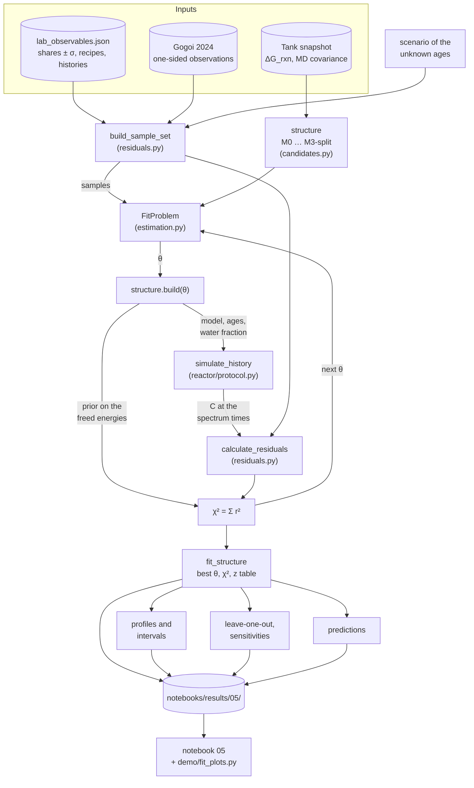
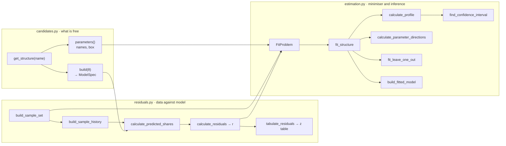
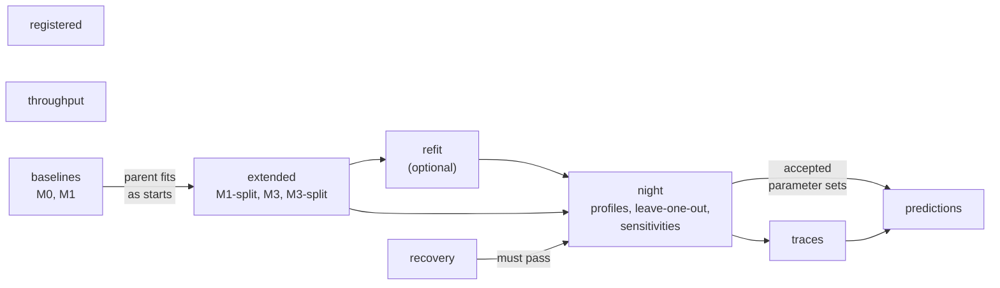
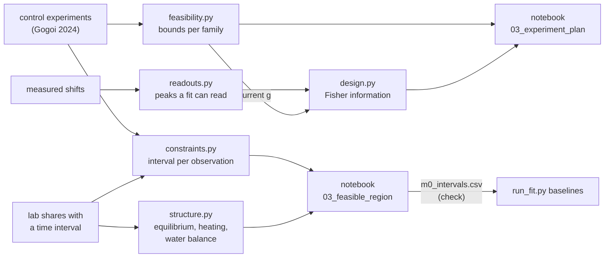

# Fitting system: how a fit runs, from the data to the result files

| | |
|---|---|
| **Status** | Draft |
| **Source** | Y. Alcaraz Galván |
| **Scope** | The fit of the kinetic models to the lab NMR data as one system: what is compared with what, what is minimised, which files take part, the stages of the runner and the files they write. Read from the code; no fit was run to write it. |
| **Applies to** | Branch `fit/first-fit`, 2026-10-07. Sections 1–7 describe the system of the second fit; section 8 lists what the third fit changed |
| **See also** | [reference-fit_models.md](reference-fit_models.md) for the equations and free parameters of each model; [MODULES.md](../MODULES.md) §7 for every function with its input and output |

The work on the data has two parts, and they share the same models and reactors:

- **Before the fit** (notebook 03): which barriers the observations allow, and what to measure next. Section 6.
- **The fit** (notebook 05): the lab shares against candidate models. Sections 1 to 5.

## 1. Overall scheme



Read it as a loop. The minimiser proposes a parameter set θ. The structure turns θ into a model. The reactor simulates every sample with that model. The predicted shares are compared with the measured ones. The sum of squared residuals goes back to the minimiser.

## 2. What is fitted: definitions

### 2.1 Data side

| Term | Meaning | Where |
|---|---|---|
| **Sample** | One NMR tube: a composition at mixing, a temperature history, one or more spectra | `build_sample_set` |
| **Block** | The spectra of one nucleus of a sample. A tube recorded on ³¹P and ¹³C has two blocks; they share composition, history and age and are read off one simulation | `residuals.py` |
| **Share** | Fraction of the total peak area in one ppm window of one spectrum. The quantity the fit compares | `lab_observables.json` |
| **Role** | `fit` (enters χ²), `hold_out` (predicted afterwards, never fitted), `check` (a consistency check) | per block, in the observables file |
| **Age** | Time from mixing to a sample's first spectrum. Not recorded for any sample | scenario |
| **Paper observation** | A one-sided limit from Gogoi 2024 (E1) added to the lab samples. Its residual is zero inside the limit | `PAPER_OBSERVATIONS` |

### 2.2 The unknown ages: scenarios

Every result is computed under one scenario, because the ages are not known.

| Scenario | Every unknown age is |
|---|---|
| `short` | 1 h |
| `middle` | 1 day |
| `long` | 7 days |
| `free` | Between 1 h and 30 days. The age of the heated 2 % water sample is a fit parameter (`log10 age 2 % H2O`). The age of each unheated sample is the value that favours the model, found inside every evaluation |

### 2.3 The error of a share

| Part | What it is |
|---|---|
| Noise | White noise of the spectrum, propagated to the share |
| Baseline spread | Half the spread of the share between three baselines |
| Floor | A declared minimum error |

The three add in quadrature. Repeated room-temperature spectra of one block count as one composition plus n − 1 measurements of "no drift": baseline and floor are common to them, the noise is independent. The K shares of a spectrum sum to one, so their residuals are scaled by √((K − 1)/K).

### 2.4 The objective

```
z   = (predicted share − measured share) / σ          one per measured quantity
χ²  = Σ z²  +  dᵀ · Σ_MD⁻¹ · d                         d = freed reaction energies (M3, M3-split only)
```

A sample whose simulation fails contributes a fixed penalty for each of its values, so the minimiser moves away from that region.

### 2.5 The parameter vector θ

In this order, each with a declared search box:

| Parameters | Present in | Box |
|---|---|---|
| `g <family>` intrinsic barriers | every structure | 0.60–1.70 eV, narrower for some families |
| `dG R1` … `dG R4` shifts of the reaction energies | M3, M3-split | ±0.75 eV around the computed value |
| `water fraction` | names ending in `+W` | 0.05–1 |
| `log10 age 2 % H2O` | `free` scenario | 1 h to 30 days |

### 2.6 Rules fixed before any fit

- **Fit rule.** A structure fits a scenario if no |z| exceeds 3. The pull of each freed energy counts as a residual.
- **Selection rule.** The first consistent parameter set is that of the smallest structure that fits; a scenario with a common age takes precedence over free ages.
- **Interval.** The range of a parameter over which its profile stays within Δχ² = 3.84 of the minimum. A side the data do not close stays open.
- **Two tolerances.** The search uses a loose solver tolerance (rtol 10⁻⁶); every reported χ², table and final polish uses rtol 10⁻⁸.

## 3. The fit core, in call order



| File | Role | Entry points |
|---|---|---|
| [candidates.py](../kinetics/fitting/candidates.py) | Declares the six structures and their search boxes. Turns θ into a self-contained model: own network (when a family is split) and own species shifts (when energies are freed) | `get_structure`, `FitStructure.parameters`, `FitStructure.build`, `embed_parent_theta`, `build_fitted_model` |
| [residuals.py](../kinetics/fitting/residuals.py) | Builds the sample set of a scenario, simulates each sample and whitens the difference with the error model | `build_sample_set`, `calculate_residuals`, `tabulate_residuals`, `find_free_age` |
| [estimation.py](../kinetics/fitting/estimation.py) | Holds the problem (structure + samples), searches the box, and then asks what the data determine | `FitProblem`, `fit_structure`, `calculate_profile`, `find_confidence_interval`, `calculate_parameter_directions`, `fit_leave_one_out`, `compare_structures` |

**How `fit_structure` searches.** A Sobol screen of the box at the loose tolerance. Bounded least squares from the best screen points, plus any starting points given (the fit of the smaller structure this one extends, mapped by `embed_parent_theta`). A final polish at the report tolerance. The result keeps the other local optima it found and the parameters that ended at a bound.

**How an interval is found.** `calculate_profile` fixes one parameter at each value of a grid and re-minimises the others. `extend_profile` repeats this from other local optima, so a second basin is not missed. `refine_profile_edges` adds points where the interval ends. `find_confidence_interval` reads the interval off the profile.

**Layers the core calls.** One evaluation goes through [reactor/protocol.py](../kinetics/reactor/protocol.py) (`simulate_history`), [reactor/engine.py](../kinetics/reactor/engine.py), [microkinetics/models.py](../kinetics/microkinetics/models.py) and [rates.py](../kinetics/microkinetics/rates.py), and, for freed energies, [thermo/uncertainty.py](../kinetics/thermo/uncertainty.py). They are described in [MODULES.md](../MODULES.md) §3 to §5.

## 4. The runner and its stages

[scripts/run_fit.py](../scripts/run_fit.py) runs one stage per call. Every job writes one file under the results folder and is skipped when that file exists, so a stage can be interrupted and started again. A new fit needs a new folder (`--results`): in a folder that holds results, the old fits are returned as they are.



| Stage | Does | Reads | Writes |
|---|---|---|---|
| `registered` | Evaluates the four registered models as they are, in the four scenarios | `lab_observables.json` | `registered.csv`, `registered_residuals.csv` |
| `throughput` | Measures evaluations per second, to size the long stages | — | `throughput.csv` |
| `recovery` | Refits synthetic data generated from known parameters, with the design and error model of the lab set. The check of the pipeline | — | `recovery/<case>_seed<n>.json`, `recovery_summary.csv` |
| `baselines` | Fits M0-BEP, M0-Marcus and M1 in the four scenarios | `lab_observables.json` | `fits/<structure>__<scenario>.json`, the four `fits_*.csv` tables |
| `extended` | Fits M1-split, M3 and M3-split, starting from the fits of the smaller structures | `fits/` of `baselines` | The fit files of the three structures, the `fits_*.csv` tables again |
| `refit` | Re-checks M3 and M3-split at a tighter search tolerance. It repaired a solver setting of the first run; a new run can skip it | `fits/`, `profiles/` | Fits kept or replaced; a replaced one moves to `fits_first_pass/` |
| `night` | Profiles and intervals, leave-one-sample-out, structures the data cannot tell apart, sensitivity to the declared errors and times. Runs `recovery` first and stops if it fails | `fits/` | `profiles/`, `loo/`, tagged fits in `fits/`, `intervals.csv`, `barrier_bands.csv`, `leave_one_out.csv`, `indistinguishability.csv`, `sensitivities.csv`, `tolerance_check.csv`. A fit replaced by a lower profile minimum moves to `fits_before_profiles/` |
| `traces` | Tests a trace of TMSOH at mixing (0 to 1 mM) in the two water samples: as fitted, and fitted again | `fits/` | `trace_sensitivity.csv`, `fits/M3-split__<scenario>__TMSOH_<level>.json` |
| `predictions` | Hold-out samples, checks against samples and paper observations the fit did not use, storage at 25 °C, the bench protocol with its ΔS‡ band | `fits/`, `profiles/`, the trace refits | `hold_out.csv`, `check_tmspa_alone.csv`, `check_paper.csv`, `prediction_storage.csv`, `prediction_storage_traces.csv`, `prediction_protocol.csv`, `sample_trajectories.csv` |

Helpers of the runner worth knowing:

- `run_one` and `run_structure` run one cached fit and add the starts from the parent structures.
- `fit_tmsoh_block` fits condensation and solvent attack from the TMSOH-only samples first, to seed the screen.
- `select_consistent` applies the selection rule of section 2.6.
- `summarize_fits` writes `fits_summary.csv` and its companions.

## 5. Result files

All under the results folder (`notebooks/results/05/` by default).

| File or folder | Holds | Written by |
|---|---|---|
| `fits/<structure>__<scenario>[__tag].json` | One fit: θ, χ², z table, ages, local optima, barriers per reaction | `baselines`, `extended`, `night`, `traces` |
| `fits_summary.csv`, `fits_parameters.csv`, `fits_residuals.csv`, `fits_barriers.csv` | The main fits side by side: χ² and the fit rule; θ; every z; ΔG‡ per reaction | `summarize_fits` |
| `profiles/<structure>__<scenario>.json` | Profiles, intervals and the parameter combinations the data see | `night` |
| `intervals.csv`, `barrier_bands.csv` | The intervals as flat tables | `night` |
| `loo/<structure>__<scenario>.json`, `leave_one_out.csv` | The fit without each sample in turn | `night` |
| `indistinguishability.csv`, `sensitivities.csv`, `tolerance_check.csv` | Structures the data cannot separate; effect of the declared errors and times; effect of the solver tolerance | `night` |
| `recovery/`, `recovery_summary.csv` | The synthetic-data check | `recovery` |
| `registered.csv`, `registered_residuals.csv` | The registered models without fitting | `registered` |
| `trace_sensitivity.csv` | Effect of a trace of TMSOH | `traces` |
| `hold_out.csv`, `check_*.csv`, `prediction_*.csv`, `sample_trajectories.csv` | Predictions and checks on data the fit did not use | `predictions` |
| `run.log` | One line per job, with the fit rule verdict | every stage |

A fit result is turned into a model with `build_fitted_model(load_fit_result(path))`. The model is built at run time and is not written into the registry.

## 6. Before the fit

These modules do not minimise anything. They turn windowed observations into bounds and compare candidate experiments.



| File | Question it answers | Output | Notebook |
|---|---|---|---|
| [feasibility.py](../kinetics/fitting/feasibility.py) | Which family barriers do the control experiments allow? | Bounds `g ≥` or `g ≤` per family, also in the (ΔS‡, g) plane | `03_experiment_plan` |
| [readouts.py](../kinetics/fitting/readouts.py) | Which NMR peaks can a fit integrate? | Species and nuclei per measured peak | `03_experiment_plan` |
| [design.py](../kinetics/fitting/design.py) | What would a candidate experiment determine? | σ per parameter and experiment, from the Fisher information | `03_experiment_plan` |
| [constraints.py](../kinetics/fitting/constraints.py) | Which barrier values does each observation allow, when its time is only known as an interval? | Allowed interval per observation, and their intersection | `03_feasible_region` |
| [structure.py](../kinetics/fitting/structure.py) | What does a measurement imply whatever the barriers are? | Equilibrium locus, room-temperature equivalent of a heating, water needed | `03_feasible_region` |

Both notebooks write their tables to `notebooks/results/03/`.

## 7. Things to know when reading the code

- **Two words with two meanings.** A *structure* in `candidates.py` is a candidate model (`FitStructure`); `structure.py` holds tests of the model structure and is not used by the fit. *Observables* in `data/observables.py` are the lab shares; `reactor/observables.py` holds half-lives and tables of a run.
- **Stage names.** `night` and `refit` are named after how the first run was done, not after what they compute: `night` is the inference stage, `refit` a repair.
- **Search effort.** `EFFORT` in `run_fit.py` sets the size of the screen per structure. The first and the second fit use different values, so a results folder is only reproduced with the `EFFORT` it was run with (the second fit records its code state in its own folder).
- **Tests.** [test_estimation.py](../tests/test_estimation.py) covers the fit core, [test_fitting.py](../tests/test_fitting.py) the modules of section 6, [test_observables.py](../tests/test_observables.py) the observables file. They use [tests/synthetic_observables.py](../tests/synthetic_observables.py), so none needs the lab data.

## 8. Changes of the third fit (2026-10-07)

Reasons and limits are in [plan-fit_improvement.md](plan-fit_improvement.md). What changed in the system:

| Where | Change |
|---|---|
| [observables.py](../kinetics/data/observables.py) | "TMSPa alone" has role `fit` and `unknown_M = {'H2O': (0, 0.3)}`: the range in M a fit may give its water |
| [residuals.py](../kinetics/fitting/residuals.py) | A sample carries `unknown_M`. `calculate_residuals`, `tabulate_residuals`, `find_free_age` and `calculate_predicted_shares` take `added_M`: amounts at mixing on top of the recipe |
| [candidates.py](../kinetics/fitting/candidates.py) | New parameter kind `recipe`: `c0 H2O TMSPa alone` [M], added from the sample set like an age. `build` returns `added_M` |
| [estimation.py](../kinetics/fitting/estimation.py) | `FitProblem` and `simulate_synthetic_shares` pass `added_M`. A `recipe` parameter is profiled on multiples of its best value |
| [run_fit.py](../scripts/run_fit.py) | `select_consistent`: free ages first, and a fit rejected by the trace rule is skipped. `tabulate_trace_verdicts` writes `trace_verdict.csv`. Recovery case C (free ages, water unknown). Leave-one-out includes the tube. `registered` leaves the tube out |

- **Parameter vector.** Barriers, then `dG R1…R4`, `water fraction`, `c0 H2O TMSPa alone`, `log10 age <sample>`.
- **Values.** The lab sample set has 85 values (77 in the second fit): the tube adds two spectra of four shares.
- **Trace rule.** A fit is accepted only if its parameters, unchanged, still fit with 1 µM and with 1 mM TMSOH at mixing in the tubes whose recipe holds TMSPA and no TMSOH.
- **Earlier fits.** A fit made before these changes is reproduced by building the sample set with `exclude=('TMSPa alone',)`. The observables file of the second fit is kept in the data folder as `lab_observables_second_fit_261006.json`.
